# CialloClaw 架构设计文档（修订版 v19）

## 一、项目背景与建设目标

### 1.1 项目背景

CialloClaw 的目标不是做一个以聊天框为中心的桌面 AI，而是做一个 **常驻桌面、低打扰、围绕任务现场承接协作、可确认执行、可恢复回滚** 的桌面协作 Agent。

从用户故事出发，典型场景包括：

- 用户正在浏览网页、编辑文档、查看报错或处理待办时，希望在当前现场直接发起协作，而不是先切换到聊天窗口补齐上下文。
- 用户选中一段文字、拖入一个文件、长按悬浮球说一句需求后，希望系统立刻识别任务对象、给出意图确认、返回短结果或继续执行。
- 用户在需要改文件、发消息、打开网页、运行命令时，希望系统能先提示风险、申请授权、留下审计记录，并在失败时支持恢复点回滚。
- 用户希望系统具备记忆能力，能够延续偏好、复用项目规范、沉淀阶段总结，但又不能让记忆污染运行态状态机。

### 1.2 业务背景

围绕上述用户故事，现有桌面 AI 产品通常存在以下问题：

- 默认以聊天窗口为主入口，难以围绕桌面现场承接任务。
- 上下文获取依赖用户手工补充，首次响应准确率低。
- 自动化执行能力与安全治理脱节，缺少授权、审计与回滚闭环。
- 结果交付形式不统一，短反馈、文档产物、结构化结果和任务详情彼此割裂。
- 多人协作和 AI 辅助编码时，协议、命名、数据模型容易漂移，导致实现不可合并。

因此，需要建设一套以 **桌面现场承接、任务状态可视化、安全确认、恢复机制和本地优先数据闭环** 为核心的统一架构。

### 1.3 文档目标

本文档用于将 CialloClaw 的产品定义、交互规则、模块职责、治理要求、数据结构、协议边界与技术选型收敛为可实施、可联调、可评审、可演进的系统架构方案。

### 1.4 业务目标

- 让用户在桌面现场通过悬浮球、轻量输入、选中文本、文件拖拽、语音承接等方式完成任务发起。
- 让系统在不打断用户主流程的前提下完成意图确认、短反馈、长结果交付与持续任务追踪。
- 让高风险动作具备风险分级、授权确认、审计留痕、恢复点与回滚能力。
- 让记忆、任务、成果、安全与设置形成统一工作台与长期协作闭环。

### 1.5 技术目标

- 形成 **前后端分离 + JSON-RPC 2.0 边界 + 本地 Harness 编排** 的稳定架构。
- 冻结统一命名、统一主数据模型、统一错误码、统一协议与统一跨平台抽象接口。
- 保证前端、后端、worker、共享包之间职责稳定，避免重复定义与跨层污染。
- 保证 AI 生成代码在统一目录、统一 schema、统一 Prompt 模板和统一架构边界内工作。
- 优先保障 Windows 单机闭环落地，并为未来跨平台扩展预留抽象层。

---

## 二、架构原则与冻结边界

### 2.1 设计原则

1. **桌面现场优先**：优先围绕当前页面、选中文本、拖入文件、错误信息、系统状态承接需求，而不是先让用户进入聊天页补上下文。
2. **轻量承接优先**：轻量对话、意图确认与即时结果优先由悬浮球附近的气泡和轻量输入区承接；只有需要完整状态或持续任务时才进入仪表盘。
3. **先提示、再确认、后执行**：改文件、发消息、系统动作、工作区外写入等场景必须经过风险评估、授权确认、审计记录和恢复点保护。
4. **前馈引导先于自由执行**：每次关键 LLM 调用前，都必须由 Context Manager、Memory、Skill、Prompt Composition、AGENTS 规则、架构约束、LSP 与 Blueprint 共同收敛输入。
5. **事件驱动、可恢复**：系统执行链路采用“观察—规划—执行—校验—持久化—恢复”的闭环，关键步骤进入事件流，并在关键边界保存 checkpoint。
6. **反馈闭环内建**：Linter / CI、Test Harness、Agent Review、Hooks、Trace / Eval、Doom Loop 检测、Entropy Cleanup 与 Human-in-the-loop 是 Harness 标准组成，而非附加功能。
7. **记忆与运行态分离**：长期记忆、阶段总结和画像与任务运行态、审计、恢复点严格分层；记忆检索只能通过 Memory 内核接入，不得直接侵入运行态状态机。
8. **统一出口优先**：正式结果统一通过 `delivery_result / artifact / citation` 体系发布，禁止工具、worker、SubAgent、插件绕过交付内核直接对前端返回临时结构。
9. **抽象先于平台细节**：文件系统、路径、进程、容器执行、屏幕采集、通知、快捷键、剪贴板等能力必须先定义接口，再分别实现平台适配。
10. **前后端严格解耦**：前端只通过 JSON-RPC 调用后端；后端不感知 Tauri、React、页面路由与组件树。
11. **主链路优先**：所有开发与联调必须优先服务 P0 演示链路，禁止绕过主链路先做外围能力。
12. **模型接入标准化**：模型统一通过官方 SDK 接入层与配置入口进入，不得散落在业务代码中。

### 2.2 明确不做

- 不做以终端为主入口的 Agent 壳。
- 不做以流程编排为中心的重平台。
- 不做默认静默执行高风险动作的强接管工具。
- 不把聊天窗口作为默认主入口。
- 不把桌面 UI 与业务后端强耦合成不可替换的大一体模块。
- 不在当前阶段实现 Linux / macOS 的部署、安装、分发与平台专属闭环。

### 2.3 冻结边界与统一项

正式开发前，必须冻结以下 7 个统一项：

1. 统一目录结构
2. 统一命名规范
3. 统一主数据模型
4. 统一 JSON-RPC 协议
5. 统一错误码
6. 统一 Demo 主链路
7. 统一跨平台抽象接口

### 2.4 统一命名与核心对象

为避免前端、后端、worker、数据库、协议层各自发明一套同义词，以下核心词被定义为全仓库统一保留字。它们不仅是命名规范，也是对象边界、协议字段、表名设计和事件模型的基础。凡是进入 `/packages/protocol`、数据库表结构、JSON-RPC 返回体、事件流和审计链路的正式对象，都应优先复用这些核心词，而不是再创造近义概念。

以下核心词为保留字，全仓库必须统一，不得改写：

| 核心词                 | 简要说明                                                     |
| ---------------------- | ------------------------------------------------------------ |
| `task`                 | 对外产品态主对象，承载任务列表、任务详情、正式交付、安全摘要等用户可见语义。 |
| `task_step`            | 面向前端展示的任务步骤对象，用于时间线、状态跟踪和阶段摘要展示。 |
| `session`              | 会话级容器，用于组织一组相关任务与运行对象。                 |
| `run`                  | 后端内核执行主对象，对应一次任务的主执行实例，与 `task` 存在稳定映射。 |
| `step`                 | `run` 下的内核执行步骤，承载 Planning Loop / ReAct 过程中的细粒度推进。 |
| `event`                | 执行过程中产生的关键事件对象，用于订阅推送、审计索引和回放。 |
| `tool_call`            | 一次工具调用记录，包含工具名、输入输出、错误码和耗时。       |
| `citation`             | 结果依据引用对象，用于把产物与原始来源、上下文或文件片段关联起来。 |
| `artifact`             | 任务产物对象，表示文档、截图、导出文件、结构化结果等正式成果。 |
| `delivery_result`      | 正式交付对象，定义结果以气泡、文档、结果页或打开文件等哪种方式交付。 |
| `approval_request`     | 高风险动作的待授权请求对象，承载风险等级、目标对象和影响范围。 |
| `authorization_record` | 对 `approval_request` 的授权结果记录，保存允许/拒绝及操作者信息。 |
| `audit_record`         | 审计记录对象，用于留痕关键动作、结果和目标资源。             |
| `recovery_point`       | 恢复点对象，用于高风险动作前后的回滚与恢复锚点。             |
| `memory_summary`       | 长期记忆摘要对象，用于保存偏好、阶段总结和可复用知识。       |
| `memory_candidate`     | 记忆候选对象，在沉淀为正式长期记忆前先经过规则过滤和审查。   |
| `retrieval_hit`        | 一次任务运行中的记忆命中结果，用于记录召回来源、得分和命中摘要。 |

其中：

- `task` 是前端与正式交付视角主对象。
- `run` 是后端内核执行对象。
- `task_id` 与 `run_id` 必须存在稳定映射关系。
- UI 名称、协议名称、数据库字段、事件类型必须能互相映射，不允许出现 `item/artifact`、`action/tool_call`、`memory_hit/retrieval_hit` 这类同义词混用。

### 2.5 统一依赖方向

系统依赖方向必须满足：

1. `/packages` 是最底层共享定义层。
2. `/services/local-service` 与 `/workers` 依赖 `/packages`。
3. `/apps/desktop` 依赖 `/packages`，并通过 JSON-RPC 调用 `/services/local-service`。
4. `/services/local-service` 可以编排 `/workers`。
5. `/docs` 与 `/scripts` 不参与业务层依赖。

---

## 三、系统总览与分层关系

### 3.1 总体方案

CialloClaw 采用 **“前端桌面承接层 + JSON-RPC 协议边界 + 后端 Harness 编排层”** 的总体方案：

- 前端只负责桌面交互承接、状态呈现与结果展示。
- 后端只负责任务运行、能力编排、治理与数据闭环。
- 两者之间唯一稳定边界为 **JSON-RPC 2.0**。

### 3.2 前端系统总览图

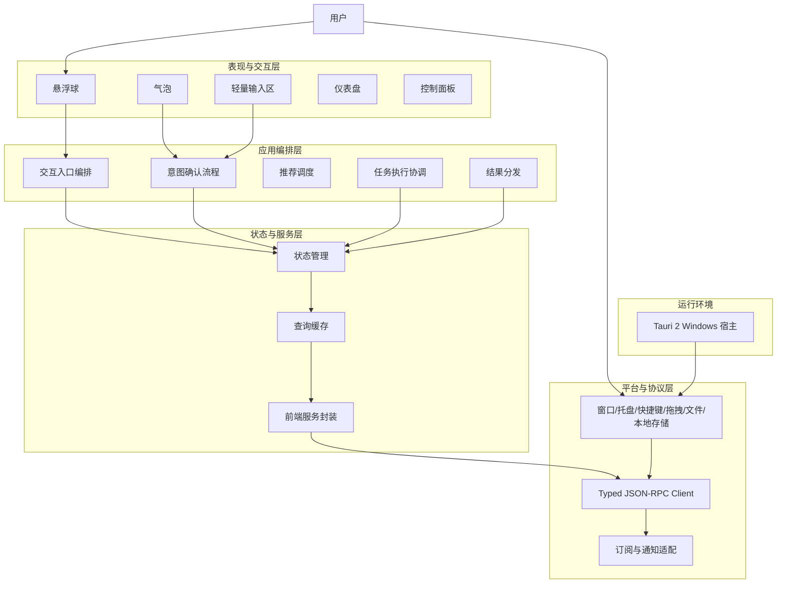
```mermaid
flowchart TB
    U[用户]

    subgraph ENV[运行环境]
        direction LR
        TAURI[Tauri 2 Windows 宿主]
    end

    subgraph P1[表现与交互层]
        direction LR
        FB[悬浮球]
        BUBBLE[气泡]
        INPUT[轻量输入区]
        DASH[仪表盘]
        PANEL[控制面板]
    end

    subgraph P2[应用编排层]
        direction LR
        ENTRY[交互入口编排]
        CONFIRM[意图确认流程]
        RECOMMEND[推荐调度]
        COORD[任务执行协调]
        DISPATCH[结果分发]
    end

    subgraph P3[状态与服务层]
        direction LR
        STATE[状态管理]
        QUERY[查询缓存]
        SERVICE[前端服务封装]
    end

    subgraph P4[平台与协议层]
        direction LR
        RPC[Typed JSON-RPC Client]
        SUB[订阅与通知适配]
        PLATFORM[窗口/托盘/快捷键/拖拽/文件/本地存储]
    end

    U --> FB
    U --> PLATFORM
    TAURI --> PLATFORM
    FB --> ENTRY
    BUBBLE --> CONFIRM
    INPUT --> CONFIRM
    ENTRY --> STATE
    CONFIRM --> STATE
    COORD --> STATE
    DISPATCH --> STATE
    STATE --> QUERY
    QUERY --> SERVICE
    SERVICE --> RPC
    RPC --> SUB
    PLATFORM --> RPC
```

### 3.3 后端 Harness 总览图

为保证正文可读性，本节拆成四张图：第一张突出 Harness 主编排关系，后面三张分别说明能力接入、治理反馈、数据与平台支撑关系。四张图合起来等价于原 3.3 的完整架构表达。

#### 3.3.1 后端 Harness 主编排图

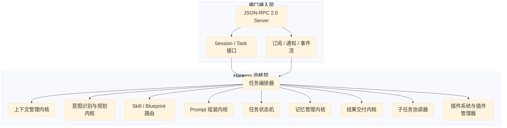
```mermaid
%%{init: {'theme': 'base', 'themeVariables': { 'fontSize': '26px'}}}%%
flowchart TB
    subgraph B1[接口接入层]
        direction LR
        JRPCS[JSON-RPC 2.0 Server]
        SESSION[Session / Task 接口]
        STREAM[订阅 / 通知 / 事件流]
    end

    subgraph B2[Harness 内核层]
        direction LR
        ORCH[任务编排器]
        CTXM[上下文管理内核]
        INTENT[意图识别与规划内核]
        SKILL[Skill / Blueprint 路由]
        PROMPT[Prompt 组装内核]
        TASK[任务状态机]
        MEMORY[记忆管理内核]
        DELIVERY[结果交付内核]
        SUBAGENT[子任务协调器]
        PLUGIN[插件系统与插件管理器]
    end

    JRPCS --> SESSION
    JRPCS --> STREAM
    SESSION --> ORCH
    STREAM --> ORCH

    ORCH --> CTXM
    ORCH --> INTENT
    ORCH --> SKILL
    ORCH --> PROMPT
    ORCH --> TASK
    ORCH --> MEMORY
    ORCH --> DELIVERY
    ORCH --> SUBAGENT
    ORCH --> PLUGIN
```

#### 3.3.2 后端 Harness 能力接入图

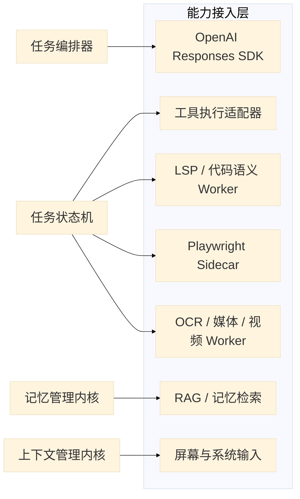
```mermaid
%%{init: {'theme': 'base', 'themeVariables': { 'fontSize': '26px'}}}%%
flowchart LR
    ORCH[任务编排器]
    TASK[任务状态机]
    MEMORY[记忆管理内核]
    CTXM[上下文管理内核]

    subgraph B3[能力接入层]
        direction TB
        MODEL[OpenAI Responses SDK]
        TOOL[工具执行适配器]
        LSP[LSP / 代码语义 Worker]
        NODEPW[Playwright Sidecar]
        OCR[OCR / 媒体 / 视频 Worker]
        RAG[RAG / 记忆检索]
        SENSE[屏幕与系统输入]
    end

    ORCH --> MODEL
    TASK --> TOOL
    TASK --> LSP
    TASK --> NODEPW
    TASK --> OCR
    MEMORY --> RAG
    CTXM --> SENSE
```

#### 3.3.3 后端 Harness 治理与反馈图

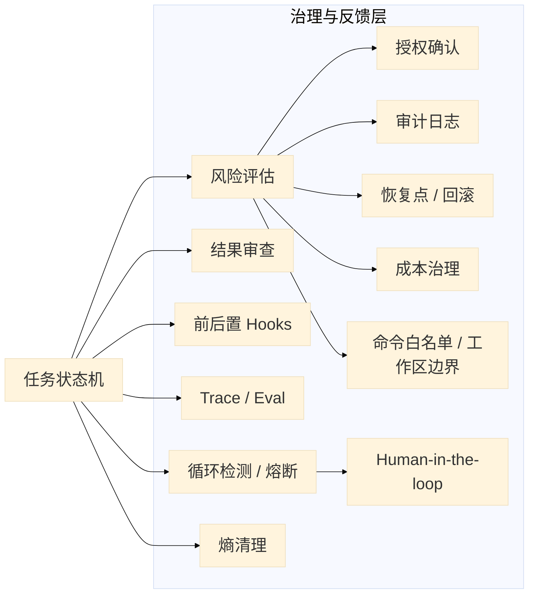
```mermaid
%%{init: {'theme': 'base', 'themeVariables': { 'fontSize': '26px'}}}%%
flowchart LR
    TASK[任务状态机]

    subgraph B4[治理与反馈层]
        direction TB
        SAFE[风险评估]
        APPROVAL[授权确认]
        REVIEW[结果审查]
        HOOKS[前后置 Hooks]
        TRACE[Trace / Eval]
        LOOP[循环检测 / 熔断]
        CLEANUP[熵清理]
        AUDIT[审计日志]
        SNAP[恢复点 / 回滚]
        BUDGET[成本治理]
        POLICY[命令白名单 / 工作区边界]
        HITL[Human-in-the-loop]
    end

    TASK --> SAFE
    TASK --> REVIEW
    TASK --> HOOKS
    TASK --> TRACE
    TASK --> LOOP
    TASK --> CLEANUP
    SAFE --> APPROVAL
    SAFE --> AUDIT
    SAFE --> SNAP
    SAFE --> BUDGET
    SAFE --> POLICY
    LOOP --> HITL
```

#### 3.3.4 后端 Harness 数据与平台支撑图

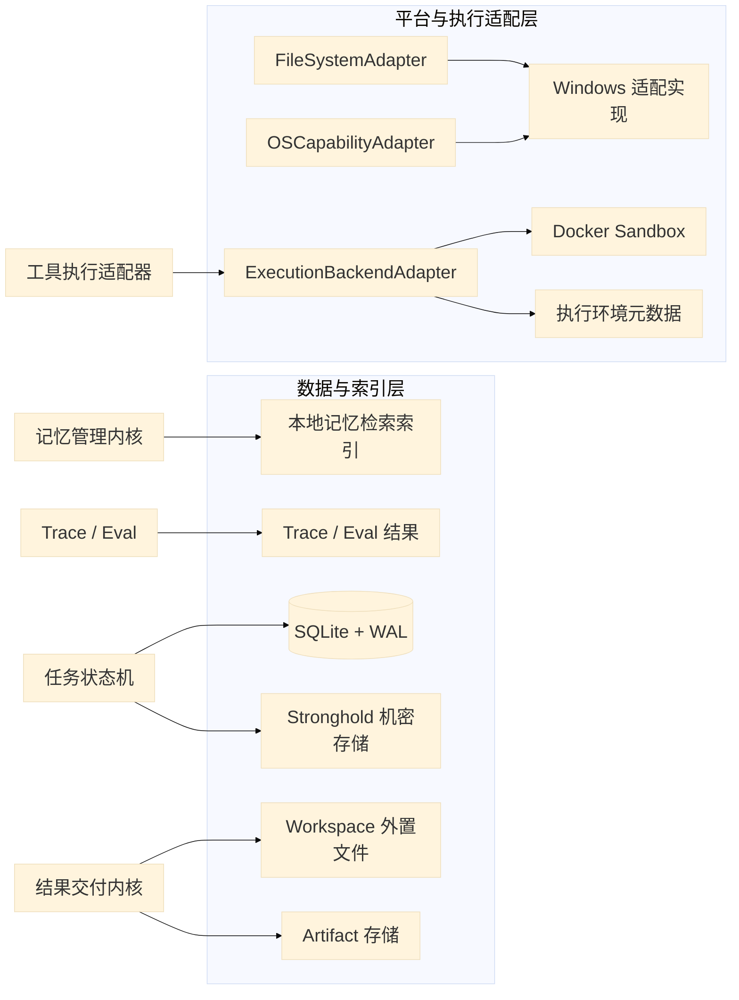
```mermaid
%%{init: {'theme': 'base', 'themeVariables': { 'fontSize': '26px'}}}%%
flowchart LR
    TASK[任务状态机]
    MEMORY[记忆管理内核]
    DELIVERY[结果交付内核]
    TRACE[Trace / Eval]
    TOOL[工具执行适配器]

    subgraph B5[数据与索引层]
        direction TB
        SQLITE[(SQLite + WAL)]
        VSTORE[本地记忆检索索引]
        TRACEDB[Trace / Eval 结果]
        WORKSPACE[Workspace 外置文件]
        ARTIFACT[Artifact 存储]
        SECRET[Stronghold 机密存储]
    end

    subgraph B6[平台与执行适配层]
        direction TB
        FSABS[FileSystemAdapter]
        OSABS[OSCapabilityAdapter]
        EXECABS[ExecutionBackendAdapter]
        DOCKER[Docker Sandbox]
        EXECMETA[执行环境元数据]
        WIN[Windows 适配实现]
    end

    TASK --> SQLITE
    MEMORY --> VSTORE
    TRACE --> TRACEDB
    DELIVERY --> WORKSPACE
    DELIVERY --> ARTIFACT
    TASK --> SECRET

    TOOL --> EXECABS
    FSABS --> WIN
    OSABS --> WIN
    EXECABS --> DOCKER
    EXECABS --> EXECMETA
```

### 3.4 前后端协议边界

前后端通信固定为 **JSON-RPC 2.0**，主传输层优先采用 **本地 IPC**，当前 Windows 采用 **Named Pipe**。

约束如下：

- 前端不得直接 import Go 服务内部实现。
- worker 不得被前端直接调用，必须经过 Go service 编排。
- 所有正式联调接口都必须登记到 `/packages/protocol/rpc`。
- 所有类型定义必须登记到 `/packages/protocol/types` 与 `/packages/protocol/schemas`。
- 所有错误必须回落到统一 `100xxxx` 错误码体系。

### 3.5 分层职责说明

#### 前端分层职责

- **桌面宿主层**：承载 Tauri 2、多窗口生命周期、托盘、通知、快捷键与更新。
- **表现层**：负责悬浮球、气泡、轻量输入区、仪表盘、控制面板等 UI 呈现。
- **应用编排层**：统一收敛单击、双击、长按、悬停、文本选中、文件拖拽等触发方式。
- **状态与服务层**：管理本地状态、查询缓存与前端服务封装。
- **平台与协议层**：负责协议调用、订阅桥接和桌面平台能力接入。

#### 后端分层职责

- **接口接入层**：后端唯一对外边界，负责 JSON-RPC Server、session/task 生命周期与事件订阅。
- **Harness 内核层**：任务编排、前馈决策、ReAct 循环组织、状态机、记忆、交付、子任务和插件管理的主中枢。
- **能力接入层**：统一接入模型、工具、Playwright、OCR、LSP、RAG、屏幕和系统输入等能力。
- **治理与反馈层**：风险评估、授权确认、结果审查、Hooks、Trace / Eval、熵清理、循环检测和人工升级。
- **数据与索引层**：负责运行态、索引、Trace / Eval、Workspace、Artifact 与机密信息持久化。
- **平台与执行适配层**：负责文件系统、系统能力、执行后端抽象与 Windows 平台实现。

---

## 四、产品功能域与承接设计

本章用于从产品承接视角补充系统功能架构。它不替代后续“核心流程与模块展开”和“核心功能模块设计”，而是回答系统到底面向哪些用户动作与产品域提供能力，以及这些能力如何在桌面现场被组织和承接。

### 4.1 入口与轻量承接域

系统默认以悬浮球为近场入口，以气泡和轻量输入区作为任务承接层，而不是以聊天页作为主入口。该功能域负责把语音、悬停输入、文本选中、文件拖拽和推荐点击统一转为任务请求，并在当前现场完成对象识别、意图确认、短结果返回和下一步分流。

核心入口包括：

- 左键单击：轻量接近或承接当前对象
- 左键双击：打开仪表盘
- 左键长按：语音主入口，上滑锁定、下滑取消
- 鼠标悬停：显示轻量输入与主动推荐
- 文件拖拽：解析文件后进入意图确认
- 文本选中：进入可操作提示态，再进入意图确认

### 4.2 任务状态与持续追踪域

该功能域负责承接“已经被 Agent 接手并正在推进”的工作，使用户能够在仪表盘中查看任务头部、步骤时间线、关键上下文、成果区、信任摘要与操作区。任务状态域面向的是用户可见进度，而不是内核态 `run / step` 的实现细节。

其核心结构包括：

- 任务头部：名称、来源、状态、开始时间、更新时间
- 步骤时间线：已完成、进行中、未开始
- 关键上下文：资料、记忆摘要、规则约束
- 成果区：草稿、文件、网页、模板、清单
- 信任摘要：风险状态、待授权数、恢复点、边界触发
- 操作区：暂停、继续、取消、修改、重启、查看安全详情

### 4.3 便签巡检与事项转任务域

该功能域面向未来安排和长期待办，不直接等同于执行中任务。它负责监听任务文件夹、解析 Markdown 任务项、识别日期与规则、做巡检提醒，并在需要时把事项升级为正式 `task`。根据统一模型约束，`TodoItem` 与 `Task` 必须分层：前者表示未来安排 / 巡检事项，后者表示已进入执行。

分类结构包括：

- 近期要做
- 后续安排
- 重复事项
- 已结束事项

底层能力包括：

- 指定 `.md` 任务文件夹监听
- Markdown 任务项识别
- 日期、优先级、状态、标签提取
- 巡检频率、变更即巡检、启动时巡检
- 到期提醒、长时间未处理提醒
- 下一步动作建议、打开资料、生成草稿

### 4.4 镜子记忆与长期协作域

镜子不是聊天记录页，而是长期协作的认知层，用于沉淀短期记忆、长期记忆和镜子总结。该功能域与运行态状态机严格分层，长期记忆支持本地 RAG 检索，但写入与检索都必须通过 Memory 内核统一接入。

三层结构为：

1. 短期记忆：支撑连续任务理解
2. 长期记忆：偏好、习惯、阶段性信息沉淀
3. 镜子总结：日报、阶段总结、用户画像显性展示

设计约束：

- 默认本地存储，可一键开关
- 长期记忆与运行态恢复状态分离
- 用户可见、可管理、可删除
- 周期总结和画像更新受操作面板配置控制

### 4.5 安全卫士与恢复治理域

该功能域是用户可感知的治理外显层，对应后端风险评估、授权确认、审计、恢复点与回滚能力。其职责不是重新实现治理逻辑，而是把绿/黄/红三级风险、待确认动作、影响范围、恢复点和中断操作清晰暴露给用户。

主要能力包括：

- 工作区边界控制
- 风险分级
- 授权确认
- 影响范围展示
- 一键中断
- 恢复与回滚
- Token 与费用治理
- 审计日志
- Docker 沙盒执行策略接入

### 4.6 操作面板与系统配置域

操作面板是系统配置中心，不承接任务，不替代仪表盘。它承担通用设置、外观与桌面入口、记忆、任务与自动化、数据与日志、模型与密钥等系统级配置职责，是桌面宿主与本地 Harness 行为约束的显式入口。

主入口为托盘右键，信息架构分为：

- 通用设置
- 外观与桌面入口
- 记忆
- 任务与自动化
- 数据与日志
- 模型与密钥
- 关于


### 4.7 扩展能力中心与多模型配置域

该功能域用于承接产品的成长性能力，不面向普通用户暴露复杂底层实现，而是在基础闭环稳定后，为进阶用户提供可扩展的插件、技能和模型能力。它对应原子功能中的“多生态插件、多模型配置、感知包扩展、兼容社区 Skills 生态”，同时受统一规范约束：插件必须通过 Go service 编排，模型接入必须通过统一 SDK 接入层与配置入口进入，不允许直接散落在业务逻辑中。

主要能力包括：

- 多生态插件：通过 Manifest + 独立 Worker + 本地 IPC / JSON-RPC 扩展感知、处理和交付能力。
- 感知包扩展：允许按办公、开发、娱乐等场景加载不同感知包，但必须走统一权限、边界和审计链路。
- 社区 Skills 兼容：支持安装经过验证的 Skills 资产，来源可包括 GitHub 等外部仓库，但安装和启用需受版本、权限和工作区策略控制。
- 多模型配置：支持提供商切换、模型 ID 切换、本地模型接入和不同能力使用不同模型策略。
- 工具路由与边界策略：允许针对不同插件、技能和模型配置不同的工具权限、执行边界和成本策略。

设计约束：

- 插件与技能不直接面向前端开放调用，必须通过 `/services/local-service` 统一编排。
- 模型切换不改变 `task / run / delivery_result` 等核心协议对象。
- 插件、技能、模型配置都必须有版本、来源与权限描述，以便进入审计和 Trace。

### 4.8 上下文感知与主动协助域

该功能域用于把“当前桌面发生了什么”和“此刻是否应该帮忙”转为可计算的输入信号，对应原子功能中的复制行为感知、屏幕/页面感知、行为与机会识别、主动推荐触发规则等能力。它并不直接替代任务入口，而是为入口承接、推荐系统和 Context Manager 提供更稳定的任务对象来源。

主要能力包括：

- 复制行为感知：识别复制、粘贴、选中等行为是否形成协作机会。
- 屏幕与页面感知：读取当前页面标题、窗口、选区、剪贴板、可视区域和停留状态。
- 行为与机会识别：基于停留、切换、重复失败、错误出现等信号，判断是否触发轻提示。
- 主动推荐触发规则：定义什么场景允许推荐、什么场景必须静默、是否存在冷却时间与置信度阈值。
- 特定对象扩展：为错误对象、文件对象、文本对象和后续的视频对象预留统一接入形态。

设计约束：

- 强意图优先于弱信号，用户显式触发必须覆盖主动推荐。
- 复制、停留、切换等弱信号默认保守处理，不得变成高频打扰源。
- 感知信号只能作为输入候选，正式执行仍需经过意图确认、风险治理和交付内核。

---

## 五、核心流程与模块展开

### 5.1 主动输入闭环图

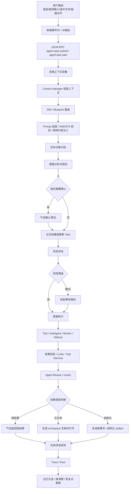
```mermaid
flowchart TB
    A[用户触发
语音/悬停输入/选中文本/拖拽文件]
    B[前端事件归一与路由]
    C[JSON-RPC agent.input.submit / agent.task.start]
    D[后端上下文采集]
    E[Context Manager 组装上下文]
    F[Skill / Blueprint 路由]
    G[Prompt 组装 / AGENTS 规则 / 架构约束注入]
    H[任务对象识别]
    I[意图分析与规划]
    J{是否需要确认}
    K[气泡确认/修正]
    L[正式创建或更新 Task]
    M[风险评估]
    N{风险等级}
    O[直接执行]
    P[挂起等待授权]
    Q[Tool / SubAgent / Worker / Sidecar]
    R[结果校验 / Linter / Test Harness]
    S[Agent Review / Hooks]
    T{结果类型判断}
    U[气泡返回短结果]
    V[生成 workspace 文档并打开]
    W[生成结果页 / 结构化 artifact]
    X[任务状态回写]
    Y[Trace / Eval]
    Z[记忆沉淀 / 熵清理 / 恢复点更新]

    A --> B --> C --> D --> E --> F --> G --> H --> I --> J
    J -- 是 --> K --> L
    J -- 否 --> L
    L --> M --> N
    N -- 绿 --> O
    N -- 黄/红 --> P --> O
    O --> Q --> R --> S --> T
    T -- 短结果 --> U --> X
    T -- 长文本 --> V --> X
    T -- 结构化 --> W --> X
    X --> Y --> Z
```

### 5.2 前馈决策展开图

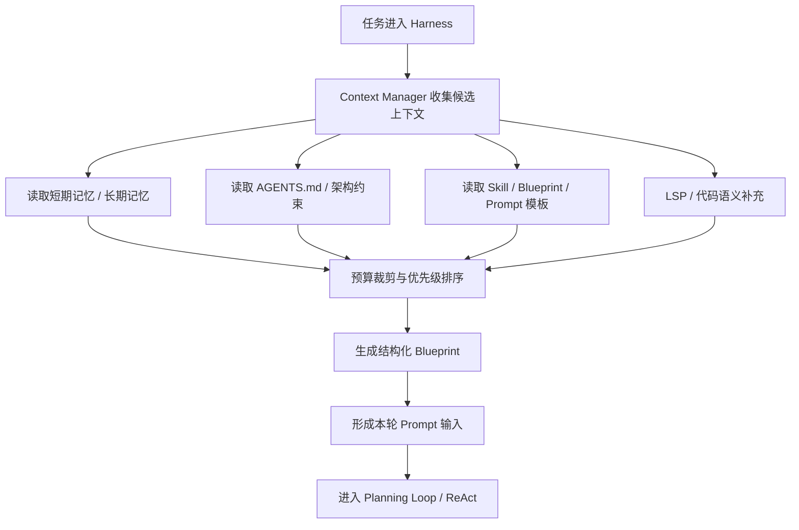
```mermaid
flowchart TB
    A[任务进入 Harness]
    B[Context Manager 收集候选上下文]
    C[读取短期记忆 / 长期记忆]
    D[读取 AGENTS.md / 架构约束]
    E[读取 Skill / Blueprint / Prompt 模板]
    F[LSP / 代码语义补充]
    G[预算裁剪与优先级排序]
    H[生成结构化 Blueprint]
    I[形成本轮 Prompt 输入]
    J[进入 Planning Loop / ReAct]

    A --> B
    B --> C
    B --> D
    B --> E
    B --> F
    C --> G
    D --> G
    E --> G
    F --> G
    G --> H --> I --> J
```

### 5.3 风险执行与回滚图

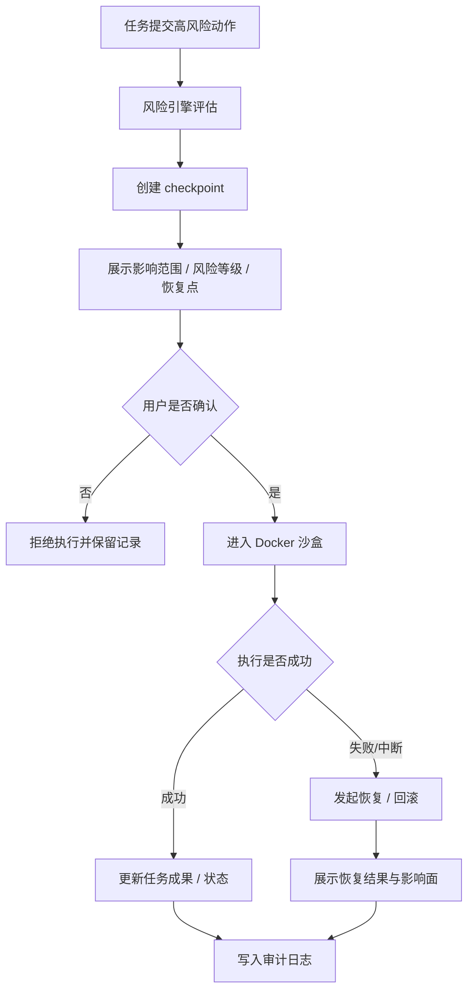
```mermaid
flowchart TB
    A[任务提交高风险动作]
    B[风险引擎评估]
    C[创建 checkpoint]
    D[展示影响范围 / 风险等级 / 恢复点]
    E{用户是否确认}
    F[拒绝执行并保留记录]
    G[进入 Docker 沙盒]
    H{执行是否成功}
    I[更新任务成果 / 状态]
    J[写入审计日志]
    K[发起恢复 / 回滚]
    L[展示恢复结果与影响面]

    A --> B --> C --> D --> E
    E -- 否 --> F
    E -- 是 --> G --> H
    H -- 成功 --> I --> J
    H -- 失败/中断 --> K --> L --> J
```

### 5.4 反馈闭环与熔断图

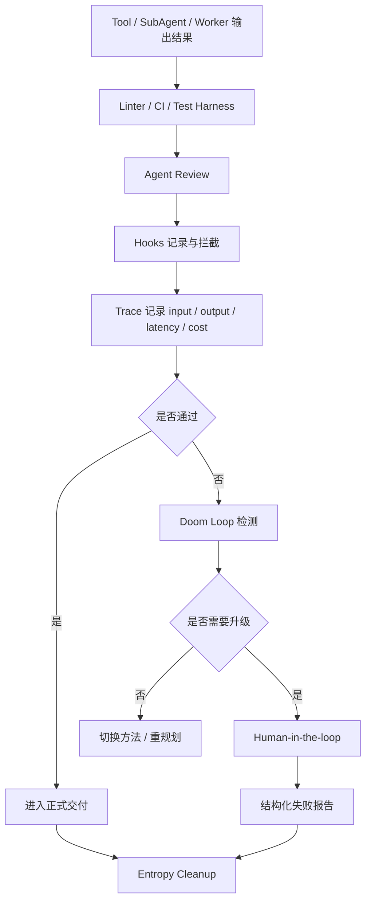
```mermaid
flowchart TB
    A[Tool / SubAgent / Worker 输出结果]
    B[Linter / CI / Test Harness]
    C[Agent Review]
    D[Hooks 记录与拦截]
    E[Trace 记录 input / output / latency / cost]
    F{是否通过}
    G[进入正式交付]
    H[Doom Loop 检测]
    I{是否需要升级}
    J[切换方法 / 重规划]
    K[Human-in-the-loop]
    L[结构化失败报告]
    M[Entropy Cleanup]

    A --> B --> C --> D --> E --> F
    F -- 是 --> G --> M
    F -- 否 --> H --> I
    I -- 否 --> J
    I -- 是 --> K --> L --> M
```

### 5.5 记忆写入与检索图

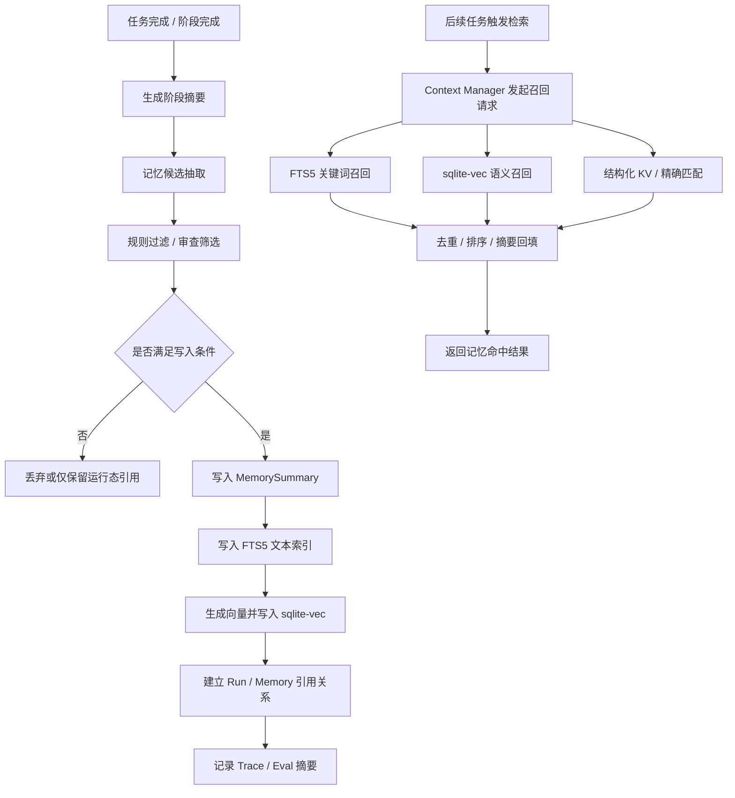
```mermaid
flowchart TB
    A[任务完成 / 阶段完成]
    B[生成阶段摘要]
    C[记忆候选抽取]
    D[规则过滤 / 审查筛选]
    E{是否满足写入条件}
    F[丢弃或仅保留运行态引用]
    G[写入 MemorySummary]
    H[写入 FTS5 文本索引]
    I[生成向量并写入 sqlite-vec]
    J[建立 Run / Memory 引用关系]
    K[记录 Trace / Eval 摘要]
    L[后续任务触发检索]
    M[Context Manager 发起召回请求]
    N[FTS5 关键词召回]
    O[sqlite-vec 语义召回]
    P[结构化 KV / 精确匹配]
    Q[去重 / 排序 / 摘要回填]
    R[返回记忆命中结果]

    A --> B --> C --> D --> E
    E -- 否 --> F
    E -- 是 --> G --> H --> I --> J --> K
    L --> M
    M --> N
    M --> O
    M --> P
    N --> Q
    O --> Q
    P --> Q --> R
```

---

### 5.6 任务巡检转任务图

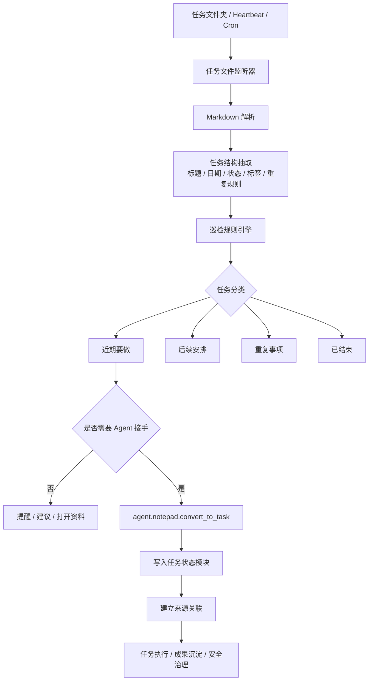
```mermaid
flowchart TB
    A[任务文件夹 / Heartbeat / Cron]
    B[任务文件监听器]
    C[Markdown 解析]
    D[任务结构抽取
标题 / 日期 / 状态 / 标签 / 重复规则]
    E[巡检规则引擎]
    F{任务分类}
    G[近期要做]
    H[后续安排]
    I[重复事项]
    J[已结束]
    K{是否需要 Agent 接手}
    L[提醒 / 建议 / 打开资料]
    M[agent.notepad.convert_to_task]
    N[写入任务状态模块]
    O[建立来源关联]
    P[任务执行 / 成果沉淀 / 安全治理]

    A --> B --> C --> D --> E --> F
    F --> G --> K
    F --> H
    F --> I
    F --> J
    K -- 否 --> L
    K -- 是 --> M --> N --> O --> P
```

### 5.7 仪表盘订阅与任务视图刷新图

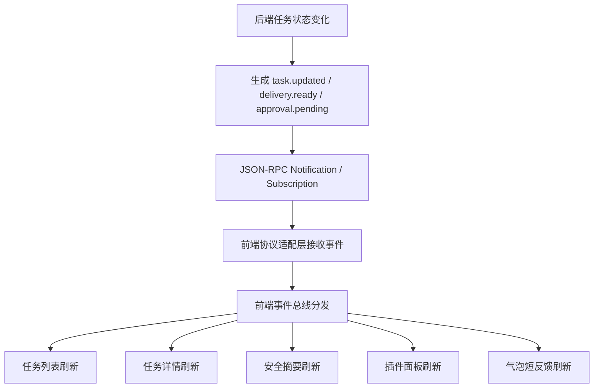
```mermaid
flowchart TB
    A[后端任务状态变化]
    B[生成 task.updated / delivery.ready / approval.pending]
    C[JSON-RPC Notification / Subscription]
    D[前端协议适配层接收事件]
    E[前端事件总线分发]
    F[任务列表刷新]
    G[任务详情刷新]
    H[安全摘要刷新]
    I[插件面板刷新]
    J[气泡短反馈刷新]

    A --> B --> C --> D --> E
    E --> F
    E --> G
    E --> H
    E --> I
    E --> J
```

### 5.8 结果审查、Trace 与熔断闭环图


```mermaid
flowchart TB
    A[Tool / SubAgent / Worker 输出结果]
    B[Linter / CI / Test Harness]
    C[Agent Review]
    D[Hooks 记录与拦截]
    E[Trace 记录 input / output / latency / cost]
    F{是否通过}
    G[进入正式交付]
    H[Doom Loop 检测]
    I{是否需要升级}
    J[切换方法 / 重规划]
    K[Human-in-the-loop]
    L[结构化失败报告]
    M[Entropy Cleanup]

    A --> B --> C --> D --> E --> F
    F -- 是 --> G --> M
    F -- 否 --> H --> I
    I -- 否 --> J
    I -- 是 --> K --> L --> M
```


### 5.9 长按语音与滑动控制图

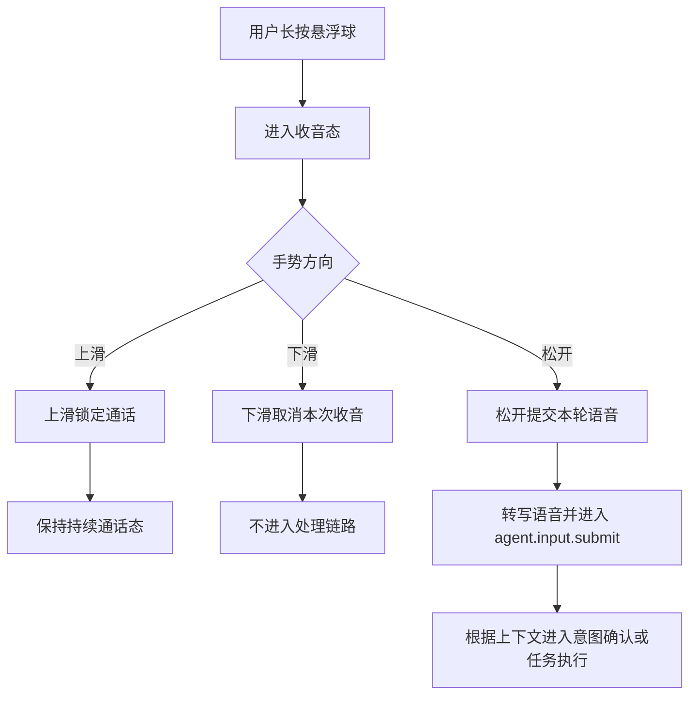
```mermaid
flowchart TB
    A[用户长按悬浮球]
    B[进入收音态]
    C{手势方向}
    D[上滑锁定通话]
    E[下滑取消本次收音]
    F[松开提交本轮语音]
    G[保持持续通话态]
    H[不进入处理链路]
    I[转写语音并进入 agent.input.submit]
    J[根据上下文进入意图确认或任务执行]

    A --> B --> C
    C -- 上滑 --> D --> G
    C -- 下滑 --> E --> H
    C -- 松开 --> F --> I --> J
```

### 5.10 主动推荐触发与轻提示图

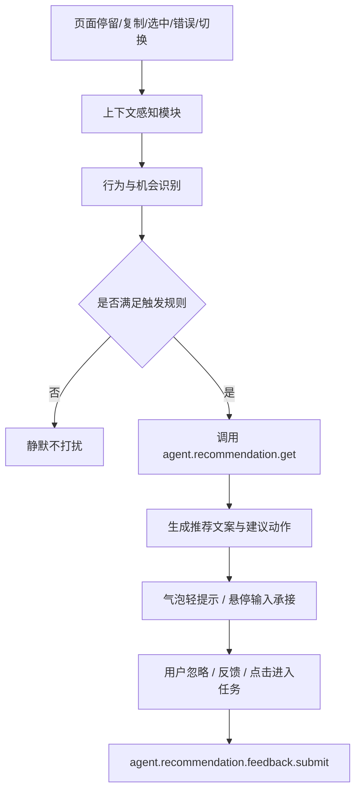
```mermaid
flowchart TB
    A[页面停留/复制/选中/错误/切换]
    B[上下文感知模块]
    C[行为与机会识别]
    D{是否满足触发规则}
    E[静默不打扰]
    F[调用 agent.recommendation.get]
    G[生成推荐文案与建议动作]
    H[气泡轻提示 / 悬停输入承接]
    I[用户忽略 / 反馈 / 点击进入任务]
    J[agent.recommendation.feedback.submit]

    A --> B --> C --> D
    D -- 否 --> E
    D -- 是 --> F --> G --> H --> I --> J
```

### 5.11 结果分流与失败中断交付图

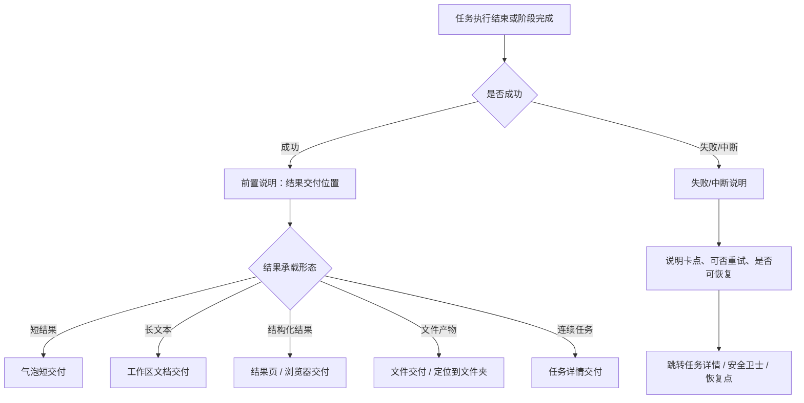
```mermaid
flowchart TB
    A[任务执行结束或阶段完成]
    B{是否成功}
    C[前置说明：结果交付位置]
    D{结果承载形态}
    E[气泡短交付]
    F[工作区文档交付]
    G[结果页 / 浏览器交付]
    H[文件交付 / 定位到文件夹]
    I[任务详情交付]
    J[失败/中断说明]
    K[说明卡点、可否重试、是否可恢复]
    L[跳转任务详情 / 安全卫士 / 恢复点]

    A --> B
    B -- 成功 --> C --> D
    D -- 短结果 --> E
    D -- 长文本 --> F
    D -- 结构化结果 --> G
    D -- 文件产物 --> H
    D -- 连续任务 --> I
    B -- 失败/中断 --> J --> K --> L
```

## 六、核心功能模块设计

> 本章按核心功能能力组织，而不是按前后端大层分块。每个功能模块都围绕用户可感知的业务动作展开，时序图用于表达功能的具体实现方式。

### 6.1 入口承接与意图确认功能

#### 模块介绍

该功能用于承接悬浮球长按语音、悬停输入、文本选中点击、文件拖拽与推荐点击等入口，把现场对象转为统一任务请求。设计目标是让用户在当前桌面现场完成对象识别、意图确认与轻量修正，而不是跳转到聊天窗口重新描述需求。

#### 职责

- 统一入口事件归一化
- 识别输入对象与来源
- 生成候选意图与确认气泡
- 将确认结果推进到任务执行主链路

#### 功能

- 语音转写结果承接
- 文本选中与文件拖拽对象识别
- 候选意图生成与修正
- 短反馈气泡与轻量输入区联动
- 长按后上滑锁定通话、下滑取消本次收音
- 单击轻量接近、双击打开仪表盘、悬停轻量输入
- 附加文件上传与可操作提示态承接

#### 原子功能补充说明

该功能除了承接 `agent.input.submit / agent.task.start` 这类协议入口外，还需要覆盖以下桌面近场原子动作：

- **悬浮球常驻**：作为默认入口与状态锚点，保证桌面始终可达。
- **单击轻量接近**：表达“我可能需要帮助”，但不等于直接打开完整界面。
- **双击打开仪表盘**：语义固定为进入完整工作台，应保持前端本地动作的一致性。
- **长按唤起语音**：进入收音态，是语音主入口。
- **上滑锁定 / 下滑取消**：前者切换持续通话模式，后者取消本次收音且不进入处理链路。
- **悬停轻量输入**：只承接一句话级别的轻量文字输入，不承担长对话历史。
- **文本选中 / 文件拖拽 / 错误信息承接**：都属于任务对象输入，必须先进入可操作提示态或意图确认，再决定是否正式建 task。
- **附加文件上传**：作为补充上下文而非独立任务对象时，仍应统一挂接到当前承接链路。
- **气泡生命周期与操作**：气泡需要支持显现、透明化、隐藏、消散，以及置顶、删除、恢复等操作，但这些能力应作为轻承接对象管理，不应膨胀为聊天线程。

#### 状态机补充说明

入口承接至少涉及两套状态机：

- **悬浮球主状态机**：待机 → 可唤起 → 承接中 → 意图确认中 → 处理中 → 等待确认 → 完成 → 异常。
- **承接状态机**：悬停承接 / 文本选中承接 / 文字拖拽承接 / 文件拖拽承接 / 语音承接 / 推荐承接 / 结果承接。

前者用于桌面入口统一状态展示，后者用于区分不同对象来源和处理分支，避免不同链路在同一状态域内混淆。

#### 边界

- 不直接执行工具调用
- 不直接决定高风险动作授权
- 不直接维护运行态 `run / step / event`

#### 接口设计

接口用途：创建任务入口请求并完成意图确认。

请求方式：JSON-RPC 2.0

核心方法：

- `agent.input.submit`
- `agent.task.start`
- `agent.task.confirm`
- `agent.recommendation.get`

#### 请求参数

```json
{
  "session_id": "sess_001",
  "source": "floating_ball",
  "trigger": "text_selected_click",
  "input": {
    "type": "text_selection",
    "text": "这里是用户选中的原文"
  },
  "options": {
    "confirm_required": true,
    "preferred_delivery": "bubble"
  }
}
```

#### 返回参数

```json
{
  "task": {
    "task_id": "task_001",
    "status": "confirming_intent",
    "intent": {
      "name": "summarize",
      "arguments": {
        "style": "key_points"
      }
    }
  },
  "bubble_message": {
    "type": "intent_confirm",
    "text": "你是想总结这段内容吗？"
  }
}
```

#### 参数说明

- `source`：请求来源，必须取自统一状态表中的 `request_source`
- `trigger`：触发动作，必须取自统一状态表中的 `request_trigger`
- `input.type`：输入对象类型，必须取自统一状态表中的 `input_type`
- `options.confirm_required`：是否进入意图确认流程

#### 数据结构

```ts
interface IntentEntryRequest {
  sessionId: string
  source: 'floating_ball' | 'dashboard' | 'tray_panel'
  trigger:
    | 'voice_commit'
    | 'hover_text_input'
    | 'text_selected_click'
    | 'file_drop'
    | 'error_detected'
    | 'recommendation_click'
  input: {
    type: 'text' | 'text_selection' | 'file' | 'error'
    text?: string
    files?: string[]
  }
  options?: {
    confirmRequired?: boolean
    preferredDelivery?: 'bubble' | 'workspace_document' | 'result_page'
  }
}
```

#### 时序图

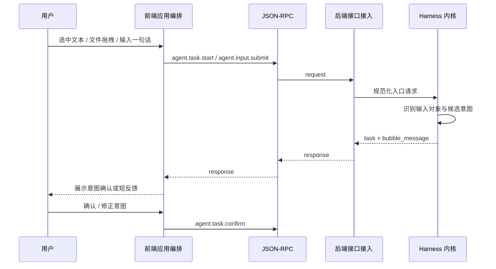
```mermaid
sequenceDiagram
    participant U as 用户
    participant FE as 前端应用编排
    participant RPC as JSON-RPC
    participant BE as 后端接口接入
    participant H as Harness 内核

    U->>FE: 选中文本 / 文件拖拽 / 输入一句话
    FE->>RPC: agent.task.start / agent.input.submit
    RPC->>BE: request
    BE->>H: 规范化入口请求
    H->>H: 识别输入对象与候选意图
    H-->>BE: task + bubble_message
    BE-->>RPC: response
    RPC-->>FE: response
    FE-->>U: 展示意图确认或短反馈
    U->>FE: 确认 / 修正意图
    FE->>RPC: agent.task.confirm
```

### 6.2 任务巡检转任务功能

#### 模块介绍

该功能面向 Markdown 任务文件夹、周期巡检规则和桌面长期待办，把“未来安排”转为“正式任务”。设计目标是通过巡检把分散的便签、提醒和重复事项纳入统一 `task` 主链路，保证巡检建议、转任务和后续执行之间有稳定映射关系。

#### 职责

- 监听任务来源目录和巡检触发器
- 解析 Markdown 任务项与重复规则
- 分类为近期要做、后续安排、重复事项、已结束
- 将确认需要 Agent 接手的事项转换为 `task`

#### 功能

- 启动时巡检
- 文件变化时巡检
- 手动巡检
- 便签项转任务

#### 边界

- 不直接执行生成类任务
- 不绕过 `agent.notepad.convert_to_task` 直接写 `task`
- 不把巡检状态混入运行态 `run_status`

#### 接口设计

接口用途：读取巡检配置、触发巡检、把事项转换为任务。

请求方式：JSON-RPC 2.0

核心方法：

- `agent.task_inspector.config.get`
- `agent.task_inspector.config.update`
- `agent.task_inspector.run`
- `agent.notepad.list`
- `agent.notepad.convert_to_task`

#### 请求参数

```json
{
  "reason": "manual",
  //工作区路径示例，并非固定路径
  "target_sources": ["D:/workspace/todos"]
}
```

#### 返回参数

```json
{
  "inspection_id": "insp_001",
  "summary": {
    "parsed_files": 3,
    "identified_items": 12,
    "due_today": 2,
    "overdue": 1,
    "stale": 3
  },
  "suggestions": [
    "优先处理今天到期的复盘邮件",
    "下周评审材料建议先生成草稿"
  ]
}
```

#### 参数说明

- `target_sources`：巡检来源目录，必须受工作区边界策略约束
- `group`：事项分组，取值必须来自 `todo_bucket`
- `confirmed`：是否把事项升级为正式任务

#### 数据结构

```json
{
  "item_id": "todo_001",
  "title": "整理 Q3 复盘要点",
  "bucket": "upcoming",
  "status": "due_today",
  "type": "one_time",
  "due_at": "2026-04-07T18:00:00+08:00",
  "agent_suggestion": "先生成一个三点摘要"
}
```

#### 时序图

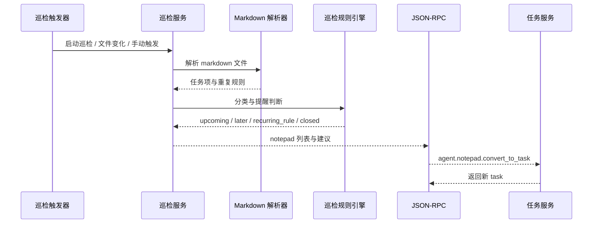
```mermaid
sequenceDiagram
    participant CRON as 巡检触发器
    participant INS as 巡检服务
    participant PARSE as Markdown 解析器
    participant RULE as 巡检规则引擎
    participant RPC as JSON-RPC
    participant TASK as 任务服务

    CRON->>INS: 启动巡检 / 文件变化 / 手动触发
    INS->>PARSE: 解析 markdown 文件
    PARSE-->>INS: 任务项与重复规则
    INS->>RULE: 分类与提醒判断
    RULE-->>INS: upcoming / later / recurring_rule / closed
    INS-->>RPC: notepad 列表与建议
    RPC-->>TASK: agent.notepad.convert_to_task
    TASK-->>RPC: 返回新 task
```

### 6.3 任务执行与结果交付功能

#### 模块介绍

该功能负责把已确认意图的任务推进为可执行的 `run`，并在结束后统一输出 `delivery_result / artifact / citation`。设计目标是保证工具调用、子任务、产物生成和正式交付之间的链路一致，避免结果散落在工具输出和临时文件中。

#### 职责

- 维护 `task` 到 `run` 的映射
- 驱动 Planning Loop / ReAct 循环
- 执行工具与子任务协调
- 统一结果交付与成果沉淀

#### 功能

- Run / Step / Event / ToolCall 状态推进
- Tool、SubAgent、Worker 编排
- 短结果、工作区文档、结果页、多文件导出等交付分流
- Artifact 与 Citation 生成
- 正式交付前的交付位置说明
- 失败 / 中断时的结构化说明与恢复提示
- 文件交付、任务详情交付与结果页交付

#### 原子功能补充说明

该功能需要覆盖原子功能表中的“输出”全链路，而不只是成功结果生成：

- **前置说明与失败/中断交付**：在正式交付前应告诉用户结果将在哪里呈现；失败时必须说明卡在哪、是否可重试、是否存在恢复点。
- **气泡短交付**：适用于一句话解释、简短翻译、三点摘要等短结果。
- **文档交付**：适用于长文本、草稿、方案说明、会议清单等内容，应写入工作区并打开。
- **结果页 / 浏览器交付**：适用于结构化或可跳转结果。
- **文件交付**：适用于导出文件、下载文件、定位到文件夹等场景。
- **任务详情交付**：适用于连续任务、治理相关任务、失败任务和过程型结果，保证结果可追溯。

#### 边界

- 不直接做风险授权交互
- 不直接写长期记忆
- 不允许工具绕过交付内核返回隐式结果

#### 接口设计

接口用途：控制任务执行、查询任务详情、打开成果。

请求方式：JSON-RPC 2.0

核心方法：

- `agent.task.detail.get`
- `agent.task.control`
- `agent.task.artifact.list`（planned）
- `agent.task.artifact.open`（planned）
- `agent.delivery.open`（planned）

#### 请求参数

```json
{
  "task_id": "task_201",
  "action": "pause",
  "arguments": {}
}
```

#### 返回参数

```json
{
  "task": {
    "task_id": "task_201",
    "status": "paused"
  },
  "bubble_message": {
    "type": "status",
    "text": "任务已暂停"
  }
}
```

#### 参数说明

- `action`：控制动作，必须取自 `task_control_action`
- `delivery_result.type`：交付类型，必须取自 `delivery_type`
- `artifact_type`：产物类型，统一使用 `snake_case`

#### 数据结构

```json
{
  "delivery_result": {
    "type": "workspace_document",
    "title": "需求文档重点摘要",
    "payload": {
      "path": "D:/CialloClawWorkspace/需求文档重点摘要.md"
    },
    "preview_text": "已为你写入文档并打开"
  }
}
```

#### 时序图

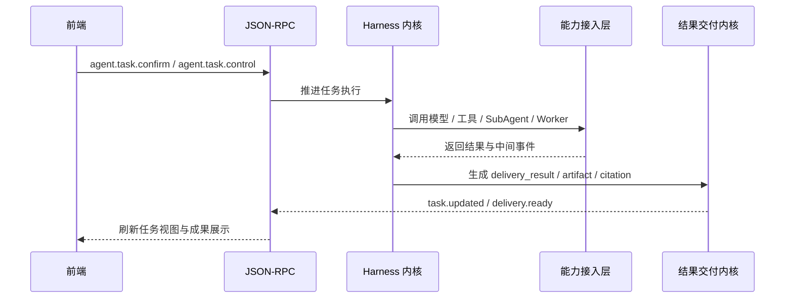
```mermaid
sequenceDiagram
    participant UI as 前端
    participant RPC as JSON-RPC
    participant H as Harness 内核
    participant CAP as 能力接入层
    participant DEL as 结果交付内核

    UI->>RPC: agent.task.confirm / agent.task.control
    RPC->>H: 推进任务执行
    H->>CAP: 调用模型 / 工具 / SubAgent / Worker
    CAP-->>H: 返回结果与中间事件
    H->>DEL: 生成 delivery_result / artifact / citation
    DEL-->>RPC: task.updated / delivery.ready
    RPC-->>UI: 刷新任务视图与成果展示
```

### 6.4 记忆写入与本地检索功能

#### 模块介绍

该功能负责在任务执行前提供短期和长期记忆召回，在任务执行后沉淀阶段摘要和候选知识。设计目标是通过 Memory 内核把记忆检索与运行态状态机严格分离，同时为 Context Manager 提供可裁剪、可排序、可追踪的记忆输入。

#### 职责

- 召回短期记忆与长期记忆
- 过滤记忆候选并写入索引
- 管理 FTS5 与 sqlite-vec 检索链路
- 维护 `task / run / memory` 引用关系

#### 功能

- 当前任务命中的偏好召回
- 阶段总结抽取与长期记忆写入
- 关键词召回、向量召回、精确匹配
- 召回结果去重、排序与摘要回填
- 历史概要、日报和用户画像基础展示
- 记忆生命周期与开关管理

#### 原子功能补充说明

镜子记忆除了作为执行前的注入源，还需要承担用户可见的长期协作层：

- **记忆开关**：允许用户显式开启或关闭镜子记忆。
- **生命周期设置**：支持仅本轮、7 天、30 天、长期保留等策略。
- **短期记忆承接**：维持当前协作上下文连续性。
- **长期记忆沉淀**：沉淀偏好、习惯和阶段性信息，但不能退化为聊天历史堆叠。
- **历史概要 / 日报 / 用户画像基础展示**：在仪表盘镜子模块中让长期价值显性可见。
- **画像管理与镜子总结完整化**：可作为后续增强方向，但仍需在架构上预留对象与入口。

#### 边界

- 不直接修改 `run_status`
- 不把检索命中混入运行态主表
- 不绕过 Context Manager 直接注入模型

#### 接口设计

接口用途：获取镜子概览、管理记忆、提供 Memory 命中摘要。

请求方式：JSON-RPC 2.0

核心方法：

- `agent.mirror.overview.get`
- `agent.mirror.memory.manage`（planned）

#### 请求参数

```json
{
  "task_id": "task_001",
  "run_id": "run_001",
  "query": "用户偏好的输出格式"
}
```

#### 返回参数

```json
{
  "items": [
    {
      "retrieval_hit_id": "hit_001",
      "memory_id": "pref_001",
      "score": 0.87,
      "summary": "偏好将输出整理为 markdown 并先给三点摘要"
    }
  ]
}
```

#### 参数说明

- `memory_id`：长期记忆主键
- `score`：召回分数
- `source`：命中来源，可能为 `rag_index`、`fts`、`kv`

#### 数据结构

```json
{
  "memory_summary": {
    "memory_id": "pref_001",
    "reason": "当前任务命中了用户偏好的输出格式",
    "summary": "偏好将输出整理为 markdown 并先给三点摘要"
  }
}
```

#### 时序图

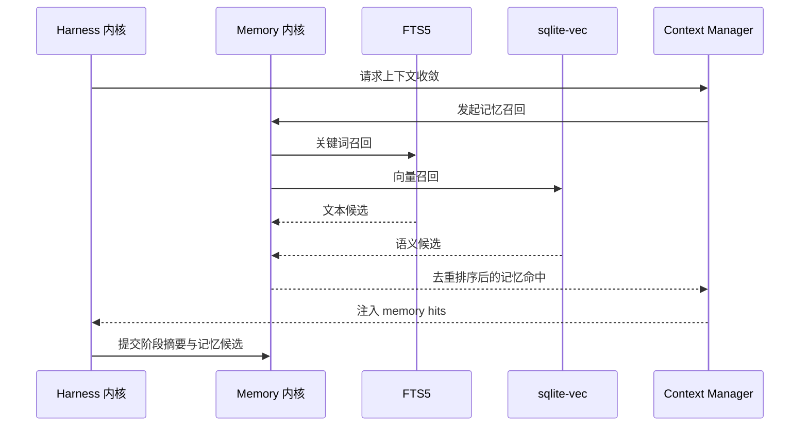
```mermaid
sequenceDiagram
    participant H as Harness 内核
    participant MEM as Memory 内核
    participant FTS as FTS5
    participant VEC as sqlite-vec
    participant CTX as Context Manager

    H->>CTX: 请求上下文收敛
    CTX->>MEM: 发起记忆召回
    MEM->>FTS: 关键词召回
    MEM->>VEC: 向量召回
    FTS-->>MEM: 文本候选
    VEC-->>MEM: 语义候选
    MEM-->>CTX: 去重排序后的记忆命中
    CTX-->>H: 注入 memory hits
    H->>MEM: 提交阶段摘要与记忆候选
```

### 6.5 风险授权与恢复回滚功能

#### 模块介绍

该功能负责高风险动作的风险分级、授权确认、影响范围展示、恢复点创建与回滚执行。设计目标是让所有高风险动作在正式执行前都有可追踪、可解释、可恢复的安全闭环。

#### 职责

- 风险等级评估
- 授权请求生成与响应处理
- 影响范围与工作区边界计算
- 恢复点创建与回滚执行
- 审计摘要留痕

#### 功能

- 绿/黄/红三级风险控制
- 工作区外写入拦截
- 删除、覆盖、命令执行前确认
- 执行失败或用户中断后的恢复
- 一键中断、立即停与优雅关闭
- Token / 费用总览与预算降级
- 恢复点查看与影响范围展示

#### 原子功能补充说明

安全卫士不仅是后端治理链路，还要覆盖用户可感知的治理原子功能：

- **工作区边界控制**：限定可写范围与影响对象。
- **风险分级**：绿灯静默、黄灯询问、红灯强制人工确认。
- **授权确认**：高风险动作不能静默通过。
- **审计记录**：文件、网页、命令、系统动作及结果必须可查可追责。
- **影响范围展示**：明确显示涉及文件、网页、应用、是否越出工作区。
- **一键中断**：支持立即停、优雅关闭和可恢复中断。
- **恢复点与恢复查看**：恢复机制需要首期可见，即使自动回滚实现可后置。
- **Token / 费用总览与预算降级**：成本透明属于治理核心，而不是仅在设置页隐藏展示。

#### 边界

- 不负责业务意图识别
- 不直接生成最终结果文档
- 不允许跳过 `approval_request / authorization_record / audit_record / recovery_point`

#### 接口设计

接口用途：查看安全摘要、响应待授权操作、查看恢复点和审计记录。

请求方式：JSON-RPC 2.0

核心方法：

- `agent.security.summary.get`
- `agent.security.pending.list`
- `agent.security.respond`
- `agent.security.audit.list`（planned）
- `agent.security.restore_points.list`（planned）
- `agent.security.restore.apply`（planned）

#### 请求参数

```json
{
  "task_id": "task_301",
  "approval_id": "appr_001",
  "decision": "allow_once"
}
```

#### 返回参数

```json
{
  "authorization_record": {
    "authorization_record_id": "auth_001",
    "task_id": "task_301",
    "approval_id": "appr_001",
    "decision": "allow_once"
  }
}
```

#### 参数说明

- `decision`：授权结果，必须取自 `approval_decision`
- `risk_level`：风险等级，必须取自 `risk_level`
- `reason`：触发授权的原因，如 `out_of_workspace`

#### 数据结构

```json
{
  "approval_request": {
    "approval_id": "appr_001",
    "task_id": "task_301",
    "operation_name": "write_file",
    "risk_level": "red",
    "target_object": "C:/Users/demo/Desktop/report.docx",
    "reason": "out_of_workspace",
    "status": "pending"
  }
}
```

#### 时序图

```mermaid
sequenceDiagram
    participant H as Harness 内核
    participant SAFE as 风险引擎
    participant SNAP as 恢复点服务
    participant UI as 前端
    participant EXEC as 执行后端

    H->>SAFE: 提交高风险动作计划
    SAFE->>SNAP: 创建恢复点
    SAFE-->>UI: 返回 approval_request + impact_scope
    UI->>SAFE: allow_once / deny_once
    alt 已允许
        SAFE->>EXEC: 执行高风险动作
        EXEC-->>SAFE: success / failure
        SAFE->>SNAP: 失败时回滚
    else 已拒绝
        SAFE-->>H: 拒绝执行并写审计
    end
```

### 6.6 仪表盘订阅与任务视图刷新功能

#### 模块介绍

该功能负责把任务状态、正式交付、安全待确认项和插件运行态通过订阅机制实时同步到仪表盘与气泡。设计目标是让前端视图刷新围绕统一事件流进行，而不是靠页面各自轮询和拼装状态。

#### 职责

- 统一订阅后端事件
- 将事件映射为任务列表、任务详情、安全摘要、插件面板和气泡刷新
- 保证前端任务视图与后端事件一致

#### 功能

- `task.updated` 推送
- `delivery.ready` 推送
- `approval.pending` 推送
- 插件状态和指标推送
- 仪表盘首页 / 意识场聚合展示
- 任务状态、任务巡检、镜子、安全卫士四大模块刷新

#### 原子功能补充说明

仪表盘不只是“任务列表页”，而是用户进入完整工作台后的高频总览入口：

- **仪表盘首页 / 意识场**：展示当前最值得关注的事，是双击悬浮球进入后的默认总览。
- **任务状态模块**：展示未完成 / 已结束任务、进展、安全摘要与产出物。
- **任务巡检模块**：展示近期要做、后续安排、重复事项和已结束事项，更偏未来安排与推进。
- **镜子模块**：展示历史概要、日报和画像，是长期协作可见层。
- **安全卫士模块**：展示风险、恢复、授权、审计和费用，是治理细节入口。

#### 边界

- 不直接维护后端数据库
- 不直接调用 worker
- 不通过非协议方式同步状态

#### 接口设计

接口用途：获取仪表盘首页摘要与模块数据，并通过 subscription 接收事件。

请求方式：JSON-RPC 2.0 + Notification / Subscription

核心方法：

- `agent.dashboard.overview.get`
- `agent.dashboard.module.get`
- `task.updated`
- `delivery.ready`
- `approval.pending`

#### 请求参数

```json
{
  "module": "task_overview",
  "task_id": "task_201"
}
```

#### 返回参数

```json
{
  "data": {
    "task": {
      "task_id": "task_201",
      "status": "processing"
    },
    "artifacts": [],
    "security_summary": {
      "pending_authorizations": 1
    }
  }
}
```

#### 参数说明

- `module`：仪表盘模块标识
- `task_id`：指定任务详情时的目标任务 ID
- Notification 事件必须使用 `dot.case`

#### 数据结构

```json
{
  "event": {
    "event_id": "evt_001",
    "task_id": "task_201",
    "type": "task.updated",
    "payload": {
      "status": "processing"
    }
  }
}
```

#### 时序图

```mermaid
sequenceDiagram
    participant BE as 后端事件流
    participant RPC as JSON-RPC Subscription
    participant FE as 前端协议适配层
    participant VIEW as 任务列表 / 详情 / 安全摘要 / 气泡

    BE->>RPC: task.updated / delivery.ready / approval.pending
    RPC-->>FE: subscription event
    FE->>FE: 事件总线分发
    FE->>VIEW: 刷新任务列表与详情
    FE->>VIEW: 刷新安全摘要与气泡
```

### 6.7 结果审查、Trace 与熔断功能

#### 模块介绍

该功能负责在工具或模型返回结果后执行规则校验、语义审查、Trace 记录、循环检测和熵清理，保证 Harness 不会在错误路径上无节制重试。设计目标是建立可观测、可评估、可熔断的反馈闭环。

#### 职责

- 执行 Linter / CI / Test Harness 检查
- 执行 Agent Review 与 Hooks 拦截
- 记录 Trace / Eval
- 检测 Doom Loop 并触发升级
- 在任务结束后执行 Entropy Cleanup

#### 功能

- 结果结构校验
- 语义一致性审查
- latency / cost / rule_hits 记录
- 相同错误重复检测与重规划
- Human-in-the-loop 升级

#### 边界

- 不直接决定业务意图
- 不直接生成交付结果
- 不应绕过审计与 Trace 存储

#### 接口设计

接口用途：在任务结束或阶段完成后回写反馈结果，供任务详情、审计和评估使用。

请求方式：内部编排调用 + JSON-RPC 查询

核心查询方法：

- `agent.task.detail.get`
- `agent.dashboard.module.get`
- `agent.security.audit.list`（planned）

#### 请求参数

```json
{
  "trace_id": "trace_001",
  "task_id": "task_001",
  "run_id": "run_001",
  "review_result": "failed",
  "loop_round": 3
}
```

#### 返回参数

```json
{
  "trace_record": {
    "trace_id": "trace_001",
    "task_id": "task_001",
    "latency_ms": 1830,
    "cost": 0.12,
    "review_result": "failed"
  },
  "escalation": {
    "need_hitl": true,
    "reason": "same_error_repeated"
  }
}
```

#### 参数说明

- `review_result`：审查结果，可为 `passed / failed / needs_human_review`
- `loop_round`：当前循环轮次
- `reason`：熔断或升级原因，如 `same_error_repeated`

#### 数据结构

```json
{
  "trace_record": {
    "trace_id": "trace_001",
    "task_id": "task_001",
    "run_id": "run_001",
    "llm_input_summary": "summary input",
    "llm_output_summary": "summary output",
    "latency_ms": 1830,
    "cost": 0.12,
    "loop_round": 3,
    "rule_hits": ["workspace_boundary_check"],
    "review_result": "failed"
  }
}
```

#### 时序图

```mermaid
sequenceDiagram
    participant CAP as Tool / Worker / SubAgent
    participant FB as 反馈闭环模块
    participant TRACE as Trace Store
    participant HITL as Human-in-the-loop
    participant H as Harness 内核

    CAP-->>FB: 输出结果
    FB->>FB: Linter / Test Harness / Agent Review / Hooks
    FB->>TRACE: 写入 trace_record / eval_snapshot
    alt 审查通过
        FB-->>H: 允许进入正式交付
    else 检测到 doom loop
        FB->>HITL: 发起人工升级
        HITL-->>FB: 决策结果
        FB-->>H: 返回重规划或失败报告
    end
```


### 6.8 主动推荐与上下文感知功能

#### 模块介绍

该功能负责把复制、选中、停留、错误出现、页面切换等上下文信号转为可计算的协助机会，并在满足触发规则时通过轻提示或推荐动作承接用户。设计目标是让系统“在合适的时候帮一把”，而不是在所有弱信号上频繁打扰。

#### 职责

- 采集复制、选中、停留、切换、错误等上下文信号
- 判断当前是否存在协作机会
- 触发推荐、静默、冷却或禁止出现
- 将推荐点击映射到正式任务入口

#### 功能

- 复制行为感知
- 屏幕 / 页面感知
- 行为与机会识别
- 主动推荐触发规则与冷却
- 错误对象、文本对象、文件对象的统一承接

#### 边界

- 不直接执行工具调用
- 不绕过显式入口创建高风险任务
- 弱信号默认保守处理，不与强意图抢占入口

#### 接口设计

接口用途：提供推荐内容并接收用户反馈。

请求方式：JSON-RPC 2.0 + 前端本地感知

核心方法：

- `agent.recommendation.get`
- `agent.recommendation.feedback.submit`
- `agent.input.submit`
- `agent.task.start`

#### 参数说明

- `recommendation_scene`：推荐触发场景，必须来自统一状态表
- `recommendation_feedback`：推荐反馈，必须来自统一状态表
- 页面、窗口、选区、剪贴板等信号由前端或平台适配层采集后再归一输入后端

#### 时序图

```mermaid
sequenceDiagram
    participant SIG as 选中/复制/停留/报错信号
    participant FE as 前端感知层
    participant RPC as JSON-RPC
    participant BE as 推荐服务
    participant U as 用户

    SIG->>FE: 上下文变化
    FE->>FE: 命中触发规则与冷却判断
    FE->>RPC: agent.recommendation.get
    RPC->>BE: 获取推荐
    BE-->>RPC: 推荐项
    RPC-->>FE: 推荐内容
    FE-->>U: 气泡轻提示或悬停输入承接
    U->>FE: 点击 / 忽略 / 不喜欢
    FE->>RPC: agent.recommendation.feedback.submit
```

### 6.9 扩展能力中心与多模型配置功能

#### 模块介绍

该功能用于承接多生态插件、技能安装、多模型配置和感知包扩展，是系统的成长性能力中心。设计目标是在不破坏主链路和统一协议的前提下，为进阶用户提供可扩展的能力组合空间。

#### 职责

- 管理插件、技能、感知包和模型配置
- 控制插件生命周期、权限和执行边界
- 为不同能力配置不同模型或工具路由
- 保持扩展能力与 `task / run / delivery_result` 主链路解耦

#### 功能

- 多生态插件接入
- 感知包扩展不同场景能力
- 兼容社区 Skills 生态并支持从 GitHub 安装技能
- 多模型配置、模型提供商切换与本地模型接入
- 对不同能力配置不同工具权限、边界和调用策略

#### 边界

- 插件不能直接被前端调用，必须通过 Go service 编排
- 模型 SDK 不能散落在业务层，必须经统一 SDK 接入层进入
- 扩展能力不能私自定义独立协议对象绕过 `/packages/protocol`

#### 接口设计

接口用途：当前阶段通过设置快照和插件运行态间接承接，后续再冻结专门的插件与模型管理接口。

请求方式：JSON-RPC 2.0

当前承接方法：

- `agent.settings.get`
- `agent.settings.update`


#### 原子功能与协议映射说明

并不是每一个原子功能都会被设计成一个独立的 JSON-RPC 方法。根据统一规范，只有需要跨前后端稳定联调、需要进入 `/packages/protocol/rpc` 的正式边界，才会被冻结为协议方法。因此：

- **悬浮球单击 / 双击 / 长按 / 上滑 / 下滑 / 悬停** 属于前端交互动作，本地先进入前端状态机，再映射到 `agent.input.submit`、`agent.task.start` 或本地 UI 行为。
- **文本选中承接、文件拖拽承接、错误信息承接** 统一收敛到 `agent.task.start`。
- **主动推荐与反馈** 统一使用 `agent.recommendation.get` 和 `agent.recommendation.feedback.submit`。
- **任务巡检、事项转任务** 统一使用 `agent.task_inspector.*` 与 `agent.notepad.*`。
- **仪表盘首页、镜子、安全卫士** 统一使用 `agent.dashboard.*`、`agent.mirror.*`、`agent.security.*`。
- **插件、多模型、技能安装** 当前阶段先通过 `agent.settings.get / update` 与仪表盘模块承接，待对象、权限与来源字段完全冻结后再升级为独立正式接口。

这意味着架构文档中出现的功能比当前 stable 方法集合更大是正常的：前者表达系统能力边界，后者表达当前正式冻结的协议边界。

- `agent.dashboard.module.get`

后续冻结方向：

- 插件源管理
- 技能安装与启停
- 模型配置与路由策略管理

#### 参数说明

- 插件、技能、模型配置都必须有来源、版本、权限和策略字段
- 插件 worker、tool、artifact 类型、provider 名称必须遵循统一命名规范

#### 时序图

```mermaid
sequenceDiagram
    participant U as 用户
    participant UI as 设置/仪表盘
    participant RPC as JSON-RPC
    participant PM as 插件管理器
    participant MODEL as 模型配置层
    participant H as Harness

    U->>UI: 启用插件 / 切换模型 / 安装技能
    UI->>RPC: settings.get / settings.update
    RPC->>PM: 更新插件与技能配置
    RPC->>MODEL: 更新模型路由配置
    PM-->>H: 暴露可用能力与边界
    MODEL-->>H: 暴露模型选择策略
    H-->>UI: 任务执行时按配置生效
```

## 七、数据库与存储设计

### 7.1 存储分层

为保证运行态、记忆检索、前馈配置、评估结果和大对象产物之间边界清晰，数据层采用分层存储，而不是把所有内容混入同一套表或同一目录。

1. **结构化运行态数据库（SQLite + WAL）**
   存任务状态、步骤、待确认动作、授权结果、成本统计、事件索引、运行态审计摘要。该层服务于 `task / run / step / event / tool_call / delivery_result` 等正式对象。

2. **本地记忆检索与 RAG 索引层**
   用于长期记忆、摘要、向量召回和候选过滤。优先采用本地嵌入、本地索引、本地检索方案，属于 Harness 的本地能力，不归入外部能力层。

3. **前馈配置与版本层**
   存 Skill Manifest、Blueprint 定义、Prompt 模板版本、AGENTS 规则快照与架构约束版本，用于支持任务复现、版本命中回溯、评估和审计。

4. **Trace / Eval 结果层**
   存模型调用轨迹、工具序列、Hook 记录、审查结果、评估结果、熔断事件和回放结果，为优化 Harness 和回归验证提供基础。

5. **工作区文件系统（Workspace）**
   存生成文档、草稿、报告、导出文件、补丁、模板等工作区内正式文件。

6. **大对象存储区（Artifact）**
   存截图、录屏、音频、视频、可访问性树、关键帧等大对象，不直接塞进主状态库。

7. **机密与敏感配置区（Stronghold）**
   存模型密钥、访问令牌、敏感配置和需要加密保护的本地凭据。

### 7.2 核心表设计

本节采用“表用途说明 + 带中文注释的建表 SQL”方式展开。字段命名、主对象关系和状态值必须与统一协议、统一主数据模型、统一命名规范保持一致，尤其是 `task / run / step / event / tool_call / artifact / delivery_result / approval_request / retrieval_hit` 等保留核心词不得改写。

#### 7.2.1 tasks

**表用途说明**

`tasks` 是对外产品态主表，仪表盘、任务列表、任务详情、正式交付、审计摘要都围绕 `task_id` 组织。该表不承载内核细粒度执行过程，而是承载用户可见任务状态。

```sql
CREATE TABLE tasks (
  task_id TEXT PRIMARY KEY,                  -- 任务ID，对外主键
  session_id TEXT NOT NULL,                  -- 所属会话ID
  title TEXT NOT NULL,                       -- 任务标题
  source_type TEXT NOT NULL,                 -- 任务来源类型：voice/selected_text/dragged_file/todo 等
  status TEXT NOT NULL,                      -- 任务状态，必须取自统一 task_status
  intent_name TEXT,                          -- 已确认意图名称
  intent_arguments_json TEXT,                -- 意图参数 JSON
  current_step TEXT,                         -- 当前任务步骤名称
  risk_level TEXT NOT NULL,                  -- 风险等级：green/yellow/red
  request_source TEXT,                       -- 请求来源：floating_ball/dashboard/tray_panel
  request_trigger TEXT,                      -- 触发方式：voice_commit/file_drop 等
  started_at TEXT NOT NULL,                  -- 任务开始时间
  updated_at TEXT NOT NULL,                  -- 最近更新时间
  finished_at TEXT,                          -- 任务完成时间
  FOREIGN KEY (session_id) REFERENCES sessions(session_id)
);
```

**字段说明补充**

- `status` 只能使用统一状态表中登记的 `task_status`。
- `request_source` 与 `request_trigger` 必须可追溯入口承接方式。
- `task_id` 与 `run_id` 的映射必须在 `runs` 表中保持稳定一对一主关系。

#### 7.2.2 task_steps

**表用途说明**

`task_steps` 用于面向前端展示任务时间线，是产品态的步骤对象；它与内核态 `steps` 分层存在，不能相互替代。

```sql
CREATE TABLE task_steps (
  task_step_id TEXT PRIMARY KEY,             -- 任务步骤ID
  task_id TEXT NOT NULL,                     -- 所属任务ID
  name TEXT NOT NULL,                        -- 步骤名称
  status TEXT NOT NULL,                      -- 任务步骤状态
  order_index INTEGER NOT NULL,              -- 展示顺序
  input_summary TEXT,                        -- 输入摘要
  output_summary TEXT,                       -- 输出摘要
  created_at TEXT NOT NULL,                  -- 创建时间
  updated_at TEXT NOT NULL,                  -- 更新时间
  FOREIGN KEY (task_id) REFERENCES tasks(task_id)
);
```

#### 7.2.3 sessions

**表用途说明**

`sessions` 用于组织一组相关任务和运行态对象，是任务与执行主链路的上层容器。

```sql
CREATE TABLE sessions (
  session_id TEXT PRIMARY KEY,               -- 会话ID
  title TEXT,                                -- 会话标题
  status TEXT NOT NULL,                      -- 会话状态
  created_at TEXT NOT NULL,                  -- 创建时间
  updated_at TEXT NOT NULL                   -- 更新时间
);
```

#### 7.2.4 runs

**表用途说明**

`runs` 是后端内核执行主表，负责记录一次任务的主执行实例。根据统一规范，一个 `task` 必须映射到一个主 `run`，两者不能漂移为无语义差异的同义对象。

```sql
CREATE TABLE runs (
  run_id TEXT PRIMARY KEY,                   -- 执行实例ID，后端内核主键
  task_id TEXT NOT NULL UNIQUE,              -- 对应任务ID，保持一对一主映射
  session_id TEXT NOT NULL,                  -- 所属会话ID
  source_type TEXT NOT NULL,                 -- 执行来源类型
  status TEXT NOT NULL,                      -- 运行状态，仅保留 processing/completed 等最小兼容态
  started_at TEXT NOT NULL,                  -- 执行开始时间
  finished_at TEXT,                          -- 执行结束时间
  FOREIGN KEY (task_id) REFERENCES tasks(task_id),
  FOREIGN KEY (session_id) REFERENCES sessions(session_id)
);
```

#### 7.2.5 steps

**表用途说明**

`steps` 是 `runs` 的内核级步骤对象，用于记录 Planning Loop / ReAct 过程中的细粒度步骤，不直接暴露为前端产品态主对象。

```sql
CREATE TABLE steps (
  step_id TEXT PRIMARY KEY,                  -- 执行步骤ID
  run_id TEXT NOT NULL,                      -- 所属执行实例ID
  task_id TEXT NOT NULL,                     -- 冗余保存任务ID，便于查询
  name TEXT NOT NULL,                        -- 步骤名称
  status TEXT NOT NULL,                      -- 步骤状态
  order_index INTEGER NOT NULL,              -- 顺序号
  input_summary TEXT,                        -- 输入摘要
  output_summary TEXT,                       -- 输出摘要
  created_at TEXT NOT NULL,                  -- 创建时间
  updated_at TEXT NOT NULL,                  -- 更新时间
  FOREIGN KEY (run_id) REFERENCES runs(run_id),
  FOREIGN KEY (task_id) REFERENCES tasks(task_id)
);
```

#### 7.2.6 events

**表用途说明**

`events` 记录关键状态变化、通知事件、系统回写和插件事件，是前后端订阅与审计追踪的重要基础。

```sql
CREATE TABLE events (
  event_id TEXT PRIMARY KEY,                 -- 事件ID
  run_id TEXT NOT NULL,                      -- 所属执行实例ID
  task_id TEXT NOT NULL,                     -- 所属任务ID
  step_id TEXT,                              -- 关联步骤ID，可为空
  type TEXT NOT NULL,                        -- 事件类型，必须使用 dot.case
  level TEXT NOT NULL,                       -- 事件级别：info/warn/error
  payload_json TEXT NOT NULL,                -- 事件负载 JSON
  created_at TEXT NOT NULL,                  -- 事件时间
  FOREIGN KEY (run_id) REFERENCES runs(run_id),
  FOREIGN KEY (task_id) REFERENCES tasks(task_id),
  FOREIGN KEY (step_id) REFERENCES steps(step_id)
);
```

#### 7.2.7 tool_calls

**表用途说明**

`tool_calls` 记录工具调用全过程，是回放、审计、错误分析和 Doom Loop 检测的重要依据。根据统一规范，worker 返回结构不得绕过 `ToolCall / Artifact / Event / DeliveryResult` 体系。

```sql
CREATE TABLE tool_calls (
  tool_call_id TEXT PRIMARY KEY,             -- 工具调用ID
  run_id TEXT NOT NULL,                      -- 所属执行实例ID
  task_id TEXT NOT NULL,                     -- 所属任务ID
  step_id TEXT,                              -- 关联步骤ID
  tool_name TEXT NOT NULL,                   -- 工具名称，必须使用 snake_case
  status TEXT NOT NULL,                      -- 工具调用状态
  input_json TEXT,                           -- 工具输入 JSON
  output_json TEXT,                          -- 工具输出 JSON
  error_code INTEGER,                        -- 统一错误码
  duration_ms INTEGER,                       -- 调用耗时（毫秒）
  created_at TEXT NOT NULL,                  -- 创建时间
  FOREIGN KEY (run_id) REFERENCES runs(run_id),
  FOREIGN KEY (task_id) REFERENCES tasks(task_id),
  FOREIGN KEY (step_id) REFERENCES steps(step_id)
);
```

#### 7.2.8 delivery_results

**表用途说明**

`delivery_results` 是正式交付对象表，所有任务正式结果都必须经过该表落盘，禁止工具、worker 或插件绕过该表直接向前端返回隐式结果。

```sql
CREATE TABLE delivery_results (
  delivery_result_id TEXT PRIMARY KEY,       -- 正式交付ID
  task_id TEXT NOT NULL,                     -- 所属任务ID
  delivery_type TEXT NOT NULL,               -- 交付类型：bubble/workspace_document/result_page 等
  title TEXT NOT NULL,                       -- 交付标题
  payload_json TEXT NOT NULL,                -- 交付负载 JSON
  preview_text TEXT,                         -- 预览文案
  created_at TEXT NOT NULL,                  -- 创建时间
  FOREIGN KEY (task_id) REFERENCES tasks(task_id)
);
```

#### 7.2.9 artifacts

**表用途说明**

`artifacts` 用于保存任务产物元数据，如文档、截图、音视频、结构化结果文件等。它与 `delivery_results` 的关系是：`delivery_result` 负责正式交付语义，`artifact` 负责实际产物索引。

```sql
CREATE TABLE artifacts (
  artifact_id TEXT PRIMARY KEY,              -- 产物ID
  task_id TEXT NOT NULL,                     -- 所属任务ID
  run_id TEXT,                               -- 来源执行实例ID
  artifact_type TEXT NOT NULL,               -- 产物类型，统一使用 snake_case
  title TEXT NOT NULL,                       -- 产物标题
  path TEXT,                                 -- 文件路径或资源路径
  mime_type TEXT,                            -- MIME 类型
  size_bytes INTEGER,                        -- 文件大小（字节）
  created_at TEXT NOT NULL,                  -- 创建时间
  FOREIGN KEY (task_id) REFERENCES tasks(task_id),
  FOREIGN KEY (run_id) REFERENCES runs(run_id)
);
```

#### 7.2.10 approval_requests

**表用途说明**

`approval_requests` 记录待授权动作，是高风险执行前的人机边界锚点。

```sql
CREATE TABLE approval_requests (
  approval_id TEXT PRIMARY KEY,              -- 授权请求ID
  task_id TEXT NOT NULL,                     -- 所属任务ID
  operation_name TEXT NOT NULL,              -- 操作名称，如 write_file / run_command
  risk_level TEXT NOT NULL,                  -- 风险等级：green/yellow/red
  target_object TEXT,                        -- 目标对象，如路径/网页/应用
  reason TEXT NOT NULL,                      -- 触发授权原因
  status TEXT NOT NULL,                      -- 授权状态：pending/approved/denied
  impact_scope_json TEXT,                    -- 影响范围 JSON
  created_at TEXT NOT NULL,                  -- 创建时间
  FOREIGN KEY (task_id) REFERENCES tasks(task_id)
);
```

#### 7.2.11 authorization_records

**表用途说明**

`authorization_records` 记录用户或系统对授权请求的最终决定，必须能追溯到对应 `approval_request`。

```sql
CREATE TABLE authorization_records (
  authorization_record_id TEXT PRIMARY KEY,  -- 授权结果记录ID
  task_id TEXT NOT NULL,                     -- 所属任务ID
  approval_id TEXT NOT NULL,                 -- 关联授权请求ID
  decision TEXT NOT NULL,                    -- 决策：allow_once / deny_once
  remember_rule INTEGER NOT NULL DEFAULT 0,  -- 是否记住本次规则
  operator TEXT NOT NULL,                    -- 操作者：user/system
  created_at TEXT NOT NULL,                  -- 创建时间
  FOREIGN KEY (task_id) REFERENCES tasks(task_id),
  FOREIGN KEY (approval_id) REFERENCES approval_requests(approval_id)
);
```

#### 7.2.12 audit_records

**表用途说明**

`audit_records` 用于记录高风险动作、关键文件写入、系统操作和结果摘要，是审计链路的核心表。

```sql
CREATE TABLE audit_records (
  audit_id TEXT PRIMARY KEY,                 -- 审计记录ID
  task_id TEXT NOT NULL,                     -- 所属任务ID
  audit_type TEXT NOT NULL,                  -- 审计类型：file/web/command/system 等
  action TEXT NOT NULL,                      -- 实际动作名称
  summary TEXT NOT NULL,                     -- 动作摘要
  target TEXT,                               -- 目标对象
  result TEXT NOT NULL,                      -- 结果：success/failed/intercepted
  created_at TEXT NOT NULL,                  -- 创建时间
  FOREIGN KEY (task_id) REFERENCES tasks(task_id)
);
```

#### 7.2.13 recovery_points

**表用途说明**

`recovery_points` 保存回滚锚点信息，用于高风险执行前后的恢复与补偿。

```sql
CREATE TABLE recovery_points (
  recovery_point_id TEXT PRIMARY KEY,        -- 恢复点ID
  task_id TEXT NOT NULL,                     -- 所属任务ID
  summary TEXT NOT NULL,                     -- 恢复点摘要
  objects_json TEXT,                         -- 可恢复对象集合 JSON
  created_at TEXT NOT NULL,                  -- 创建时间
  FOREIGN KEY (task_id) REFERENCES tasks(task_id)
);
```

#### 7.2.14 memory_summaries

**表用途说明**

`memory_summaries` 是长期记忆摘要主表，用于保存可复用偏好、阶段总结与经验知识。统一规范明确要求记忆检索不得侵入运行态状态机，因此该表必须与 `runs / steps / events` 分层。

```sql
CREATE TABLE memory_summaries (
  memory_id TEXT PRIMARY KEY,                -- 记忆摘要ID
  task_id TEXT,                              -- 关联任务ID，可为空
  run_id TEXT,                               -- 关联执行实例ID，可为空
  summary TEXT NOT NULL,                     -- 记忆摘要内容
  memory_scope TEXT NOT NULL,                -- 记忆范围：short_term/long_term/profile 等
  source TEXT,                               -- 记忆来源
  created_at TEXT NOT NULL,                  -- 创建时间
  FOREIGN KEY (task_id) REFERENCES tasks(task_id),
  FOREIGN KEY (run_id) REFERENCES runs(run_id)
);
```

#### 7.2.15 memory_candidates

**表用途说明**

`memory_candidates` 保存等待审查的记忆候选，用于在正式沉淀到长期记忆前先经过规则过滤和审查。

```sql
CREATE TABLE memory_candidates (
  memory_candidate_id TEXT PRIMARY KEY,      -- 记忆候选ID
  task_id TEXT,                              -- 关联任务ID
  run_id TEXT,                               -- 关联执行实例ID
  candidate_text TEXT NOT NULL,              -- 候选文本
  candidate_type TEXT NOT NULL,              -- 候选类型
  review_status TEXT NOT NULL,               -- 审查状态
  created_at TEXT NOT NULL,                  -- 创建时间
  FOREIGN KEY (task_id) REFERENCES tasks(task_id),
  FOREIGN KEY (run_id) REFERENCES runs(run_id)
);
```

#### 7.2.16 retrieval_hits

**表用途说明**

`retrieval_hits` 保存一次任务运行中的记忆召回结果，用于追踪命中依据、得分和来源，但不能把命中结果直接混入运行态主表。

```sql
CREATE TABLE retrieval_hits (
  retrieval_hit_id TEXT PRIMARY KEY,         -- 检索命中ID
  task_id TEXT NOT NULL,                     -- 所属任务ID
  run_id TEXT NOT NULL,                      -- 所属执行实例ID
  memory_id TEXT NOT NULL,                   -- 命中的记忆ID
  score REAL NOT NULL,                       -- 命中分数
  source TEXT NOT NULL,                      -- 来源：rag_index/fts/kv
  summary TEXT,                              -- 命中摘要
  created_at TEXT NOT NULL,                  -- 创建时间
  FOREIGN KEY (task_id) REFERENCES tasks(task_id),
  FOREIGN KEY (run_id) REFERENCES runs(run_id),
  FOREIGN KEY (memory_id) REFERENCES memory_summaries(memory_id)
);
```

#### 7.2.17 skill_manifests / blueprint_definitions / prompt_template_versions

**表用途说明**

这三张表是前馈配置真源，用于版本化保存 Skill、Blueprint 和 Prompt 模板，以支撑前馈引导层命中回溯、Trace 记录和回归分析。

```sql
CREATE TABLE skill_manifests (
  skill_id TEXT PRIMARY KEY,                 -- Skill ID
  name TEXT NOT NULL,                        -- Skill 名称
  version TEXT NOT NULL,                     -- Skill 版本
  description TEXT,                          -- Skill 描述
  manifest_json TEXT NOT NULL,               -- Skill 配置 JSON
  created_at TEXT NOT NULL                   -- 创建时间
);

CREATE TABLE blueprint_definitions (
  blueprint_id TEXT PRIMARY KEY,             -- Blueprint ID
  name TEXT NOT NULL,                        -- 蓝图名称
  version TEXT NOT NULL,                     -- 蓝图版本
  definition_json TEXT NOT NULL,             -- 蓝图定义 JSON
  created_at TEXT NOT NULL                   -- 创建时间
);

CREATE TABLE prompt_template_versions (
  prompt_template_id TEXT PRIMARY KEY,       -- Prompt 模板ID
  template_name TEXT NOT NULL,               -- 模板名称
  version TEXT NOT NULL,                     -- 模板版本
  template_body TEXT NOT NULL,               -- 模板正文
  variables_json TEXT,                       -- 模板变量 JSON
  created_at TEXT NOT NULL                   -- 创建时间
);
```

#### 7.2.18 trace_records / eval_snapshots

**表用途说明**

`trace_records` 和 `eval_snapshots` 用于保存执行观测与评估结果，是优化 Harness、进行回放分析和追踪前馈命中效果的重要数据基础。

```sql
CREATE TABLE trace_records (
  trace_id TEXT PRIMARY KEY,                 -- Trace ID
  task_id TEXT NOT NULL,                     -- 所属任务ID
  run_id TEXT NOT NULL,                      -- 所属执行实例ID
  llm_input_summary TEXT,                    -- 模型输入摘要
  llm_output_summary TEXT,                   -- 模型输出摘要
  latency_ms INTEGER,                        -- 延迟（毫秒）
  cost REAL,                                 -- 成本
  loop_round INTEGER,                        -- 当前循环轮次
  rule_hits_json TEXT,                       -- 规则命中 / Hook 命中 / Blueprint 命中摘要
  review_result TEXT,                        -- 审查结论
  created_at TEXT NOT NULL,                  -- 创建时间
  FOREIGN KEY (task_id) REFERENCES tasks(task_id),
  FOREIGN KEY (run_id) REFERENCES runs(run_id)
);

CREATE TABLE eval_snapshots (
  eval_snapshot_id TEXT PRIMARY KEY,         -- Eval 快照ID
  task_id TEXT NOT NULL,                     -- 所属任务ID
  run_id TEXT NOT NULL,                      -- 所属执行实例ID
  eval_type TEXT NOT NULL,                   -- 评估类型
  score REAL,                                -- 评估分数
  verdict TEXT,                              -- 评估结论
  detail_json TEXT,                          -- 评估详情 JSON
  created_at TEXT NOT NULL,                  -- 创建时间
  FOREIGN KEY (task_id) REFERENCES tasks(task_id),
  FOREIGN KEY (run_id) REFERENCES runs(run_id)
);
```

### 7.3 关键字段说明

#### tasks

- `task_id`：前端与正式交付主键，所有产品态视图围绕它组织
- `status`：对外任务状态，必须取自统一 `task_status`
- `request_source / request_trigger`：请求来源与触发方式，必须可追踪到入口
- `intent_name / intent_arguments_json`：记录已确认意图与参数

#### runs

- `run_id`：后端执行主键，与 `task_id` 形成 1:1 主映射
- `status`：内核兼容运行状态，仅保留 `processing / completed`
- `source_type`：执行来源，用于和前端场景回溯

#### events

- `type`：事件类型，必须使用 `dot.case`
- `payload_json`：结构化事件负载
- `step_id`：允许为空，用于挂接任务级事件

#### tool_calls

- `tool_name`：工具名称，必须使用 `snake_case`
- `input_json / output_json`：保留原始输入输出，便于回放
- `error_code`：统一错误码
- `duration_ms`：执行耗时

#### delivery_results

- `delivery_type`：交付类型，必须取自统一 `delivery_type`
- `payload_json`：面向交付目标的结构化对象
- `preview_text`：用于气泡或仪表盘摘要展示

#### approval_requests / authorization_records / audit_records / recovery_points

- 共同构成高风险动作的授权、审计、恢复闭环
- `approval_id` 与 `authorization_record_id` 必须可追踪
- `impact_scope_json` 用于展示影响范围和边界命中结果
- `objects_json` 用于回滚对象集合

#### memory_summaries / memory_candidates / retrieval_hits

- `memory_scope`：区分短期摘要、长期偏好、阶段总结等类别
- `review_status`：控制记忆候选能否进入长期沉淀
- `score`：召回分数，仅用于排序与过滤，不直接进入运行态主表

#### skill_manifests / blueprint_definitions / prompt_template_versions

- `version`：前馈配置版本号
- `manifest_json / definition_json / template_body`：运行时装配真源
- 这些对象用于记录前馈层命中与版本追踪

#### trace_records / eval_snapshots

- `loop_round`：当前 ReAct 循环轮次
- `rule_hits_json`：命中规则、Hook、审查项摘要
- `score / verdict`：评估结果，用于后续 Replay 与回归分析

### 7.4 关键关系图

考虑到标准 ER 语法在正文里不够直观，本节改为“主表关系图”表达方式。关系仍然保持 ER 含义，但统一使用更容易阅读的盒图和中文关系标注。

#### 7.4 主表关系图

考虑到标准 ER 语法在正文里不够直观，本节改为“主表关系图”表达方式。关系仍然保持 ER 含义，但统一使用更容易阅读的盒图和中文关系标注。

#### 7.4.1 任务运行主链路关系图

```mermaid
%%{init: {'theme': 'base', 'themeVariables': { 'fontSize': '26px'}}}%%
flowchart TB
    SESSIONS[SESSIONS<br/>会话主表]
    TASKS[TASKS<br/>任务主表]
    RUNS[RUNS<br/>执行主表]
    TASK_STEPS[TASK_STEPS<br/>任务步骤表]
    STEPS[STEPS<br/>执行步骤表]
    EVENTS[EVENTS<br/>事件表]
    TOOL_CALLS[TOOL_CALLS<br/>工具调用表]
    DELIVERY_RESULTS[DELIVERY_RESULTS<br/>正式交付表]
    ARTIFACTS[ARTIFACTS<br/>任务产物表]

    SESSIONS -->|1:N 拥有| TASKS
    SESSIONS -->|1:N 拥有| RUNS
    TASKS -->|1:1 映射| RUNS
    TASKS -->|1:N 展示| TASK_STEPS
    RUNS -->|1:N 包含| STEPS
    RUNS -->|1:N 产生| EVENTS
    RUNS -->|1:N 触发| TOOL_CALLS
    TASKS -->|1:N 交付| DELIVERY_RESULTS
    TASKS -->|1:N 产出| ARTIFACTS
```

#### 7.4.2 治理、记忆与前馈配置关系图

```mermaid
%%{init: {'theme': 'base', 'themeVariables': { 'fontSize': '26px'}}}%%
flowchart TB
    TASKS[TASKS<br/>任务主表]
    RUNS[RUNS<br/>执行主表]

    APPROVAL_REQUESTS[APPROVAL_REQUESTS<br/>待授权表]
    AUTHORIZATION_RECORDS[AUTHORIZATION_RECORDS<br/>授权结果表]
    AUDIT_RECORDS[AUDIT_RECORDS<br/>审计记录表]
    RECOVERY_POINTS[RECOVERY_POINTS<br/>恢复点表]

    MEMORY_SUMMARIES[MEMORY_SUMMARIES<br/>长期记忆摘要表]
    MEMORY_CANDIDATES[MEMORY_CANDIDATES<br/>记忆候选表]
    RETRIEVAL_HITS[RETRIEVAL_HITS<br/>记忆命中表]

    TRACE_RECORDS[TRACE_RECORDS<br/>观测记录表]
    EVAL_SNAPSHOTS[EVAL_SNAPSHOTS<br/>评估快照表]

    SKILL_MANIFESTS[SKILL_MANIFESTS<br/>Skill 配置表]
    BLUEPRINT_DEFINITIONS[BLUEPRINT_DEFINITIONS<br/>Blueprint 配置表]
    PROMPT_TEMPLATE_VERSIONS[PROMPT_TEMPLATE_VERSIONS<br/>Prompt 模板表]

    TASKS -->|1:N 发起| APPROVAL_REQUESTS
    APPROVAL_REQUESTS -->|1:N 形成| AUTHORIZATION_RECORDS
    TASKS -->|1:N 写入| AUDIT_RECORDS
    TASKS -->|1:N 生成| RECOVERY_POINTS

    TASKS -->|1:N 沉淀| MEMORY_SUMMARIES
    TASKS -->|1:N 提交| MEMORY_CANDIDATES
    RUNS -->|1:N 命中| RETRIEVAL_HITS
    MEMORY_SUMMARIES -->|1:N 被命中| RETRIEVAL_HITS

    TASKS -->|1:N 记录| TRACE_RECORDS
    RUNS -->|1:N 评估| EVAL_SNAPSHOTS

    SKILL_MANIFESTS -->|版本命中| TRACE_RECORDS
    BLUEPRINT_DEFINITIONS -->|计划命中| TRACE_RECORDS
    PROMPT_TEMPLATE_VERSIONS -->|模板命中| TRACE_RECORDS
```

### 7.5 数据设计约束

- 对外产品界面统一围绕 `task_id` 组织。
- 内核执行对象使用 `run / step / event / tool_call`。
- `task` 与 `run` 的映射关系必须在协议层可追踪，不能只存在于实现细节里。
- 记忆检索结果不得混入运行态原始状态表。
- worker 返回结构不得绕过 `tool_call / artifact / event / delivery_result` 体系。
- 新增字段、状态、表和索引必须先更新 `/packages/protocol` 与文档，再进入实现。

## 八、协议、状态与错误约束

### 8.1 JSON-RPC 方法集合

本节用于收敛前后端正式联调范围内的方法边界。这里列出的不是所有内部函数，而是前端可调用、可订阅、需要进入 `/packages/protocol/rpc` 的正式协议方法集合。未登记的方法不得直接进入实现，前端也不得手写临时方法字符串。

当前 stable 范围方法包括：


- `agent.input.submit`
- `agent.task.start`
- `agent.task.confirm`
- `agent.recommendation.get`
- `agent.recommendation.feedback.submit`
- `agent.task.list`
- `agent.task.detail.get`
- `agent.task.control`
- `agent.task_inspector.config.get`
- `agent.task_inspector.config.update`
- `agent.task_inspector.run`
- `agent.notepad.list`
- `agent.notepad.convert_to_task`
- `agent.dashboard.overview.get`
- `agent.dashboard.module.get`
- `agent.mirror.overview.get`
- `agent.security.summary.get`
- `agent.security.pending.list`
- `agent.security.respond`
- `agent.settings.get`
- `agent.settings.update`


#### 原子功能与协议映射说明

并不是每一个原子功能都会被设计成一个独立的 JSON-RPC 方法。根据统一规范，只有需要跨前后端稳定联调、需要进入 `/packages/protocol/rpc` 的正式边界，才会被冻结为协议方法。因此：

- **悬浮球单击 / 双击 / 长按 / 上滑 / 下滑 / 悬停** 属于前端交互动作，本地先进入前端状态机，再映射到 `agent.input.submit`、`agent.task.start` 或本地 UI 行为。
- **文本选中承接、文件拖拽承接、错误信息承接** 统一收敛到 `agent.task.start`。
- **主动推荐与反馈** 统一使用 `agent.recommendation.get` 和 `agent.recommendation.feedback.submit`。
- **任务巡检、事项转任务** 统一使用 `agent.task_inspector.*` 与 `agent.notepad.*`。
- **仪表盘首页、镜子、安全卫士** 统一使用 `agent.dashboard.*`、`agent.mirror.*`、`agent.security.*`。
- **插件、多模型、技能安装** 当前阶段先通过 `agent.settings.get / update` 与仪表盘模块承接，待对象、权限与来源字段完全冻结后再升级为独立正式接口。

这意味着架构文档中出现的功能比当前 stable 方法集合更大是正常的：前者表达系统能力边界，后者表达当前正式冻结的协议边界。

### 8.2 状态约束

本节用于统一对外产品态和内核执行态的状态值。状态值不只是 UI 标签，而是数据库字段、事件流、JSON-RPC 返回体、任务筛选和治理规则的共同依据。文档中未登记的状态值不得进入实现，也不允许前后端各自扩展一套近义状态。

对外产品态统一使用 `task_status`，包括：


- `confirming_intent`
- `processing`
- `waiting_auth`
- `waiting_input`
- `paused`
- `blocked`
- `failed`
- `completed`
- `cancelled`
- `ended_unfinished`

内核态 `run_status` 仅保留最小兼容集合：

- `processing`
- `completed`

### 8.3 错误码约束

错误码统一分段：

- `1001xxx`：Task / Session / Run / Step 错误
- `1002xxx`：协议与参数错误
- `1003xxx`：工具调用错误
- `1004xxx`：权限与风险错误
- `1005xxx`：存储与数据库错误
- `1006xxx`：worker / sidecar 错误
- `1007xxx`：系统与平台错误

典型错误码：

- `1001001 TASK_NOT_FOUND`
- `1002001 INVALID_PARAMS`
- `1003002 TOOL_EXECUTION_FAILED`
- `1004001 APPROVAL_REQUIRED`
- `1005001 SQLITE_WRITE_FAILED`
- `1006002 PLAYWRIGHT_SIDECAR_FAILED`
- `1007005 PATH_POLICY_VIOLATION`

---

## 九、技术选型与实现路线

### 9.1 前端桌面壳与应用

- 桌面壳：Tauri 2（Windows）
- 前端框架：React 18
- 语言：TypeScript
- 构建工具：Vite
- 样式体系：Tailwind CSS
- 组件原语：Radix UI
- 基础组件：shadcn/ui
- 浮层定位：Floating UI
- 图标：lucide-react
- 动效：Motion

### 9.2 前端状态与协议访问

- 本地交互状态：Zustand
- 异步查询与缓存：TanStack Query
- 运行时 schema 校验：zod
- 统一协议调用：Typed JSON-RPC Client

### 9.3 前端交互与桌面集成

前端交互与桌面集成用于承接桌面现场入口，把悬浮球、气泡、轻量输入、拖拽、长按和推荐等交互统一收敛到 Tauri 宿主与前端应用层之间。该部分属于技术选型的一部分，因为它直接决定桌面交互实现方式和平台接入边界。

- **桌面文件拖入**：原生 `DragEvent` + Tauri 文件能力
- **应用内拖拽**：`dnd-kit`（仅在需要复杂拖拽时引入）
- **手势与长按**：`Pointer Events` 主实现
- **桌面能力**：Tauri 官方插件（Tray / Notification / Global Shortcut / Clipboard / Updater / Store）

该层与前端应用编排、Typed JSON-RPC Client、窗口 / 托盘 / 快捷键等能力共同形成桌面承接闭环，不直接进入后端 Harness 内核。

### 9.4 后端 Harness 主栈

- 主后端：Go 1.26 local service / harness service
- 模型接入：OpenAI 官方 Responses API SDK
- 前后端通信：JSON-RPC 2.0 + IPC + Named Pipe
- 结构化存储：SQLite + WAL
- 记忆与检索：FTS5 + sqlite-vec
- 密钥与敏感配置：Tauri Stronghold

### 9.5 能力与扩展能力

- 浏览器自动化：Node.js sidecar + Playwright
- 屏幕 / 视频：getDisplayMedia + MediaRecorder + FFmpeg + yt-dlp + Tesseract
- 插件系统：Manifest + 独立进程 Worker + stdio / 本地 IPC / JSON-RPC
- Skill / Blueprint / Prompt 配置体系：YAML / JSON / Markdown 模板
- 代码语义能力：LSP Worker / Language Server Protocol
- Trace / Eval / Replay：Go + SQLite + CI 脚本
- 多模型配置：统一模型 SDK 接入层 + 配置化模型路由
- 社区 Skills 与感知包：配置资产 + 插件化扩展 + 统一权限边界

### 9.6 执行隔离与沙盒

- Docker 外部执行后端
- 宿主负责 workspace 边界、命令白名单、网络代理与策略控制

### 9.7 技术路线约束

- 模型 SDK 接入只能放 `/services/local-service/internal/model`
- 平台适配代码只能放 `/services/local-service/internal/platform` 或 Tauri 宿主层
- 共享协议只能放 `/packages/protocol`
- worker 不得内嵌业务主链路状态模型

### 9.8 选型理由

#### 9.8.1 Tauri 2 + React 18 + TypeScript + Vite

这套组合适合承载悬浮球、仪表盘、控制面板等多窗口桌面壳，同时支持多入口前端构建与快速迭代。Tauri 负责桌面宿主和平台能力，React 负责交互承接与状态驱动，TypeScript 保证任务状态、协议和结果结构的一致性。

#### 9.8.2 Zustand + TanStack Query + zod + Typed JSON-RPC Client

前端既有大量本地交互状态，也有持续刷新的后端任务视图，因此需要把“本地瞬时态”和“异步查询态”分开。Zustand 适合轻量本地状态，TanStack Query 适合任务列表、详情与摘要类数据缓存，zod 用于运行时校验协议对象，Typed JSON-RPC Client 用于避免前端手写方法名和临时结构。

#### 9.8.3 Go 1.26 + JSON-RPC 2.0 + IPC + Named Pipe

Go 适合作为本地常驻 Harness service，承接任务状态机、工具编排和治理逻辑。JSON-RPC 2.0 适合跨语言、多进程通信；Windows 当前优先以 Named Pipe 作为本地 IPC 实现，满足前后端与 worker 的统一边界要求。

#### 9.8.4 SQLite + WAL + FTS5 + sqlite-vec

SQLite 适合作为单机本地结构化运行态数据库；WAL 模式有利于读写并发和事件落盘；FTS5 与 sqlite-vec 可以在同一本地数据体系内完成关键词检索与语义检索，满足 Memory 内核本地优先、轻量闭环的目标。

#### 9.8.5 Node.js Sidecar + Playwright + LSP Worker

浏览器自动化和 LSP 生态在 Node 环境中更成熟。Playwright sidecar 用于网页与浏览器场景自动化；LSP Worker 用于代码语义能力接入。两者都通过独立进程与 JSON-RPC / stdio 接入 Harness，避免污染主服务执行模型。

#### 9.8.6 Docker Sandbox + Stronghold

Docker 适合作为高风险执行和工具调用的隔离后端，便于控制工作区边界、命令白名单、网络与资源限制。Stronghold 用于保存密钥与敏感配置，避免把模型凭据直接暴露在业务代码或普通配置文件中。

---

## 十、部署、观测与非功能要求

### 10.1 执行隔离分层

执行隔离分层用于区分“由宿主负责治理和编排的安全边界”与“真正承载高风险动作的外部执行后端”。目的是避免把工作区边界校验、命令白名单、网络策略、sidecar 启停与真正的命令执行环境混成一层。

#### 10.1.1 宿主治理层

适用于：

- workspace 边界校验
- 命令白名单
- 网络代理
- sidecar / worker / plugin 启停
- 风险提示与授权确认

该层由桌面宿主与本地 Harness 协同完成，负责“允不允许做”和“在哪里做”的前置约束。

#### 10.1.2 外部执行后端层

适用于真正高风险任务：

- Docker
- 未来可扩展的远程执行后端

该层负责真正隔离执行环境，承载高风险命令、文件修改和自动化动作。宿主治理层只负责边界与策略，不直接替代执行环境本身。

### 10.2 部署原则

- 当前仅交付 Windows 安装包与 Windows 运行闭环。
- 以前后端一体分发、内部多进程解耦为原则，不拆分为公网服务。
- Go local service 作为应用 sidecar 随桌面端一起安装与启动。
- Node Playwright sidecar、媒体 worker、LSP worker 保持独立进程与独立升级能力。
- 升级链路必须使用签名校验，禁止未签名二进制直接替换。
- 部署策略必须优先保证主链路可运行，再考虑扩展能力按需启用。
- 平台专属能力必须通过抽象接口接入，禁止在部署脚本或业务实现中写死未来跨平台不可迁移的主逻辑。

### 10.3 部署与分发

- 桌面壳：Tauri Windows 安装包。
- 后端 Harness：随桌面壳分发的 Go sidecar。
- 浏览器自动化、媒体处理、LSP：独立 worker / sidecar 二进制或 Node runtime 组件。
- 数据目录：Workspace、SQLite、Artifact、Stronghold 分目录管理。
- 升级与回滚：安装包升级、worker 独立升级、失败回滚到上一个稳定版本。

### 10.4 可观测指标

应把以下内容做成一等指标：

- 每次调用输入 / 输出 Token
- 上下文块占比
- Skill 命中率
- Blueprint 复用率
- LSP 诊断命中率
- 审查通过率
- Hook 拦截次数
- RAG 命中率
- 记忆候选过滤命中率
- Doom Loop 命中率
- 熔断触发率
- worker / sidecar / plugin 失败率

### 10.5 成本控制策略

- 上下文预算前置分配
- 历史上下文采用摘要继承
- 工具结果默认回填摘要
- 小模型 / 规则预处理，大模型做推理和生成
- 长任务阶段性压缩
- 触发成本熔断与自动降级

### 10.6 非功能要求

#### 性能

- 悬浮球常驻必须轻量
- 主动协助默认低频、不强弹窗
- 高频状态变化使用事件总线与增量更新

#### 可靠性

- 关键步骤 checkpoint
- 原子写入
- sidecar / worker / plugin 崩溃后可重连、可回收、可降级

#### 安全性

- workspace prefix check
- 高风险动作必须确认
- 容器执行优先
- 审计全链路留痕
- 插件权限显式授权

---

## 十一、结语

CialloClaw 的正确架构方向，是：

**Tauri 2 桌面宿主 + React 18 前端 + JSON-RPC 2.0 边界 + Go 1.26 Harness Service + OpenAI 官方 Responses API SDK + SQLite + 本地 RAG + Stronghold + 外部 worker / sidecar / plugin + 容器优先执行后端 + 严格统一规范。**

因此，CialloClaw 应被定义为：

**一个以前后端分离为基本架构、以 Tauri 2 为 Windows 桌面宿主、以 React 18 + TypeScript + Vite 为前端、以 Go 1.26 Harness Service 为主业务后端、以 JSON-RPC 2.0 与本地 IPC 为通信边界、以 task-centric API 契约和 run-centric 执行内核双层模型、以 SQLite + 本地 RAG 为数据基础的轻量桌面协作 Agent。**
