# CialloClaw 架构总览文档（v14）

## 一、项目定位与设计动因

CialloClaw 的目标不是做一个以聊天框为中心的桌面 AI，而是做一个 **常驻桌面、低打扰、围绕任务现场承接协作、可确认执行、可恢复回滚** 的桌面协作 Agent。

系统需要同时解决四个核心问题：

1. **现场承接问题**：用户在网页、文档、报错、待办等当前现场，希望直接发起协作，而不是先切换到聊天窗口补上下文。
2. **持续推进问题**：用户希望系统能在不打断主流程的前提下完成意图确认、短反馈、长结果交付与持续任务追踪。
3. **执行安全问题**：用户希望在改文件、发消息、打开网页、运行命令时，系统先提示风险、申请授权、留下审计记录，并在失败时支持恢复点回滚。
4. **长期协作问题**：用户希望系统具备记忆能力，能够延续偏好、复用项目规范、沉淀阶段总结，但又不能让记忆污染运行态状态机。

因此，CialloClaw 的架构不应以“聊天轮次”为组织中心，而应以 **桌面现场入口、统一任务主对象、治理闭环和本地优先数据闭环** 为组织中心。

---

## 二、系统边界与总体结构

### 总体架构图

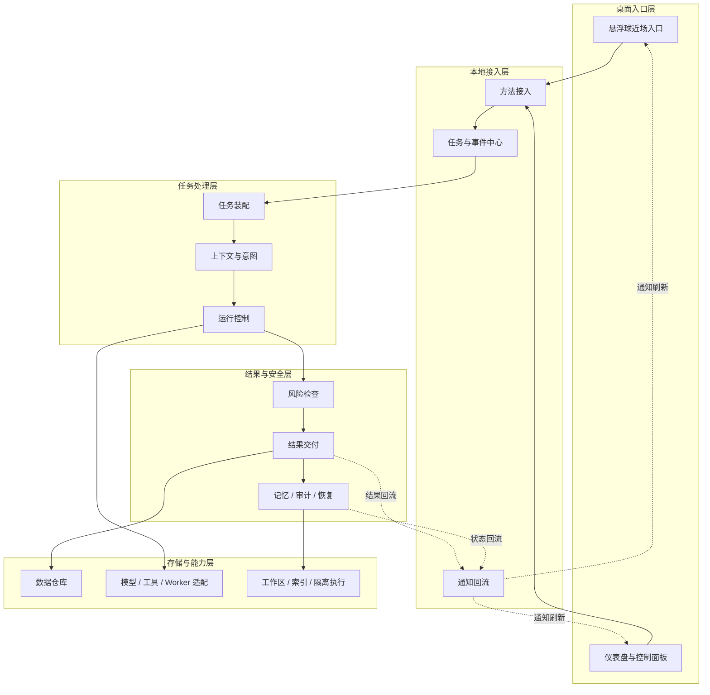

虚线表示 **状态、结果和待确认事项的回流路径**，不表示主执行链路。主执行链路始终从最上方的桌面入口层开始，向下依次经过本地接入层、任务处理层，最后到达结果与安全层；存储与能力层只承担支撑作用，不改变主阅读顺序。

### 分层总览

| 层 | 大模块 | 主要职责 | 边界 |
| --- | --- | --- | --- |
| 桌面入口层 | `悬浮球近场入口`、`仪表盘与控制面板` | 承接桌面现场动作、展示轻反馈、持续任务和设置入口 | 只消费正式对象，不直接触达数据库、模型、worker、Sandbox |
| 本地接入层 | `方法接入`、`任务与事件中心`、`通知回流` | 收口正式方法、锚定任务对象、推送事件通知 | 只做协议收口与对象回流，不承担任务规划和业务决策 |
| 任务处理层 | `任务装配`、`上下文与意图`、`运行控制` | 把输入变成正式任务，推进任务状态机和执行主链路 | 是唯一任务中枢，不直接把底层结果越层返回前端 |
| 结果与安全层 | `风险检查`、`结果交付`、`记忆 / 审计 / 恢复` | 负责授权、审查、正式交付、记忆沉淀、审计和恢复点 | 不自创业务任务，所有治理结果都必须回到正式对象链 |
| 存储与能力层 | `数据仓库`、`模型 / 工具 / Worker 适配`、`工作区 / 索引 / 隔离执行` | 负责持久化真源、模型与工具接入、平台抽象和执行隔离 | 不承担产品语义决策，不允许上层绕过它直接访问底层实现 |

### 总体结构说明

- **桌面入口层** 从悬浮球近场入口开始承接用户动作，在需要完整视图时再进入仪表盘和控制面板；
- **本地接入层** 负责把所有桌面请求收口成正式方法调用，并维护任务对象、事件通知和状态回流；
- **任务处理层** 负责把输入装配成正式 `task`，并完成上下文准备、意图判断和运行推进；
- **结果与安全层** 位于主链路末端，负责高风险动作确认、正式交付、记忆沉淀、审计记录和恢复点；
- **存储与能力层** 作为底层支撑，负责结构化真源、模型与工具接入、worker 调度、工作区文件和隔离执行后端。

### 层级联系

- 桌面入口层通过正式 `agent.*` 方法把请求送入本地接入层；
- 本地接入层把请求绑定到 `session / task / event` 主对象后，再交给任务处理层；
- 任务处理层向下调度结果与安全层，并按需调用存储与能力层；
- 结果与安全层把正式状态、正式交付和待授权对象回写给本地接入层，再回流到桌面入口层；
- 因此，系统阅读顺序与执行顺序保持一致：先入口，再接入，再处理，再交付与治理，最后落到存储与能力支撑。

### 分层约束

- 桌面入口层不能直接触达数据库、worker、模型 SDK、Sandbox 或文件系统；
- 本地接入层只做协议收口、对象锚定和事件回流，不承担任务规划和风险决策；
- 任务处理层是唯一正式任务中枢，worker / sidecar / plugin 不能自持 `task / run` 状态机；
- 结果与安全层必须能真正影响主链路，不能只是旁路做日志；
- 存储与能力层必须统一收口真源读写和外部能力调用，避免平台和执行细节污染业务层。

---

## 三、分层架构与模块展开

### 3.1 桌面入口层

#### 3.1.1 模块功能

桌面入口层负责把桌面上的语音、悬停输入、文本选中、文件拖拽、仪表盘查看和安全确认等动作收敛为统一输入，并把正式对象稳定回显给用户。当前项目里，这一层已经拆成多窗口与多入口，而不是单一页面。

#### 3.1.2 子模块图

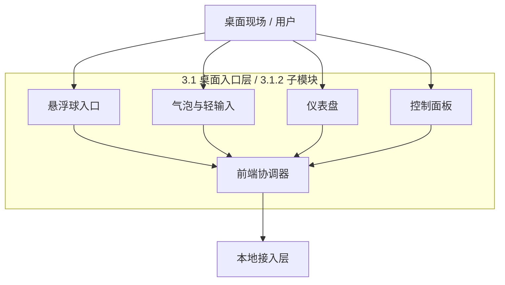

#### 3.1.3 子模块说明

- **悬浮球入口**：负责单击、双击、长按、拖拽吸附等近场交互，是当前桌面默认入口；
- **气泡与轻输入**：负责意图确认、短结果反馈、轻量补充输入和推荐提示；
- **仪表盘**：负责持续任务查看、任务详情、安全摘要、镜子信息和事项列表入口；
- **控制面板**：负责设置、策略开关、自动化规则和系统配置入口；
- **前端协调器**：负责把多个窗口和入口动作统一收敛成正式请求或正式视图刷新。

#### 3.1.4 主要边界

- 该层只承接交互与视图，不拥有正式执行真源；
- 前端局部状态不能覆盖 `task.status`、`approval.status` 等正式状态；
- 所有正式请求都必须通过本地接入层进入系统，不允许前端直调 worker、数据库或模型；
- 删除、置顶、隐藏、恢复等展示动作只属于表现态，不等于业务态删除或完成。

#### 3.1.5 关键接口

| 接口 | 输入 | 输出 | 说明 |
| --- | --- | --- | --- |
| `handleEntryAction()` | 单击、双击、长按、悬停、拖拽等动作 | 标准化入口事件 | 统一处理多入口动作归一化 |
| `captureTaskObject()` | 文本选区、文件、错误对象、页面信息 | 结构化输入对象 | 为正式任务发起准备上下文 |
| `openDashboard()` | 当前入口状态、目标视图 | 仪表盘或详情页展示指令 | 打开持续任务与系统视图 |
| `submitApprovalDecision()` | 用户确认结果、授权对象 ID | 正式确认请求 | 把人工授权回传到后端 |
| `dispatchViewUpdate()` | `task.updated / delivery.ready / approval.pending` | 视图刷新结果 | 把正式对象变化更新到界面 |

#### 3.1.6 输入与输出说明

- 输入主要来自鼠标手势、语音手势、拖拽、选中、托盘入口以及后端通知；
- 输出不是业务真源，而是两类结果：一类是发往本地接入层的正式请求，另一类是对悬浮球、气泡、仪表盘、控制面板的视图更新；
- 该层出现的 `bubble_message`、语音状态、窗口状态都只属于前端局部状态，不作为数据库真源。

#### 3.1.7 数据结构

这一层主要处理前端局部状态，因此数据结构以轻量视图态为主，不直接落数据库。

```ts
interface EntryViewState {
  activeView: 'shell_ball' | 'bubble' | 'dashboard' | 'control_panel'
  currentTaskId?: string
  pendingApprovalId?: string
}
```

字段说明：

| 字段 | 说明 |
| --- | --- |
| `activeView` | 当前激活的桌面入口视图，用于区分悬浮球、气泡、仪表盘或控制面板 |
| `currentTaskId` | 当前界面正在承接或展示的任务 ID |
| `pendingApprovalId` | 当前入口上需要用户处理的待确认授权对象 ID |

#### 3.1.8 层内协作时序图

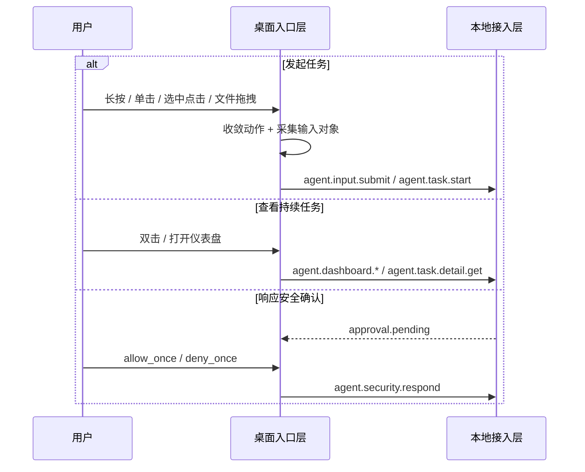

### 3.2 本地接入层

#### 3.2.1 模块功能

本地接入层是前端与后端之间唯一稳定边界，负责 JSON-RPC 方法承接、对象锚定、通知推送、列表与详情查询装配。当前项目里，这一层已经在 `services/local-service/internal/rpc` 中落成了基础服务端、方法处理器、Named Pipe 监听和测试骨架。

#### 3.2.2 子模块图

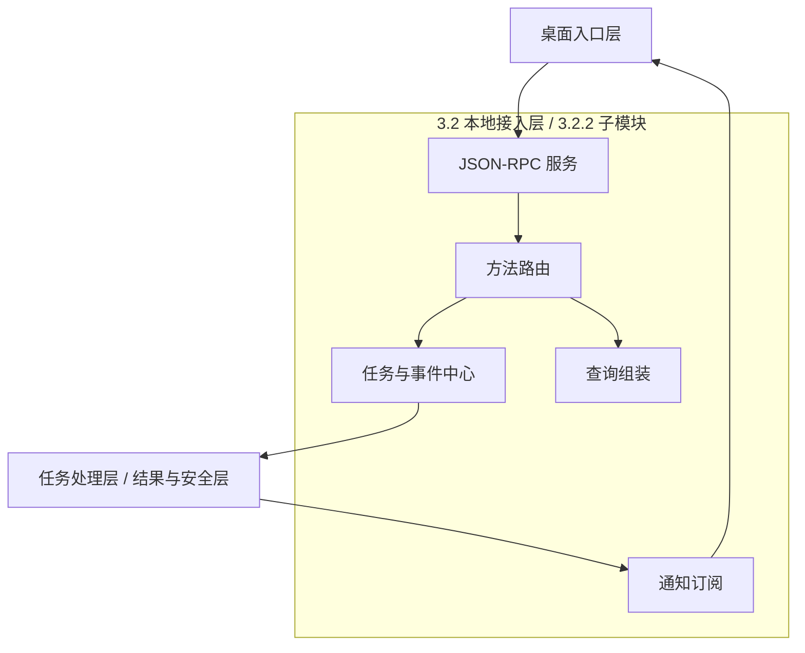

#### 3.2.3 子模块说明

- **JSON-RPC 服务**：负责接收请求、返回响应，并在调试态兼容 HTTP / SSE 入口；
- **方法路由**：负责把稳定的 `agent.*` 方法映射到后端主链路服务；
- **任务与事件中心**：负责请求对象锚定、`session / task / event` 绑定与状态回流；
- **查询组装**：负责把任务详情、仪表盘、安全摘要、镜子概览等结果装配为前端可消费对象；
- **通知订阅**：负责 `task.updated`、`delivery.ready`、`approval.pending` 等事件回流与订阅刷新。

#### 3.2.4 主要边界

- 该层只做协议收口、参数校验、对象分发和结果装配，不承担意图规划与业务决策；
- 所有正式方法、事件、状态枚举和错误码都必须以协议设计文档为准；
- Notification 只承担状态变化推送，不允许退化为隐藏命令通道；
- 前端不能直接暴露 `run / step / tool_call` 内部结构，必须通过 `task` 主对象体系收口。

#### 3.2.5 关键接口

本地接入层对前端暴露的是 **正式协议接口**，不是临时内部方法。接口除了名字，还需要明确其用途、输入和输出：

| 方法 | 用途 | 主要输入 | 主要输出 |
| --- | --- | --- | --- |
| `agent.input.submit` | 承接语音和轻量文本输入 | `session_id`、`source`、`trigger`、`input`、`context` | `task`、`bubble_message` |
| `agent.task.start` | 发起对象型任务 | `session_id`、`input`、`intent`、`delivery` | `task`、`bubble_message`、`delivery_result` |
| `agent.task.confirm` | 推进意图确认后的执行 | `task_id`、`confirmed`、`corrected_intent` | 更新后的 `task`、`bubble_message` |
| `agent.task.list` | 获取任务列表 | `group`、分页和排序参数 | `items`、`page` |
| `agent.task.detail.get` | 获取任务详情 | `task_id` | `task`、`timeline`、`artifacts`、`security_summary` |
| `agent.task.control` | 暂停、继续、取消、重启 | `task_id`、`action`、`arguments` | 更新后的 `task`、`bubble_message` |
| `agent.task_inspector.*` | 巡检配置和巡检执行 | 配置项、巡检来源、触发原因 | 配置快照、巡检摘要、建议 |
| `agent.notepad.*` | 事项列表与事项转任务 | 分组、事项 ID、确认标记 | `items` 或新建 `task` |
| `agent.dashboard.*` | 仪表盘首页与模块视图 | `focus_mode`、模块名、标签页 | 首页总览、模块数据 |
| `agent.mirror.overview.get` | 镜子和长期记忆概览 | `include` | 历史概要、日报、画像、记忆引用 |
| `agent.security.*` | 风险摘要和人工确认 | `approval_id`、`task_id`、分页参数、决策结果 | `approval_request`、`authorization_record`、`summary` |
| `agent.settings.*` | 控制面板配置读取与保存 | `scope`、设置项变更 | 设置快照、生效方式、是否需要重启 |

#### 3.2.6 输入与输出说明

通用输入约束：

- 所有正式请求统一遵循 JSON-RPC 2.0；
- `request_meta.trace_id` 用于端到端排查；
- `session_id`、`task_id`、`approval_id` 等对象 ID 必须与正式对象真源保持一致；
- 参数字段、状态枚举和错误码都必须来自协议设计文档，而不是前端自行扩展。

通用输出约束：

- 任务类接口统一返回 `task`，按需附带 `bubble_message`、`delivery_result`；
- 列表类接口统一返回 `items + page`；
- 安全类接口统一返回 `approval_request / authorization_record / audit_record / recovery_point` 相关对象；
- 查询类接口统一返回结构化视图结果，不让前端自行拼装底层对象；
- 通知类事件统一使用 `task.updated`、`delivery.ready`、`approval.pending` 等正式事件名。

#### 3.2.7 数据结构

这一层保存的是协议分发上下文和通知回流上下文，重点是对象锚定，而不是业务计算。

```ts
type RpcDispatchContext = {
  method: string
  sessionId?: string
  taskId?: string
  traceId: string
}
```

字段说明：

| 字段 | 说明 |
| --- | --- |
| `method` | 当前请求的方法名，用于进入对应的处理器和校验流程 |
| `sessionId` | 当前请求所属的会话 ID，便于把请求挂到正确上下文上 |
| `taskId` | 当前请求关联的任务 ID，便于状态更新和通知回流锚定 |
| `traceId` | 端到端跟踪 ID，用于排障、审计和通知关联 |

#### 3.2.8 层内协作时序图

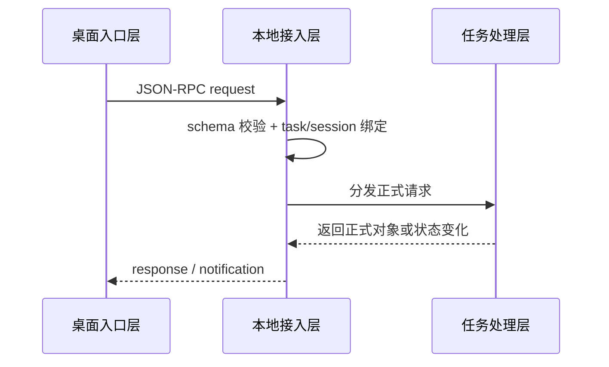

### 3.3 任务处理层

#### 3.3.1 模块功能

任务处理层负责把标准请求组织成正式 `task` 链路，完成任务装配、上下文准备、意图判断和运行推进。当前项目中，这一层的职责已经拆分在 `orchestrator`、`context`、`intent`、`runengine`、`recommendation`、`taskinspector` 等目录中。

#### 3.3.2 子模块图

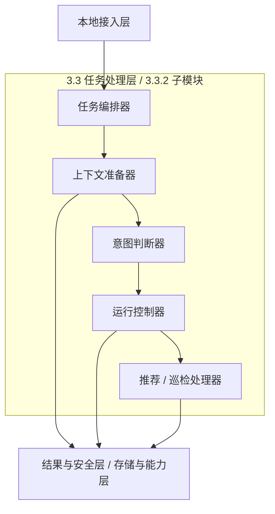

#### 3.3.3 子模块说明

- **任务编排器**：负责把接入层请求装配成正式 `task` 主链路输入；
- **上下文准备器**：负责收集页面、选区、文件、记忆命中、规则和预算信息；
- **意图判断器**：负责识别任务意图、路由 Blueprint / Prompt 方向和候选步骤骨架；
- **运行控制器**：负责维护 `task / run / step` 的状态推进和执行循环；
- **推荐 / 巡检处理器**：负责主动推荐机会判断、任务巡检和事项升级等辅助主链路逻辑。

#### 3.3.4 主要边界

- 该层是唯一正式任务中枢，worker / plugin / sidecar / subagent 不能自持 `task / run` 状态机；
- 对外产品对象统一围绕 `task` 组织，对内执行对象统一回流到 `run / step / event / tool_call`；
- 任务处理层只负责把任务推进起来，不单独拥有交付真源和治理真源；
- 所有能力调用结果都必须继续回流到正式对象链，而不是由调用者私自返回给前端。

#### 3.3.5 关键接口

| 接口 | 输入 | 输出 | 说明 |
| --- | --- | --- | --- |
| `startTask()` | 标准化任务请求 | `task`、`run` 初始骨架 | 创建正式任务 |
| `confirmIntent()` | `task_id`、确认结果、修正意图 | 更新后的 `task` | 推进确认后的执行 |
| `controlTask()` | `task_id`、控制动作 | 更新后的状态、事件 | 处理暂停、继续、取消、重启 |
| `inspectTodoSources()` | 巡检目录、规则、触发原因 | 巡检摘要、事项结果 | 支撑事项巡检链路 |
| `planRecommendation()` | 场景信号、上下文信息 | 推荐项、冷却结果 | 支撑推荐链路 |

#### 3.3.6 输入与输出说明

- 输入主要来自本地接入层的标准请求对象；
- 输出主要分为三类：正式任务对象、执行兼容对象、交给结果与安全层的治理 / 交付 / 记忆处理请求；
- 在这一层形成的 `task / run` 关系必须稳定，不能因为前端入口不同而改变主对象体系；
- 该层不直接面向前端返回最终结构，而是先经过结果与安全层处理后再回流。

#### 3.3.7 数据结构

这一层最核心的是任务运行包，它把对外 `task` 和对内 `run` 稳定绑定在一起。

```ts
type TaskRuntimeEnvelope = {
  taskId: string
  primaryRunId?: string
  status: string
  intentName?: string
}
```

字段说明：

| 字段 | 说明 |
| --- | --- |
| `taskId` | 对外任务主对象 ID，是任务处理层的主锚点 |
| `primaryRunId` | 对内执行兼容对象 ID，用于把 `task` 和 `run` 稳定映射起来 |
| `status` | 当前任务运行状态，用于推进状态机和后续治理链路 |
| `intentName` | 当前确认后的任务意图名称，便于执行和交付按意图路由 |

#### 3.3.8 层内协作时序图

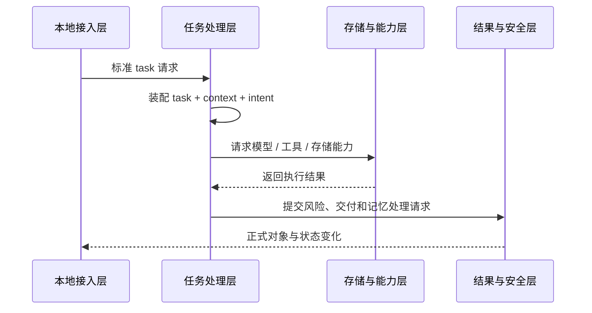

### 3.4 结果与安全层

#### 3.4.1 模块功能

结果与安全层负责把任务结果变成正式交付，同时守住高风险动作、长期记忆、审计和恢复闭环。当前项目中，这一层的职责已经拆分在 `risk`、`delivery`、`memory`、`audit`、`checkpoint` 等目录中。

#### 3.4.2 子模块图

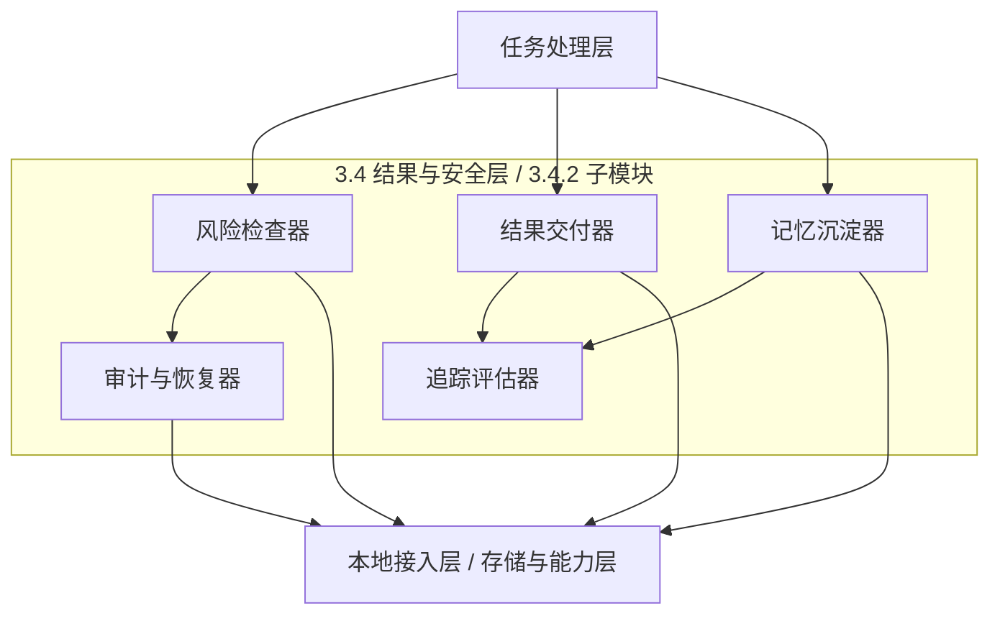

#### 3.4.3 子模块说明

- **风险检查器**：负责高风险动作判断、影响范围生成和待授权对象创建；
- **结果交付器**：负责把执行结果构造成正式 `delivery_result / artifact` 出口；
- **记忆沉淀器**：负责长期记忆候选筛选、召回命中和阶段摘要写入；
- **审计与恢复器**：负责 `audit_record`、`recovery_point`、回滚说明等治理对象；
- **追踪评估器**：负责 Trace / Eval、规则命中、成本和回放信息记录。

#### 3.4.4 主要边界

- 该层必须能真正影响主链路，而不是只做日志记录；
- 高风险动作必须先有待授权对象，再进入执行；
- 正式结果统一通过 `delivery_result / artifact` 发布，不允许工具结果直接越层交付；
- 记忆沉淀、审计记录、恢复点和 Trace / Eval 必须与 `task / run` 稳定关联。

#### 3.4.5 关键接口

| 接口 | 输入 | 输出 | 说明 |
| --- | --- | --- | --- |
| `evaluateRisk()` | 动作类型、目标范围、边界信息 | `risk_level`、`approval_request` | 控制高风险动作进入正式授权链 |
| `buildDelivery()` | 任务结果、结果类型、交付偏好 | `delivery_result`、`artifact` | 统一结果出口 |
| `persistMemory()` | 阶段摘要、记忆候选、引用信息 | `memory_summary`、`retrieval_hit` | 完成长短期记忆闭环 |
| `createRecoveryPoint()` | 高风险动作前状态 | `recovery_point` | 为回滚提供锚点 |
| `writeAuditRecord()` | 真实动作与执行结果 | `audit_record` | 保证审计留痕 |
| `recordTraceAndEval()` | 输入摘要、输出摘要、规则命中、成本 | `trace_record`、`eval_snapshot` | 支撑排障与评估 |

#### 3.4.6 输入与输出说明

- 输入主要来自任务处理层的执行结果、待执行动作和上下文摘要；
- 输出主要分为四类：正式交付对象、待授权对象、记忆对象、审计与恢复对象；
- 该层的对象必须继续回流到本地接入层，不能直接跳过协议边界触达前端；
- 该层不能直接创建新的业务任务，只能围绕已有 `task` 主链路做治理与交付。

#### 3.4.7 数据结构

这一层输出的是治理与交付对象，因此数据结构以“可回流的正式对象包”为主。

```ts
type GovernanceEnvelope = {
  approvalId?: string
  deliveryResultId?: string
  recoveryPointId?: string
  traceId?: string
}
```

字段说明：

| 字段 | 说明 |
| --- | --- |
| `approvalId` | 待授权动作对象 ID，用于连接风险确认链路 |
| `deliveryResultId` | 正式交付结果 ID，用于回流结果展示与打开入口 |
| `recoveryPointId` | 恢复点 ID，用于失败后恢复或回滚 |
| `traceId` | 本轮治理与交付追踪 ID，用于排障、评估和审计 |

#### 3.4.8 层内协作时序图

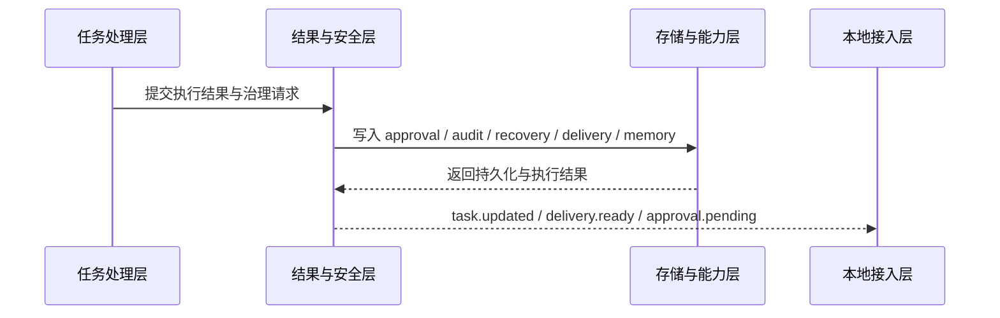

### 3.5 存储与能力层

#### 3.5.1 模块功能

存储与能力层负责真源持久化、模型与工具接入、平台抽象和执行隔离，是数据仓库 + 适配边界 + 本地后端的统一收口层。当前项目里，这一层已经拆出 `storage`、`model`、`tools`、`platform`、`plugin` 和 `workers/*` 等目录。

#### 3.5.2 子模块图

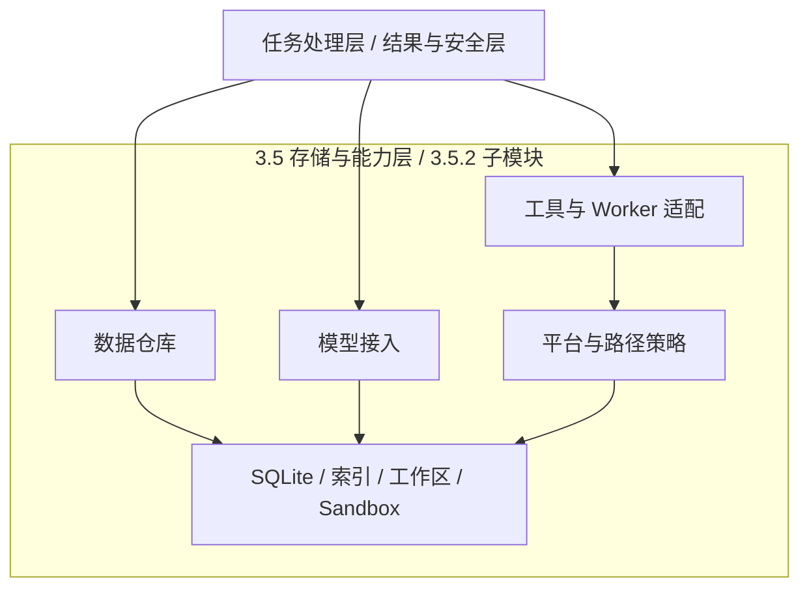

#### 3.5.3 子模块说明

- **数据仓库**：负责正式对象真源的读写和查询；
- **模型接入**：负责统一模型调用入口和模型参数封装；
- **工具与 Worker 适配**：负责工具调用、Playwright、OCR、媒体 worker 等能力桥接；
- **平台与路径策略**：负责文件系统、路径边界、系统能力和执行后端策略抽象；
- **SQLite / 索引 / 工作区 / Sandbox**：负责结构化存储、检索索引、工作区文件和隔离执行后端。

#### 3.5.4 主要边界

- 数据仓库是正式真源读写的唯一收口层，不允许业务模块、前端或 worker 绕过它直写 SQLite、Workspace 或 Artifact；
- 模型、工具、平台和执行后端都必须通过适配层进入，不承担产品语义决策；
- PathPolicy、ExecutionBackendAdapter、Stronghold 等边界能力必须在这一层统一执行，不能散落在业务代码中；
- 任何路径越界、半成功写入、格式解析失败和执行异常都必须能定位到具体对象并进入审计或恢复链路。

#### 3.5.5 关键接口

| 接口 | 输入 | 输出 | 说明 |
| --- | --- | --- | --- |
| `TaskRepository / RunEventRepository / DeliveryRepository / MemoryRepository` | 正式对象、查询条件 | 持久化结果、查询结果 | 负责 `task / run / delivery / memory` 真源 |
| `ModelAdapter` | 模型 ID、prompt、上下文、预算 | 模型输出、调用摘要 | 统一模型接入入口 |
| `ToolRouterAdapter` | 工具名、参数、执行上下文 | 标准化工具结果 | 统一工具和 worker 调度 |
| `ExecutionBackendAdapter` | 高风险执行请求、隔离策略 | 受控执行结果 | 对接 Sandbox 或其他执行后端 |
| `FileSystemAdapter / PathPolicy` | 文件路径、读写请求、边界策略 | 文件结果、边界判断结果 | 保证工作区与路径安全 |
| `SecretStoreAdapter` | 密钥或敏感配置操作请求 | 机密读写结果 | 隔离敏感配置 |

#### 3.5.6 输入与输出说明

- 输入主要来自任务处理层和结果与安全层的能力请求与持久化请求；
- 输出主要分为两类：正式对象读写结果，和标准化能力调用结果；
- 该层返回的是“受控结果”，不是直接给前端展示的临时数据；
- 所有输出都必须重新回到上层主链路，再由上层决定如何交付或治理。

#### 3.5.7 数据结构

这一层更关注落盘目标和能力调用目标，结构上以“对象类型 + 动作”来组织。

```ts
type RepositoryTarget = {
  objectType: string
  objectId: string
  action: 'insert' | 'update' | 'query'
}
```

字段说明：

| 字段 | 说明 |
| --- | --- |
| `objectType` | 当前要读写或查询的正式对象类型，如 `task`、`event`、`delivery_result` |
| `objectId` | 目标对象 ID，用于把仓储操作准确落到对应记录上 |
| `action` | 当前仓储动作类型，决定是新增、更新还是查询 |

#### 3.5.8 层内协作时序图

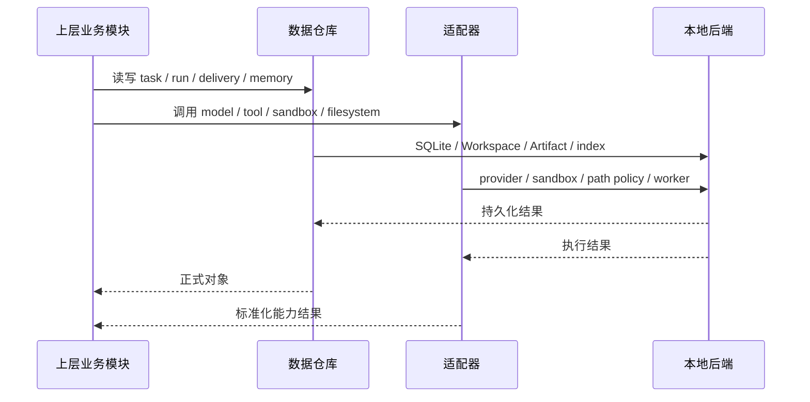

### 3.6 模块联动约束

- 桌面入口层只向本地接入层发起正式请求，不直接理解 `run / step` 细节；
- 本地接入层只负责方法分发和对象回流，不替代任务处理层进行任务决策；
- 任务处理层统一调度结果与安全层，以及存储与能力层，不能越过支撑边界直连 SQLite、Workspace、Sandbox 或 Provider SDK；
- 结果与安全层产生的交付、记忆、审计和恢复对象必须重新回到正式对象链，不能直接绕过本地接入层交付给前端；
- 核心功能模块设计中的每一条链路都必须映射回这五层模块结构。

---

## 四、核心功能模块设计

### 4.1 主动输入闭环模块

#### 功能实现图

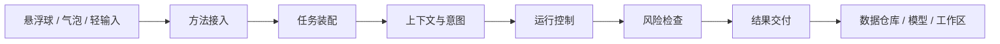

#### 模块介绍
该模块用于承接悬浮球长按语音、悬停输入、文本选中点击、文件拖拽与推荐点击等入口，把当前现场对象转为统一任务请求。设计目标是让用户在当前桌面现场完成对象识别、意图确认与轻量修正，而不是跳转到聊天窗口重新描述需求。

#### 模块定位
作为桌面现场的第一入口模块，负责把用户动作收敛为标准任务请求，并决定进入意图确认还是直接创建任务。

#### 职责
- 统一入口事件归一化；
- 识别输入对象与来源；
- 生成候选意图与确认气泡；
- 将确认结果推进到任务执行主链路；
- 将短结果、长结果和结构化结果分流到正式交付出口。

#### 核心功能
- 语音转写结果承接；
- 文本选中与文件拖拽对象识别；
- 候选意图生成与修正；
- 轻量反馈气泡与轻量输入区联动；
- 单击轻量接近、双击打开仪表盘、悬停轻量输入；
- 附加文件上传与可操作提示态承接。

#### 模块边界
- 不直接执行工具调用；
- 不直接决定高风险动作授权；
- 不直接维护运行态 `run / step / event`；
- 所有正式请求都通过 JSON-RPC 进入后端；
- 所有正式状态变化都回落到 `task` 主对象和正式交付对象。

#### 接口设计

| 方法 | 使用时机 | 主要输入 | 主要输出 |
| --- | --- | --- | --- |
| `agent.input.submit` | 长按语音提交、轻量文本提交 | `session_id`、`source`、`trigger`、`input`、`context`、`options` | `task`、`bubble_message` |
| `agent.task.start` | 文本选中、文件拖拽、错误对象承接 | `session_id`、`source`、`trigger`、`input`、`intent`、`delivery` | `task`、`bubble_message`、`delivery_result` |
| `agent.task.confirm` | 用户确认或修正意图后继续执行 | `task_id`、`confirmed`、`corrected_intent` | 更新后的 `task`、`bubble_message` |

这些方法共同组成主动输入闭环：先承接对象，再确认意图，最后推进正式执行。

#### 请求参数

```json
{
  "session_id": "sess_001",
  "source": "floating_ball",
  "trigger": "text_selected_click",
  "input": {
    "type": "text_selection",
    "text": "这里是用户选中的原文"
  },
  "options": {
    "confirm_required": true,
    "preferred_delivery": "bubble"
  }
}
```

#### 返回参数

```json
{
  "task": {
    "task_id": "task_001",
    "status": "confirming_intent",
    "intent": {
      "name": "summarize",
      "arguments": {
        "style": "key_points"
      }
    }
  },
  "bubble_message": {
    "type": "intent_confirm",
    "text": "你是想总结这段内容吗？"
  }
}
```

#### 参数说明

请求字段：

| 字段 | 说明 |
| --- | --- |
| `session_id` | 当前会话 ID，用于把本次输入挂到正式协作上下文上 |
| `source` | 请求来源，必须取自统一 `request_source` |
| `trigger` | 触发动作，必须取自统一 `request_trigger` |
| `input.type` | 输入对象类型，必须取自统一 `input_type` |
| `input.text` | 文本内容；当 `input.type` 为 `text` 或 `text_selection` 时使用 |
| `input.files` | 文件路径列表；当入口是拖拽文件时使用 |
| `options.confirm_required` | 是否先进入意图确认流程 |
| `options.preferred_delivery` | 偏好的正式交付方式 |

返回字段：

| 字段 | 说明 |
| --- | --- |
| `task.task_id` | 新建或更新后的任务 ID |
| `task.status` | 当前任务状态，通常先进入 `confirming_intent` 或 `processing` |
| `task.intent` | 当前识别出的意图及其参数 |
| `bubble_message.type` | 当前气泡类型，如 `intent_confirm`、`status`、`result` |
| `bubble_message.text` | 近场反馈文案，用于当前现场承接 |

#### 对应核心存储表

该模块从“现场输入”进入正式任务链路，因此它对应的核心存储重点是会话、任务、阶段步骤和执行兼容对象。

| 表 | 作用 | 关键字段 |
| --- | --- | --- |
| `sessions` | 记录输入归属的协作会话 | `session_id`、`title`、`status` |
| `tasks` | 记录正式任务主对象 | `task_id`、`session_id`、`status`、`request_source`、`request_trigger`、`primary_run_id` |
| `task_steps` | 记录面向前端展示的阶段步骤 | `task_step_id`、`task_id`、`name`、`status`、`order_index` |
| `runs` | 记录执行兼容主对象 | `run_id`、`task_id`、`status` |
| `events` | 记录主链路事件与状态回流依据 | `event_id`、`task_id`、`type`、`payload_json` |

#### 时序图

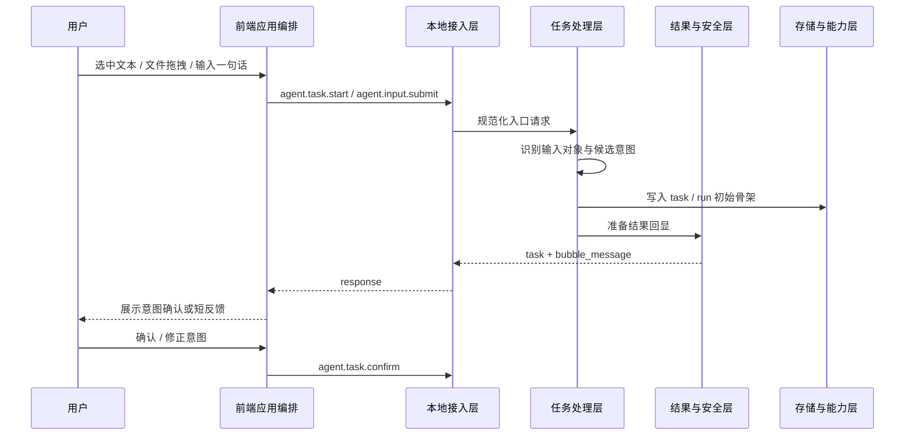

### 4.2 任务巡检转任务模块

#### 功能实现图

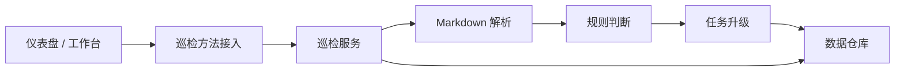

#### 模块介绍
该模块面向 Markdown 任务文件夹、周期巡检规则和桌面长期待办，把“未来安排”转为“正式任务”。设计目标是通过巡检把分散的便签、提醒和重复事项纳入统一 `task` 主链路。

#### 模块定位
作为长期待办与正式任务之间的桥接模块，负责事项解析、分类巡检与升级。

#### 职责
- 监听任务来源目录和巡检触发器；
- 解析 Markdown 任务项与重复规则；
- 分类为近期要做、后续安排、重复事项、已结束；
- 将确认需要 Agent 接手的事项转换为 `task`。

#### 核心功能
- 启动时巡检；
- 文件变化时巡检；
- 手动巡检；
- 便签项转任务。

#### 模块边界
- 不直接执行生成类任务；
- 不绕过 `agent.notepad.convert_to_task` 直接写 `task`；
- 不把巡检状态混入运行态 `run_status`；
- `TodoItem` 与 `Task` 必须严格分层。

#### 接口设计

| 方法 | 使用时机 | 主要输入 | 主要输出 |
| --- | --- | --- | --- |
| `agent.task_inspector.config.get` | 打开巡检设置时 | 无业务参数 | 当前巡检配置 |
| `agent.task_inspector.config.update` | 修改巡检设置时 | 巡检来源、频率、触发开关 | 生效后的配置 |
| `agent.task_inspector.run` | 用户手动点击立即巡检时 | `reason`、`target_sources` | `inspection_id`、`summary`、`suggestions` |
| `agent.notepad.list` | 查看事项桶时 | `group`、分页参数 | `items`、`page` |
| `agent.notepad.convert_to_task` | 把事项交给 Agent 处理时 | `item_id`、`confirmed` | 新建 `task` |

这里有两条接口链路：一条是“巡检配置 / 巡检执行”，另一条是“事项列表 / 事项转任务”。二者都服务于同一个长期待办到正式任务的升级过程。

#### 请求参数

```json
{
  "reason": "manual",
  "target_sources": ["D:/workspace/todos"]
}
```

#### 返回参数

```json
{
  "inspection_id": "insp_001",
  "summary": {
    "parsed_files": 3,
    "identified_items": 12,
    "due_today": 2,
    "overdue": 1,
    "stale": 3
  },
  "suggestions": [
    "优先处理今天到期的复盘邮件",
    "下周评审材料建议先生成草稿"
  ]
}
```

#### 参数说明

请求字段：

| 字段 | 适用方法 | 说明 |
| --- | --- | --- |
| `reason` | `agent.task_inspector.run` | 触发原因，如 `manual`、启动、文件变化 |
| `target_sources` | `agent.task_inspector.run` | 本次要巡检的来源目录列表，必须受工作区边界约束 |
| `task_sources` | `agent.task_inspector.config.update` | 持久化的巡检来源目录列表 |
| `inspection_interval` | `agent.task_inspector.config.update` | 巡检频率，通常由 `unit + value` 组成 |
| `group` | `agent.notepad.list` | 事项桶分组，取值必须来自统一 `todo_bucket` |
| `item_id` | `agent.notepad.convert_to_task` | 目标事项 ID |
| `confirmed` | `agent.notepad.convert_to_task` | 是否确认把事项升级为正式任务 |

返回字段：

| 字段 | 适用方法 | 说明 |
| --- | --- | --- |
| `inspection_id` | `agent.task_inspector.run` | 本次巡检唯一 ID |
| `summary.parsed_files` | `agent.task_inspector.run` | 本次解析的文件数量 |
| `summary.identified_items` | `agent.task_inspector.run` | 识别出的事项总数 |
| `summary.due_today / overdue / stale` | `agent.task_inspector.run` | 今日到期、已过期、长期未处理的事项数 |
| `suggestions` | `agent.task_inspector.run` | 本次巡检给出的后续建议列表 |
| `items` | `agent.notepad.list` | 当前分组下的事项列表 |
| `task` | `agent.notepad.convert_to_task` | 升级后的正式任务对象 |

#### 对应核心存储表

该模块的关键不在临时对象，而在于事项层和任务层必须分表存储、分链路推进。

| 表 | 作用 | 关键字段 |
| --- | --- | --- |
| `todo_items` | 存储尚未转成正式任务的事项 | `todo_item_id`、`bucket`、`status`、`source_path`、`linked_task_id` |
| `recurring_rules` | 存储周期规则和提醒策略 | `recurring_rule_id`、`todo_item_id`、`rule_type`、`reminder_strategy` |
| `tasks` | 存储升级后的正式任务 | `task_id`、`source_type`、`status` |
| `task_steps` | 存储升级后面向前端的阶段信息 | `task_step_id`、`task_id`、`name`、`status` |

#### 时序图

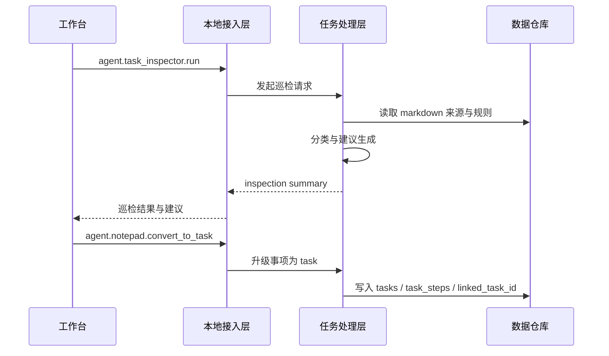


---

## 五、技术选型与实现路线

### 5.1 前端宿主与多窗口承接

当前桌面端采用 **Tauri 2 + React 18 + TypeScript + Vite**。这已经直接体现在当前仓库结构中：`apps/desktop` 下已经拆出 `shell-ball.html`、`shell-ball-bubble.html`、`shell-ball-input.html`、`dashboard.html`、`control-panel.html` 多入口页面，并在 `apps/desktop/src/features` 中对应拆出 `shell-ball`、`dashboard`、`control-panel` 功能目录。

选择这套组合的原因是：

- Tauri 2 适合桌面多窗口、托盘、窗口控制和本地能力桥接，能支撑悬浮球、气泡、仪表盘和控制面板这种多入口桌面形态；
- React 18 + TypeScript 适合快速组织复杂前端状态和多视图复用；
- Vite 对多入口页面和桌面联调足够轻，开发反馈快；
- 当前 `apps/desktop/package.json` 已落地 `@tauri-apps/api`、`react-router-dom`、`zustand`、`@tanstack/react-query`、`zod`、`tailwindcss` 等依赖，说明前端已按“多窗口 + 状态管理 + 查询缓存 + 类型校验”的方向构建。

因此，前端技术路线不是单页聊天 UI，而是 **桌面多窗口承接层**：

- `shell-ball` 负责近场主入口；
- `bubble / light input` 负责轻承接与短反馈；
- `dashboard` 负责持续任务、安全和镜子视图；
- `control-panel` 负责设置和策略配置；
- `src/platform`、`src/rpc`、`src/services`、`src/stores` 共同承担前端平台桥接、协议调用和状态收口。

### 5.2 本地服务与协议边界

后端采用 **Go 1.26 local-service + JSON-RPC 2.0 + 本地受控传输**。这一点在当前代码中已经非常明确：

- 根目录 `go.mod` 采用 Go 1.26；
- `services/local-service/internal/rpc` 已存在 `server.go`、`jsonrpc.go`、`handlers.go`、`namedpipe_windows.go`、`namedpipe_other.go`、`server_test.go`；
- `tmp-local-service.err.log` 已记录 `transport=named_pipe` 和调试态 `debug_http=:4317`，说明当前实现已经按“正式 Named Pipe + 调试 HTTP”双通路在跑；
- `handlers.go` 已把稳定方法组统一注册到 `agent.*` 路由上，说明本地接入层已经有明确收口点，而不是停留在概念图阶段。

选择 Go local-service 的原因是：

- 本地常驻服务更适合承担任务编排、状态机、风控、通知和多进程协调；
- Go 在本地服务、并发任务和受控 IPC 上更稳，适合做长期驻留的 Harness 中枢；
- JSON-RPC 2.0 能把方法、对象、错误码和通知统一收口，适合多窗口前端和本地 sidecar 并存的场景；
- 当前仓库已经拆出 `packages/protocol/rpc`、`types`、`schemas`、`errors`、`examples`，前后端共享协议真源路径已经比较清晰。

协议边界的当前落地方式是：

- 正式主链路优先使用 Windows Named Pipe；
- 调试阶段保留 `/rpc`、`/events`、`/events/stream` 这类 HTTP / SSE 入口用于联调与测试；
- Notification 在 RPC 层已有显式 draining 逻辑，`server_test.go` 也已经覆盖了 `approval.pending` 等通知行为。

### 5.3 数据、状态真源与本地检索

数据层选择 **SQLite + WAL + FTS5 + sqlite-vec + Workspace / Artifact 文件体系**。

这样选的原因是：

- CialloClaw 当前是 Windows 优先、本地优先的单机闭环产品，不需要先引入远端数据库和复杂基础设施；
- `task / run / event / delivery_result / approval_request / memory_summary` 这套对象需要稳定的结构化真源，SQLite 更适合承担这个角色；
- 长期记忆与本地 RAG 需要关键词检索和语义检索并存，因此 FTS5 与 sqlite-vec 组合更符合当前目标；
- 结果交付并不只是数据库字段，还包括工作区文档和正式产物，所以仍然要保留 Workspace / Artifact 文件体系。

当前代码侧的信号也支持这一路线：

- `go.mod` 已引入 `modernc.org/sqlite`；
- `services/local-service/internal/storage` 已独立拆出，说明数据访问层不是准备散落在业务代码里；
- 数据设计文档和协议文档已经把 `tasks / runs / events / delivery_results / artifacts / memory_*` 的对象关系冻结下来，适合继续接入真实数据仓库实现。

因此，本项目的数据实现路线是：

- 先冻结对象模型和数据仓库边界；
- 再把 SQLite 真源、索引层和 Workspace 交付连起来；
- 最后再做更完整的记忆检索、恢复点和审计闭环。

### 5.4 模型、工具、worker 与执行隔离

能力层采用 **模型适配 + 工具注册 + 独立 worker / sidecar + 执行隔离** 的组合方案。

当前仓库已经体现出这条路线：

- `services/local-service/internal/model`、`tools`、`plugin`、`platform`、`execution` 已经独立拆分；
- `workers/playwright-worker`、`workers/ocr-worker`、`workers/media-worker` 已作为三个独立目录存在；
- `go.mod` 已引入 `github.com/openai/openai-go`，说明模型接入方向已经落在官方 SDK 路线上；
- `internal/risk`、`checkpoint`、`audit`、`platform` 的存在，说明系统没有把工具调用当作无治理的旁路能力。

选择这种分离式能力结构的原因是：

- Playwright、OCR、媒体处理这类能力执行模型差异大，不适合全部塞进单一进程；
- 把模型、工具、worker、执行后端都放进适配边界，更容易做权限、路径、审计和降级；
- 高风险动作需要保留进入 Sandbox 或其他执行后端的空间，不能默认直接落在宿主机执行；
- 机密存储也必须独立出普通配置，避免令牌、Provider 配置和业务状态混放。

因此，本项目的能力接入选型不是“能跑通就行”，而是 **先拆边界，再补全实现**：

- 模型统一由模型接入层进入；
- 工具和 worker 统一由工具与 Worker 适配进入；
- 高风险动作保留隔离执行路径；
- 机密、路径和系统能力保留独立策略层，而不是散落在任务编排中。

### 5.5 协议真源与共享工程组织

当前工程采用 `pnpm-workspace.yaml` 管理 `apps/*`、`packages/*`、`workers/*`，这意味着桌面端、共享协议、共享 UI 和 worker 已经按 monorepo 方式组织。

这里的技术路线不是“先写实现，再补协议”，而是：

- `packages/protocol` 负责共享类型、方法、错误码、schema 和示例；
- `packages/ui` 负责共享前端基础组件；
- `apps/desktop` 负责桌面宿主和多窗口界面；
- `services/local-service` 负责本地服务和任务主链路；
- `workers/*` 负责浏览器自动化、OCR、媒体等独立能力进程。

这样组织的原因是：

- 协议真源、前端实现和后端实现可以同步演进，降低字段漂移风险；
- worker 能以独立目录和独立运行时存在，便于升级和隔离；
- 前端 UI 与协议模型不需要散落在单一工程中，利于多入口复用。

---

## 六、非功能要求与质量保证

### 6.1 性能目标

- 悬浮球常驻必须轻量；
- 主动协助默认低频、不强打扰；
- 高频状态变化优先用事件驱动与增量更新；
- 上下文预算必须前置分配，而不是等超限后再被动截断。

### 6.2 安全性如何保证

#### 6.2.1 分层隔离

- 前端不能直接触达数据库、worker、模型 SDK 和工具执行入口；
- 所有正式调用必须经过 JSON-RPC 边界，先做 schema 校验、方法约束和错误收口；
- worker / sidecar / plugin 不直接面对前端，必须经由 Go service 编排。

#### 6.2.2 风险治理内建

- 高风险动作必须先经过风险评估，再形成 `approval_request`，命中黄 / 红级风险时进入授权确认；
- 关键动作必须生成 `authorization_record`、`audit_record` 和 `recovery_point`；
- 工作区外写入、命令执行、外部消息发送等动作必须命中边界策略和命令白名单；
- 高风险执行优先进入 Docker Sandbox，而不是直接在宿主环境执行。

#### 6.2.3 数据与机密保护

- 密钥与敏感配置统一进入 Stronghold，不进入普通配置文件和业务代码；
- 运行态、记忆、Trace / Eval、前馈配置分层存储，避免敏感信息在错误位置落盘；
- 插件、技能、感知包和模型路由都必须有来源、版本和权限描述。

### 6.3 可靠性如何保证

#### 6.3.1 状态真源稳定

- 对外产品界面统一围绕 `task` 组织，对内保留 `run` 兼容执行模型，两者保持稳定映射；
- `task.status`、`todo.status`、`run_status` 严格分层，避免状态互相污染；
- 失败、中断、熔断、人工升级和回滚都必须回落到结构化对象链。

#### 6.3.2 主链路可恢复

- 关键步骤保存 checkpoint 和 recovery point；
- SQLite 使用 WAL，主链路写入要求原子化，避免半成功半失败状态；
- sidecar / worker / plugin 崩溃后必须可重连、可回收、可降级；
- 交付构建失败时要回退到保底交付出口，而不是让任务无结果结束。

#### 6.3.3 反馈闭环可回流

- Linter / CI、Test Harness、Agent Review、Hooks、Trace / Eval、Doom Loop 检测必须进入标准编排链路；
- 审查失败不能只留日志，必须能回流状态机、升级人工确认或进入失败说明；
- Notification / Subscription 负责持续任务刷新，确保任务详情、结果页和安全摘要同步一致。

### 6.4 扩展性如何保证

#### 6.4.1 扩展边界稳定

- 扩展能力以插件、技能、感知包和模型路由配置为边界；
- 扩展能力不能改变核心协议对象与主数据模型；
- 所有扩展能力必须通过 Go service 编排，而不是由前端直接调用。

#### 6.4.2 前馈资产版本化

- Skill、Blueprint、Prompt Template、架构约束和规则片段都必须版本化；
- 模型提供商、模型 ID、路由策略必须配置化，不允许散落在业务代码中；
- 扩展启停、来源、权限和运行状态都必须可追踪，以便审计、回放和问题定位。

#### 6.4.3 平台差异可替换

- 文件系统、路径、系统能力、执行后端都先抽象，再做 Windows 当前实现；
- 平台专属逻辑只能放在平台适配层，不能污染业务层和协议层；
- 当前优先 Windows，不代表写死 Windows：未来 Linux / macOS 通过相同抽象层进入。

### 6.5 当前未完全确定的问题与风险

- 当前桌面端已经拆成 `shell-ball`、`bubble`、`light input`、`dashboard`、`control-panel` 多入口页面，但多窗口共享状态和事件顺序在端到端联调里仍需要持续验证，否则容易出现局部视图和正式状态不同步；
- 当前 RPC 层同时保留 Named Pipe 正式链路和 debug HTTP / SSE 联调链路，方法响应和通知语义必须长期保持一致，否则不同联调路径会出现行为漂移；
- 当前 `handlers.go` 已完成稳定方法注册，`server_test.go` 也覆盖了部分通知与错误映射，但 `task -> run -> delivery -> audit -> recovery` 的完整持久化闭环仍需要继续做集成验证；
- 当前 `workers/playwright-worker`、`ocr-worker`、`media-worker` 目录已经存在，但 worker 协议、健康检查、失败回收与审计回写还需要结合真实执行链继续补强；
- 当前 `packages/protocol`、`internal/rpc`、`internal/orchestrator` 已分别存在协议真源和实现入口，后续若 schema、类型、示例与 handler 演进不同步，容易造成文档与实现漂移；
- 当前 Named Pipe 只在 Windows 下有正式实现，`namedpipe_other.go` 仍是非 Windows 占位实现，因此跨平台能力目前停留在抽象层，不是已经验证完成的运行能力。

---

## 七、结语

CialloClaw 应被定义为：

**一个以前后端分离为基本架构、以 Tauri 2 为 Windows 桌面宿主、以 React 18 + TypeScript + Vite 为前端、以 Go 1.26 Harness Service 为主业务后端、以本地 JSON-RPC 为统一接入边界、以 task-centric API 契约和 run-centric 执行内核双层模型、以数据仓库与适配边界为稳定支撑、以 SQLite + 本地 RAG 为数据基础的轻量桌面协作 Agent。**
