# CialloClaw 模块详细设计文档（v6）

## 1. 文档定位

本文档承接《设计补充说明》中原本属于“模块实现层”的内容，专门描述模块职责、接口、状态机、时序图、异常处理与联调边界。  
它不是架构总览，也不是协议真源，更不是数据表清单；它回答的是：

- 前端与后端各模块分别负责什么；
- 关键链路在模块层如何协同；
- 哪些状态属于前端局部状态，哪些属于正式业务状态；
- 哪些时序必须在联调时真实跑通；
- 模块输入、输出、依赖、失败路径和降级路径分别是什么；
- 模块之间如何通过正式对象、正式协议和正式状态衔接，而不是靠临时字段或局部约定拼接。

### 1.1 文档边界

本文档只处理“模块实现层”问题，具体包括：

- 模块定位、职责、输入、输出、依赖、异常处理；
- 关键交互链路、编排链路、治理链路和恢复链路的时序；
- 前端局部状态机与后端正式状态之间的映射边界；
- 关键模块之间的联调顺序与验收点。

以下内容不作为本文档真源：

- JSON-RPC 方法、请求响应 schema、状态枚举、错误码真源：以协议设计文档为准；
- 表结构、字段、索引、DDL、对象落表关系：以数据设计文档为准；
- 系统总体分层、平台取舍、NFR 总体定义：以架构设计文档和架构总览文档为准；
- 团队优先级和排期责任：以分工安排和优先级划分文档为准。

### 1.2 阅读顺序

建议按以下顺序阅读本文档：

1. 先看第 2 章，建立前后端模块分层认识；
2. 再看第 3 章和第 4 章，理解前后端各模块的职责和边界；
3. 再看第 5 章，理解前馈决策与反馈闭环如何跨模块工作；
4. 再看第 6 章和第 7 章，理解关键链路时序、状态机与职责落地；
5. 最后结合协议设计文档与数据设计文档，确认方法、对象和表结构真源。

---

## 2. 模块分层总览

### 2.1 前端模块总览

- 前端工程与桌面宿主
- 表现层模块
- 应用编排层模块
- 状态管理与查询层模块
- 前端服务层模块
- 平台集成与协议适配层模块

### 2.2 后端模块总览

- 接口接入层模块
- Harness 内核层模块
- 能力接入层模块
- 治理与反馈层模块
- 平台与执行适配层模块

### 2.3 模块间协作总原则

1. **前端只承接交互与视图，不拥有正式执行真源**  
   前端可以拥有局部状态机，但不能自行发明正式业务状态，也不能绕过协议层改变后端状态。

2. **后端 Harness 是唯一编排中枢**  
   Context Manager、Intent、Skill / Blueprint、Prompt、RunEngine、Memory、Delivery、Hooks、Review、Trace 等都必须回到 Harness 主链路，而不是由前端、worker 或插件各自分散协调。

3. **能力接入层只提供能力，不持有主业务状态**  
   模型、工具、Playwright、OCR、LSP、RAG 只提供标准输入输出，不能自持 task/run 状态机。

4. **治理与反馈层不等于外围附属，而是主链路一部分**  
   风险评估、授权、审查、Trace、熔断、恢复、预算控制必须能影响主链路，不只是做日志记录。

5. **平台层必须抽象，不得反向污染业务层**  
   文件、路径、通知、快捷键、执行后端等能力必须经抽象层暴露，业务层不能依赖具体平台实现名和平台路径。

---

## 2.4 系统总体方案与协议边界补充

本节仅作为进入具体模块设计前的总览桥接，用于说明前端、后端、协议边界和平台能力之间的协作前提；详细模块图、分层职责、具体流程图与功能链路，以下文章节为准。

### 2.4.1 总体方案

CialloClaw 采用 **“前端桌面承接层 + JSON-RPC 协议边界 + 后端 Harness 编排层”** 的总体方案：

- 前端负责桌面交互承接、状态呈现与结果展示；
- 后端负责任务运行、能力编排、治理与数据闭环；
- 两者之间唯一稳定边界为 **JSON-RPC 2.0**；
- worker / sidecar / plugin 不直接面对前端，统一经过 Go service 编排；
- 正式接口、正式对象、正式错误码与正式状态都必须以统一协议资产为真源。

### 2.4.2 协议边界约束

- 前端不得直接 import Go 服务内部实现；
- worker 不得被前端直接调用，必须经过 Go service 编排；
- 所有正式联调接口都必须登记到 `/packages/protocol/rpc`；
- 所有类型定义必须登记到 `/packages/protocol/types` 与 `/packages/protocol/schemas`；
- 所有错误必须回落到统一 `100xxxx` 错误码体系。

### 2.4.3 阅读提示

- 第 3 章负责前端模块边界、前端承接链与前端架构图；
- 第 4 章负责后端 Harness 分层、后端总览图与各后端模块设计；
- 第 5 章负责系统级核心流程图与流程语义；
- 第 6 章负责按功能模块组织的具体实现、接口、状态与异常路径。

## 3. 前端模块设计

### 3.0 前端系统总览图

下面采用架构总览文档 v15 的前端系统总览图，作为本章具体模块展开前的统一视图。它强调的是“用户—桌面宿主—表现与交互层—应用编排层—状态与服务层—平台与协议层”的承接关系；后续 3.1 ~ 3.6 再分别展开每一层的职责、接口、状态边界和异常处理。

### 3.2 前端系统总览图

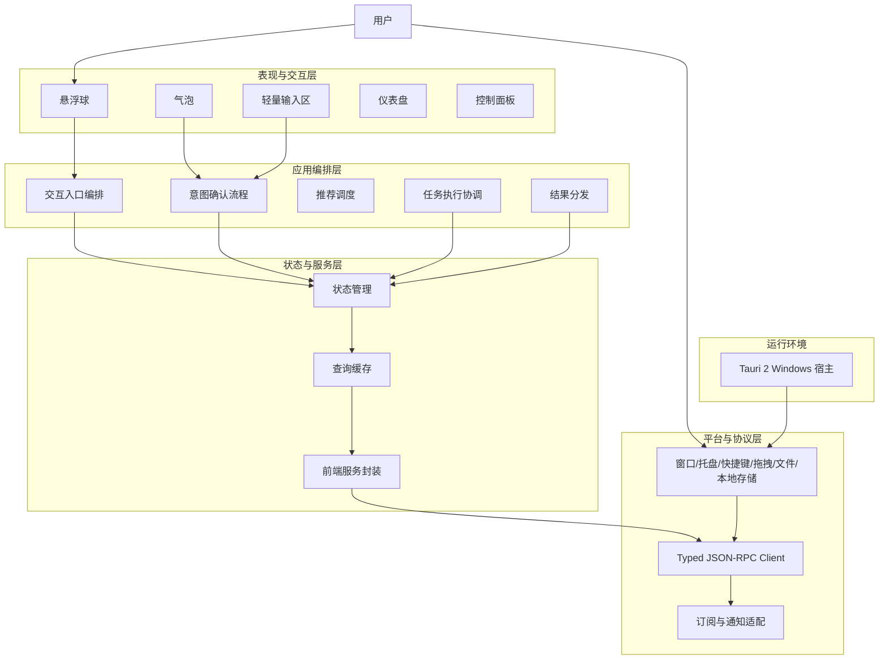
```mermaid
flowchart TB
    U[用户]

    subgraph ENV[运行环境]
        direction LR
        TAURI[Tauri 2 Windows 宿主]
    end

    subgraph P1[表现与交互层]
        direction LR
        FB[悬浮球]
        BUBBLE[气泡]
        INPUT[轻量输入区]
        DASH[仪表盘]
        PANEL[控制面板]
    end

    subgraph P2[应用编排层]
        direction LR
        ENTRY[交互入口编排]
        CONFIRM[意图确认流程]
        RECOMMEND[推荐调度]
        COORD[任务执行协调]
        DISPATCH[结果分发]
    end

    subgraph P3[状态与服务层]
        direction LR
        STATE[状态管理]
        QUERY[查询缓存]
        SERVICE[前端服务封装]
    end

    subgraph P4[平台与协议层]
        direction LR
        RPC[Typed JSON-RPC Client]
        SUB[订阅与通知适配]
        PLATFORM[窗口/托盘/快捷键/拖拽/文件/本地存储]
    end

    U --> FB
    U --> PLATFORM
    TAURI --> PLATFORM
    FB --> ENTRY
    BUBBLE --> CONFIRM
    INPUT --> CONFIRM
    ENTRY --> STATE
    CONFIRM --> STATE
    COORD --> STATE
    DISPATCH --> STATE
    STATE --> QUERY
    QUERY --> SERVICE
    SERVICE --> RPC
    RPC --> SUB
    PLATFORM --> RPC
```

### 3.0.1 图示说明

- **运行环境**：Tauri 2 Windows 宿主负责多窗口、托盘、快捷键、通知和本地平台能力承载。
- **表现与交互层**：悬浮球、气泡、轻量输入区、仪表盘和控制面板负责用户直接可见的交互呈现。
- **应用编排层**：负责把单击、双击、长按、悬停、文本选中、文件拖拽等动作收敛为统一承接动作，并串起意图确认、推荐调度、执行协调与结果分发。
- **状态与服务层**：负责前端局部状态、查询缓存和服务封装，不承担后端正式状态真源。
- **平台与协议层**：负责 Typed JSON-RPC Client、事件订阅适配和窗口 / 托盘 / 快捷键 / 拖拽 / 文件 / 本地存储等平台桥接。

## 3.1 前端工程与桌面宿主

### 模块定位
该模块负责承载 Tauri 2 Windows 宿主、多窗口入口和应用生命周期，是所有前端交互窗口的运行基础，不直接承担业务推理与任务编排。

### 职责
- 承载 Tauri 2 Windows 宿主；
- 管理多窗口：悬浮球、仪表盘、控制面板；
- 统一前端入口分包与生命周期控制；
- 为托盘、通知、快捷键、更新提供宿主桥接。

### 核心能力
- 应用启动、唤起、最小化、恢复、退出；
- 多入口分包：`shell-ball`、`dashboard`、`control-panel`；
- 托盘、通知、快捷键、更新等宿主能力接入；
- 崩溃后窗口状态恢复与上次布局恢复。

### 输入
- Tauri 生命周期事件；
- 平台插件事件；
- 本地持久化配置；
- 自动启动和恢复策略配置。

### 输出
- 前端多窗口运行环境；
- 提供给平台集成层的窗口句柄和生命周期信号；
- 提供给状态管理层的启动上下文与宿主能力可用性。

### 依赖
- Tauri 2；
- 平台集成与协议适配层；
- 本地存储；
- 设置快照。

### 关键接口
- `app.bootstrap()`：应用冷启动入口；
- `windowManager.open(windowName)`：打开指定窗口；
- `windowManager.restoreLastLayout()`：恢复最近布局；
- `appLifecycle.onResume / onSuspend / onQuit`：生命周期桥接。

### 状态与边界
- 宿主层只负责窗口和插件生命周期，不管理业务态；
- 不得在宿主层直接构建 `task`、`delivery_result` 等对象；
- 多窗口共享业务状态必须回到状态管理层，不得在窗口进程内各自缓存真源。

### 异常处理
- 宿主启动失败：进入只显示错误页或托盘提示的降级态；
- 窗口恢复失败：回退到默认布局并记录日志；
- 平台插件不可用：降级为纯窗口模式，不阻断主链路；
- 更新器异常：提示后续手动更新，不影响主流程。

### 联调重点
- 冷启动是否能恢复最近状态；
- 多窗口是否互不污染状态；
- 托盘和主窗口是否存在重复实例；
- 最小化、隐藏、恢复、置顶等行为是否一致。

---

## 3.2 表现层模块

### 模块定位
该模块负责把状态和结果直接呈现给用户，不承担协议拼装、对象建模和业务执行决策。

### 职责
- 负责悬浮球、气泡、轻量输入区、仪表盘界面、结果承接界面、控制面板界面的直接显示；
- 保持近场交互低打扰、短反馈和结果可承接；
- 根据前端局部状态机渲染不同提示态。

### 核心能力
- 悬浮球控制器：拖拽、贴边、大小与透明度；
- 气泡控制器：意图判断展示、短结果展示、生命周期管理、置顶与恢复；
- 轻量输入区：一句话补充、确认/修正、附件补充、快捷动作入口；
- 仪表盘界面：任务状态、便签协作、镜子模块、安全卫士、插件面板；
- 结果承接界面：结果页、文档打开提示、文件结果提示、任务详情入口；
- 控制面板界面：设置项配置、行为开关、记忆策略、自动化规则、成本与数据治理、密钥与模型配置。

### 输入
- 悬浮球状态、气泡状态、轻量输入状态；
- 任务详情、交付结果、安全摘要、镜子概览；
- 平台事件：拖拽、托盘、文件打开反馈；
- 前端服务层返回的视图模型。

### 输出
- 用户可见的近场反馈；
- 用户下一步动作入口；
- 视觉状态提示，不直接写业务主状态；
- 表现层事件：点击、双击、长按、悬停、删除、恢复、置顶、打开详情等。

### 关键接口
- `renderShellBall(viewState)`：渲染悬浮球；
- `renderBubble(bubbleVM)`：渲染气泡；
- `renderLightInput(inputVM)`：渲染轻量输入区；
- `renderDashboard(dashboardVM)`：渲染仪表盘；
- `renderControlPanel(settingsVM)`：渲染控制面板。

### 状态与边界
- 不直接调用后端；
- 不定义正式协议字段；
- 不修改 `task_status` 等正式业务状态；
- 只能消费应用编排层和状态层提供的数据；
- “隐藏 / 置顶 / 删除 / 恢复”属于表现态，不等同于业务删除和业务完成。

### 异常处理
- 数据缺失时使用占位视图；
- 交付失败时展示待确认或异常提示，而不是自造业务对象；
- 多窗口切换时保持状态只读，不自行重置任务链路；
- 渲染失败时保底显示纯文本提示，不中断后续操作。

### 联调重点
- 气泡和结果页是否严格区分“轻量承接”和“正式交付”；
- 删除/恢复/置顶等表现动作是否不会污染正式任务状态；
- 长结果分流是否只改变交付出口，不改变主任务对象；
- 安全待确认时是否能在表现层正确给出确认入口。

---

## 3.3 应用编排层模块

### 模块定位
该模块负责把用户动作编排成标准任务请求，并把后端返回结果分流到气泡、结果页、任务详情或仪表盘。

### 职责
- 把前端输入动作编排为可提交给后端的任务请求；
- 统一承接单击、双击、长按、悬停、文本选中、文件拖拽等入口；
- 管理意图确认、推荐调度、任务发起与结果分发。

### 核心能力
- 交互入口编排：统一处理单击、双击、长按、悬停、文本选中、文件拖拽；
- 意图确认流程：对象识别后的候选意图组织、输出方式建议、修正与确认；
- 推荐调度：推荐触发条件、冷却时间、用户活跃度与当前上下文判断；
- 任务发起与执行协调：轻量任务、持续任务、授权等待、暂停与恢复；
- 结果分发：短结果、长文档、网页结果、单文件、多文件、连续任务等多出口交付。

### 输入
- 表现层的用户动作；
- 状态管理层中的当前任务对象和上下文摘要；
- 前端服务层返回的任务、推荐和设置数据。

### 输出
- 标准化的 RPC 请求；
- 对表现层的渲染指令；
- 对状态层的局部状态更新；
- 对平台层的窗口或系统动作请求。

### 关键接口
- `handleClickShellBall()`
- `handleDoubleClickShellBall()`
- `handleLongPressVoiceStart() / handleVoiceCommit() / handleVoiceCancel()`
- `handleHoverRecommendation()`
- `handleTaskObjectStart(inputObject)`
- `handleIntentConfirm(confirmPayload)`
- `dispatchResult(deliveryResult, artifacts)`

### 状态与边界
- 不直接操作 Tauri 原生 API；
- 不直接解析数据库对象；
- 不跳过前端服务层直连协议层；
- 所有正式请求均走 Typed JSON-RPC Client；
- 一次交互动作只能产出一个标准任务请求或一个前端局部状态变化，不能同时写两套状态源。

### 异常处理
- 意图识别失败：回退到确认气泡，允许用户修正；
- 推荐失败：静默降级，不阻断悬停或点击动作；
- 结果分流失败：保底回退到气泡交付或任务详情入口；
- 当前任务对象失效：撤销编排，回到可唤起或待机态；
- 双击和单击冲突：以编排层统一防抖/判定策略为准。

### 联调重点
- 单击/双击/长按手势冲突；
- 轻量交付与正式交付的分流条件；
- 推荐冷却和悬停场景不要误触发；
- 长按中断补充是否能正确进入二次编排。

---

## 3.4 状态管理与查询层模块

### 模块定位
该模块负责承接前端局部状态机、查询缓存和后端订阅回写，是前端“本地反应层”。

### 职责
- 承接前端本地状态、查询缓存和订阅结果；
- 区分前端局部状态与正式异步数据；
- 防止表现层和应用编排层重复维护状态。

### 局部状态
- 悬浮球状态：待机、可唤起、承接中、意图确认中、处理中、等待确认、完成、异常；
- 气泡状态：数量限制、所属任务、透明化、隐藏、消散、恢复、置顶；
- 轻量输入状态：输入内容、附件、提交态、禁用态；
- 当前任务对象状态：文本、文件、语音上下文、悬停上下文等对象摘要与有效性；
- 意图确认状态：系统猜测意图、用户修正意图、候选输出方式、确认进度；
- 语音状态：收音、锁定通话、取消、打断、响应中；
- 仪表盘状态与控制面板状态：当前模块、焦点区、筛选项、未保存修改。

### 正式异步数据
- 任务列表；
- 任务详情；
- 记忆命中；
- 安全待确认项；
- 插件运行态。

### 输入
- 前端服务层请求结果；
- Notification / Subscription 推送；
- 表现层和应用编排层局部状态变更。

### 输出
- 给表现层的渲染数据；
- 给应用编排层的上下文与冷却信息；
- 给平台层的窗口和通知刷新依据；
- 给查询层的失效与重新拉取信号。

### 关键接口
- `shellBallStore`
- `bubbleStore`
- `inputStore`
- `taskObjectStore`
- `intentConfirmStore`
- `voiceStore`
- `dashboardStore`
- `queryCache.syncTask(task)`
- `eventReducer.apply(notification)`

### 约束
- 局部状态不可直接映射为正式协议状态；
- 对后端推送的 `task.updated` 等事件必须以 `task_id` 为锚点回写；
- 不允许在 store 中自造与协议冲突的字段；
- 局部状态机必须能在页面刷新或窗口切换后恢复到可解释状态；
- 查询缓存不应承担唯一真源角色。

### 异常处理
- 推送重复到达：按 `task_id + updated_at` 或事件顺序去重；
- 本地缓存失效：回退到重新拉取；
- 异步数据与局部状态冲突：以正式业务对象为准，局部状态做弱回滚；
- 多窗口竞争刷新：采用单源 store 或事件总线顺序写入。

### 联调重点
- 前端状态图和后端正式状态是否严格分层；
- 订阅风暴时是否能稳态更新；
- 多窗口共享状态是否一致；
- 前端任务状态图是否能映射到真实任务对象的变化，而不是自成体系。

---

## 3.5 前端服务层模块

### 模块定位
该模块负责把应用编排层的业务意图翻译成具体服务调用，是“前端业务能力封装层”。

### 核心服务
- 上下文服务：获取当前任务现场上下文、悬停/选中/当前界面相关输入；
- 任务服务：发起任务、查询任务状态、获取任务步骤、历史任务与任务详情；
- 推荐服务：推荐内容、推荐问题、候选动作请求；
- 语音服务：长按语音、锁定通话、语音结果提交与回传；
- 文件服务：文件解析、附件处理、结果文件查询、工作区文件打开；
- 记忆服务：镜子摘要、用户画像、近期记忆命中读取；
- 安全服务：待确认操作、风险等级、审计记录、恢复点与授权提交；
- 设置服务：设置读取、保存、校验与默认值回填。

### 输入
- 应用编排层的结构化需求；
- 协议客户端、平台集成层；本地存储仅用于前端草稿、窗口布局和面板状态缓存。

### 输出
- 标准业务对象；
- 错误码和弱提醒；
- 对状态层的可消费结果；
- 可供表现层消费的视图模型。

### 关键接口
- `contextService.captureCurrentContext()`
- `taskService.startTask() / confirmTask() / getTaskDetail() / controlTask()`
- `recommendationService.getRecommendations()`
- `voiceService.submitVoiceInput()`
- `fileService.parseDroppedFile() / openArtifact()`
- `memoryService.getMirrorOverview()`
- `securityService.getPendingApprovals() / respondApproval()`
- `settingsService.getSnapshot() / updateSettings()`

### 边界
- 不直接访问数据库；
- 不直接读取 Go 内部结构体；
- 正式设置快照只能通过 `agent.settings.get / agent.settings.update` 读取和更新；
- 只能通过协议和平台适配层访问系统能力；
- 返回值必须对齐正式对象模型，不得额外夹带隐式字段给表现层做依赖。

### 异常处理
- RPC 超时：返回可重试错误，不直接吞掉；
- 文件读取失败：保留对象上下文但降级为无文件摘要；
- 设置保存失败：不覆盖前端草稿态；
- 安全授权失败：必须把待确认对象留在前端可见区；
- 语音提交失败：保留收音摘要并允许用户重试或改文本输入。

### 联调重点
- 不同服务返回对象是否完全对齐协议文档；
- 服务层是否屏蔽了平台实现细节；
- 推荐、记忆、安全等服务是否能够失败降级但不打断主链路；
- 文件、语音、上下文和任务服务是否能拼成一条标准任务输入链。

---

## 3.6 平台集成与协议适配层模块

### 模块定位
该模块负责把前端世界与桌面平台能力、协议传输层连接起来，是“前端最底层的系统桥接层”。

### 核心能力
- Typed JSON-RPC Client：统一 method、params、result、错误模型和订阅注册；
- Windows Named Pipe 连接适配：负责主前后端本地 IPC 建链、重连、权限与错误处理；
- 订阅与通知适配：`task.updated`、`delivery.ready`、`approval.pending`、`plugin.updated` 等事件桥接；
- 窗口集成：悬浮球窗口、仪表盘窗口、控制面板窗口的打开、关闭、显隐、聚焦、置顶；
- 托盘集成：托盘图标、托盘菜单、托盘级快捷入口；
- 快捷键集成：全局快捷键注册、释放与冲突处理；
- 拖拽集成：桌面文件拖入、原生 DragEvent 桥接、应用内拖拽协同；
- 文件系统集成：打开文件、打开文件夹、高亮结果文件、读取本地文件元信息；
- 本地存储集成：前端草稿缓存、偏好镜像、面板状态记忆；正式设置真源仍通过 `agent.settings.*` 维护；
- 外部能力集成：浏览器打开、剪贴板桥接和其他 Tauri 插件统一接入。

### 输入
- 上层请求；
- Tauri 插件回调；
- Named Pipe / IPC 消息。

### 输出
- 标准协议调用结果；
- 事件流；
- 文件、窗口、通知等系统动作结果。

### 关键接口
- `rpcClient.call(method, params)`
- `rpcClient.subscribe(eventName, handler)`
- `pipeTransport.connect() / reconnect()`
- `windowBridge.open(name, options)`
- `trayBridge.registerMenu()`
- `shortcutBridge.register(shortcut)`
- `fileBridge.open(path) / reveal(path)`

### 边界
- 不持有业务真源；
- 不解释 task/run 语义；
- 只负责传输、系统能力和平台动作适配。

### 异常处理
- IPC 断开：自动重连并向状态层发出降级信号；
- 插件异常：记录并切换为功能关闭态；
- 打开文件/浏览器失败：回退为仅展示路径或交付结果文本；
- 权限不足：返回正式错误并触发安全提示。

### 联调重点
- Named Pipe 建链、断链、重连的体验；
- 多窗口与托盘协同；
- 通知事件和查询请求之间是否顺序一致；
- 本地打开文件、显示文件夹、高亮产物是否符合桌面体验。

---

## 3.7 产品功能域与模块承接映射

本节从产品承接视角补充模块实现层设计。它不替代后续模块分层，而是回答系统到底面向哪些用户动作与产品域提供能力，以及这些能力在前后端模块中分别由谁承接。

### 3.7.1 入口与轻量承接域

系统默认以悬浮球为近场入口，以气泡和轻量输入区作为任务承接层，而不是以聊天页作为主入口。该功能域负责把语音、悬停输入、文本选中、文件拖拽和推荐点击统一转为任务请求，并在当前现场完成对象识别、意图确认、短结果返回和下一步分流。

核心入口包括：

- 左键单击：轻量接近或承接当前对象
- 左键双击：打开仪表盘
- 左键长按：语音主入口，上滑锁定、下滑取消
- 鼠标悬停：显示轻量输入与主动推荐
- 文件拖拽：解析文件后进入意图确认
- 文本选中：进入可操作提示态，再进入意图确认

对应模块分工：
- 前端表现层负责入口可见形态；
- 应用编排层负责统一动作归一化；
- 状态管理层负责轻承接局部状态；
- 后端接口接入层与 Harness 内核负责把对象升级为正式 task 请求。

### 3.7.2 任务状态与持续追踪域

该功能域负责承接“已经被 Agent 接手并正在推进”的工作，使用户能够在仪表盘中查看任务头部、步骤时间线、关键上下文、成果区、信任摘要与操作区。任务状态域面向的是用户可见进度，而不是内核态 `run / step` 的实现细节。

其核心结构包括：

- 任务头部：名称、来源、状态、开始时间、更新时间
- 步骤时间线：已完成、进行中、未开始
- 关键上下文：资料、记忆摘要、规则约束
- 成果区：草稿、文件、网页、模板、清单
- 信任摘要：风险状态、待授权数、恢复点、边界触发
- 操作区：暂停、继续、取消、修改、重启、查看安全详情

对应模块分工：
- 前端仪表盘与结果承接界面负责视图组织；
- 状态管理层负责 `task` 与局部视图态映射；
- 后端任务状态机、交付内核、治理层负责真实状态推进。

### 3.7.3 便签巡检与事项转任务域

该功能域面向未来安排和长期待办，不直接等同于执行中任务。它负责监听任务文件夹、解析 Markdown 任务项、识别日期与规则、做巡检提醒，并在需要时把事项升级为正式 `task`。根据统一模型约束，`TodoItem` 与 `Task` 必须分层：前者表示未来安排 / 巡检事项，后者表示已进入执行。

分类结构包括：

- 近期要做
- 后续安排
- 重复事项
- 已结束事项

底层能力包括：

- 指定 `.md` 任务文件夹监听
- Markdown 任务项识别
- 日期、优先级、状态、标签提取
- 巡检频率、变更即巡检、启动时巡检
- 到期提醒、长时间未处理提醒
- 下一步动作建议、打开资料、生成草稿

对应模块分工：
- 前端工作台负责呈现事项桶与转任务入口；
- 后端巡检服务、规则引擎和 `agent.notepad.convert_to_task` 负责正式升级。

当前 owner-5 底座约束：

- `notes` 详情补强优先复用现有 `TodoItem / RecurringRule` 数据来源，不新增独立底座对象名；
- 详情补强字段（如 `note_text`、`prerequisite`、`planned_at`、`ended_at`、`related_resources`）先在后端运行态与后续存储扩展层准备，不直接绕过协议暴露；
- 重复事项补强字段（如 `repeat_rule_text`、`next_occurrence_at`、`recent_instance_status`、`effective_scope`、`recurring_enabled`）属于规则引擎与巡检底座职责；
- complete / cancel / restore / toggle-recurring / delete 等事项动作，先由 owner-5 提供真实状态变更底座，再由 4 号冻结正式 RPC 面；
- “打开相关资料”先由 owner-5 提供资源归一化与目标类型判断底座，是否进入稳定 open RPC 由 4 号统一收口。

### 3.7.4 镜子记忆与长期协作域

镜子不是聊天记录页，而是长期协作的认知层，用于沉淀短期记忆、长期记忆和镜子总结。该功能域与运行态状态机严格分层，长期记忆支持本地 RAG 检索，但写入与检索都必须通过 Memory 内核统一接入。

三层结构为：

1. 短期记忆：支撑连续任务理解
2. 长期记忆：偏好、习惯、阶段性信息沉淀
3. 镜子总结：日报、阶段总结、用户画像显性展示

设计约束：

- 默认本地存储，可一键开关
- 长期记忆与运行态恢复状态分离
- 用户可见、可管理、可删除
- 周期总结和画像更新受操作面板配置控制

### 3.7.5 安全卫士与恢复治理域

该功能域是用户可感知的治理外显层，对应后端风险评估、授权确认、审计、恢复点与回滚能力。其职责不是重新实现治理逻辑，而是把绿/黄/红三级风险、待确认动作、影响范围、恢复点和中断操作清晰暴露给用户。

主要能力包括：

- 工作区边界控制
- 风险分级
- 授权确认
- 影响范围展示
- 一键中断
- 恢复与回滚
- Token 与费用治理
- 审计日志
- Docker 沙盒执行策略接入

### 3.7.6 操作面板与系统配置域

操作面板是系统配置中心，不承接任务，不替代仪表盘。它承担通用设置、外观与桌面入口、记忆、任务与自动化、数据与日志、模型与密钥等系统级配置职责，是桌面宿主与本地 Harness 行为约束的显式入口。

主入口为托盘右键，信息架构分为：

- 通用设置
- 外观与桌面入口
- 记忆
- 任务与自动化
- 数据与日志
- 模型与密钥
- 关于

### 3.7.7 扩展能力中心与多模型配置域

该功能域用于承接产品的成长性能力，不面向普通用户暴露复杂底层实现，而是在基础闭环稳定后，为进阶用户提供可扩展的插件、技能和模型能力。它对应原子功能中的“多生态插件、多模型配置、感知包扩展、兼容社区 Skills 生态”，同时受统一规范约束：插件必须通过 Go service 编排，模型接入必须通过统一 SDK 接入层与配置入口进入，不允许直接散落在业务逻辑中。

主要能力包括：

- 多生态插件：通过 Manifest + 独立 Worker + 本地 IPC / JSON-RPC 扩展感知、处理和交付能力。
- 感知包扩展：允许按办公、开发、娱乐等场景加载不同感知包，但必须走统一权限、边界和审计链路。
- 社区 Skills 兼容：支持安装经过验证的 Skills 资产，来源可包括 GitHub 等外部仓库，但安装和启用需受版本、权限和工作区策略控制。
- 多模型配置：支持提供商切换、模型 ID 切换、本地模型接入和不同能力使用不同模型策略。
- 工具路由与边界策略：允许针对不同插件、技能和模型配置不同的工具权限、执行边界和成本策略。

设计约束：

- 插件与技能不直接面向前端开放调用，必须通过 `/services/local-service` 统一编排。
- 模型切换不改变 `task / run / delivery_result` 等核心协议对象。
- 插件、技能、模型配置都必须有版本、来源与权限描述，以便进入审计和 Trace。

### 3.7.8 上下文感知与主动协助域

该功能域用于把“当前桌面发生了什么”和“此刻是否应该帮忙”转为可计算的输入信号，对应原子功能中的复制行为感知、屏幕/页面感知、行为与机会识别、主动推荐触发规则等能力。它并不直接替代任务入口，而是为入口承接、推荐系统和 Context Manager 提供更稳定的任务对象来源。

主要能力包括：

- 复制行为感知：识别复制、粘贴、选中等行为是否形成协作机会。
- 屏幕与页面感知：读取当前页面标题、窗口、选区、剪贴板、可视区域和停留状态。
- 行为与机会识别：基于停留、切换、重复失败、错误出现等信号，判断是否触发轻提示。
- 主动推荐触发规则：定义什么场景允许推荐、什么场景必须静默、是否存在冷却时间与置信度阈值。
- 特定对象扩展：为错误对象、文件对象、文本对象和后续的视频对象预留统一接入形态。

设计约束：

- 强意图优先于弱信号，用户显式触发必须覆盖主动推荐。
- 复制、停留、切换等弱信号默认保守处理，不得变成高频打扰源。
- 感知信号只能作为输入候选，正式执行仍需经过意图确认、风险治理和交付内核。

## 4. 后端模块设计

### 4.0 后端 Harness 总览图

下面采用架构总览文档 v15 的后端 Harness 总览图作为本章统一总览。和第 2 章的桥接说明不同，这里保留完整 Mermaid 图，用来说明后端主编排关系、能力接入、治理反馈以及数据与平台支撑关系。后续 4.1 ~ 4.5 再分别展开每层的接口、职责、输入输出、边界与异常处理。

### 3.3 后端 Harness 总览图

为保证正文可读性，本节拆成四张图：第一张突出 Harness 主编排关系，后面三张分别说明能力接入、治理反馈、数据与平台支撑关系。四张图合起来等价于原 3.3 的完整架构表达。

#### 3.3.1 后端 Harness 主编排图

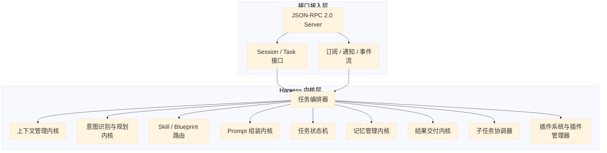
```mermaid
%%{init: {'theme': 'base', 'themeVariables': { 'fontSize': '26px'}}}%%
flowchart TB
    subgraph B1[接口接入层]
        direction LR
        JRPCS[JSON-RPC 2.0 Server]
        SESSION[Session / Task 接口]
        STREAM[订阅 / 通知 / 事件流]
    end

    subgraph B2[Harness 内核层]
        direction LR
        ORCH[任务编排器]
        CTXM[上下文管理内核]
        INTENT[意图识别与规划内核]
        SKILL[Skill / Blueprint 路由]
        PROMPT[Prompt 组装内核]
        TASK[任务状态机]
        MEMORY[记忆管理内核]
        DELIVERY[结果交付内核]
        SUBAGENT[子任务协调器]
        PLUGIN[插件系统与插件管理器]
    end

    JRPCS --> SESSION
    JRPCS --> STREAM
    SESSION --> ORCH
    STREAM --> ORCH

    ORCH --> CTXM
    ORCH --> INTENT
    ORCH --> SKILL
    ORCH --> PROMPT
    ORCH --> TASK
    ORCH --> MEMORY
    ORCH --> DELIVERY
    ORCH --> SUBAGENT
    ORCH --> PLUGIN
```

#### 3.3.2 后端 Harness 能力接入图

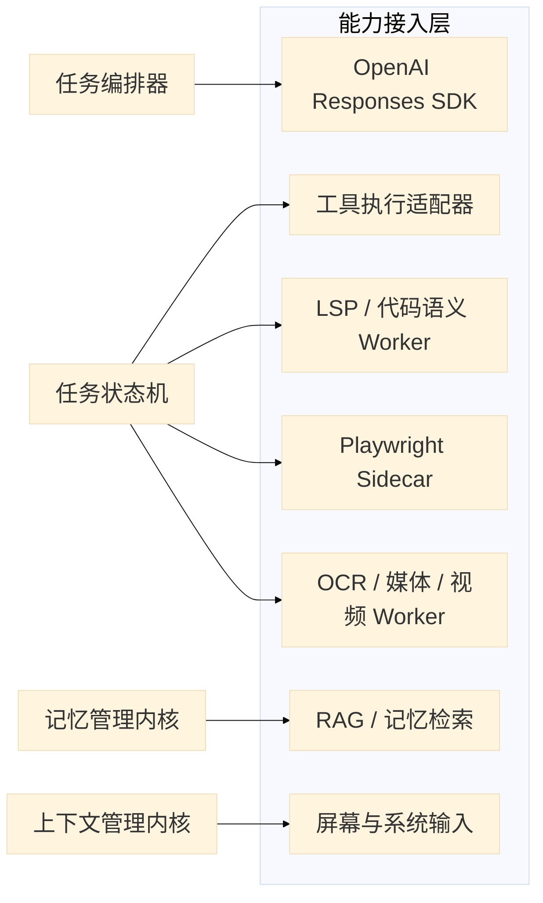
```mermaid
%%{init: {'theme': 'base', 'themeVariables': { 'fontSize': '26px'}}}%%
flowchart LR
    ORCH[任务编排器]
    TASK[任务状态机]
    MEMORY[记忆管理内核]
    CTXM[上下文管理内核]

    subgraph B3[能力接入层]
        direction TB
        MODEL[OpenAI Responses SDK]
        TOOL[工具执行适配器]
        LSP[LSP / 代码语义 Worker]
        NODEPW[Playwright Sidecar]
        OCR[OCR / 媒体 / 视频 Worker]
        RAG[RAG / 记忆检索]
        SENSE[屏幕与系统输入]
    end

    ORCH --> MODEL
    TASK --> TOOL
    TASK --> LSP
    TASK --> NODEPW
    TASK --> OCR
    MEMORY --> RAG
    CTXM --> SENSE
```

#### 3.3.3 后端 Harness 治理与反馈图

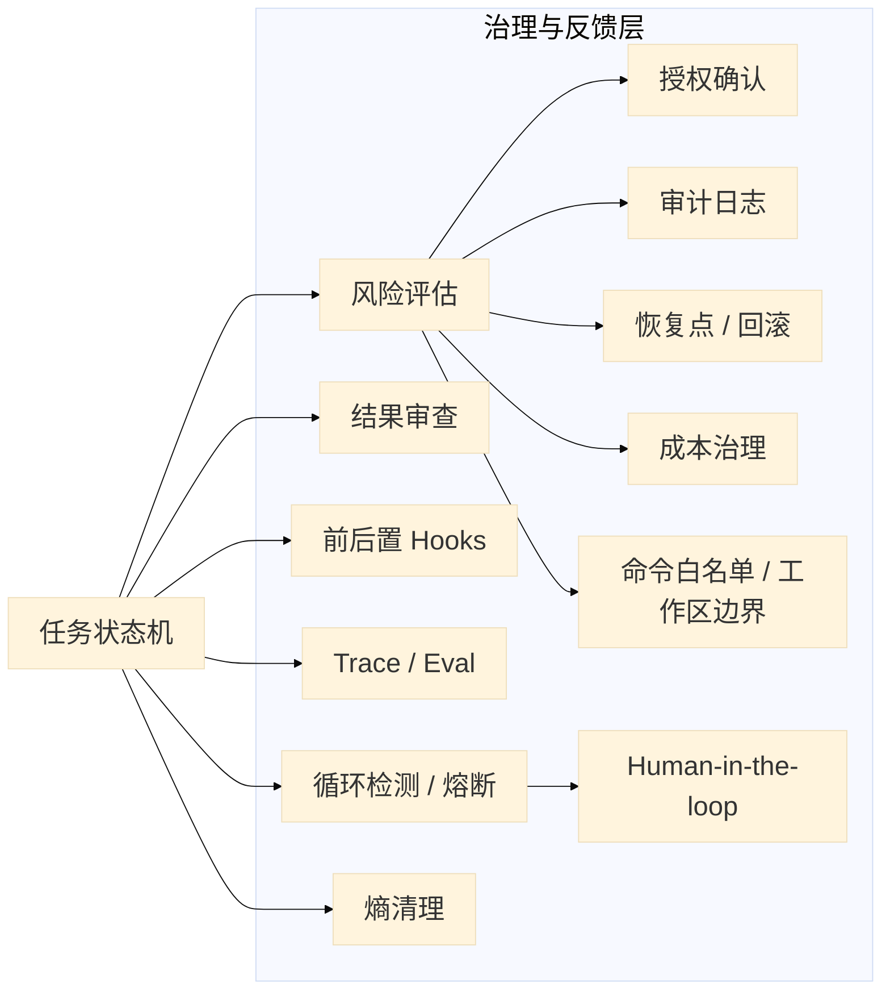
```mermaid
%%{init: {'theme': 'base', 'themeVariables': { 'fontSize': '26px'}}}%%
flowchart LR
    TASK[任务状态机]

    subgraph B4[治理与反馈层]
        direction TB
        SAFE[风险评估]
        APPROVAL[授权确认]
        REVIEW[结果审查]
        HOOKS[前后置 Hooks]
        TRACE[Trace / Eval]
        LOOP[循环检测 / 熔断]
        CLEANUP[熵清理]
        AUDIT[审计日志]
        SNAP[恢复点 / 回滚]
        BUDGET[成本治理]
        POLICY[命令白名单 / 工作区边界]
        HITL[Human-in-the-loop]
    end

    TASK --> SAFE
    TASK --> REVIEW
    TASK --> HOOKS
    TASK --> TRACE
    TASK --> LOOP
    TASK --> CLEANUP
    SAFE --> APPROVAL
    SAFE --> AUDIT
    SAFE --> SNAP
    SAFE --> BUDGET
    SAFE --> POLICY
    LOOP --> HITL
```

#### 3.3.4 后端 Harness 数据与平台支撑图

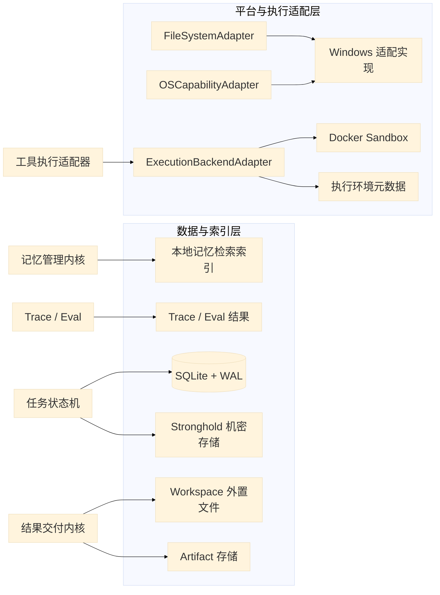
```mermaid
%%{init: {'theme': 'base', 'themeVariables': { 'fontSize': '26px'}}}%%
flowchart LR
    TASK[任务状态机]
    MEMORY[记忆管理内核]
    DELIVERY[结果交付内核]
    TRACE[Trace / Eval]
    TOOL[工具执行适配器]

    subgraph B5[数据与索引层]
        direction TB
        SQLITE[(SQLite + WAL)]
        VSTORE[本地记忆检索索引]
        TRACEDB[Trace / Eval 结果]
        WORKSPACE[Workspace 外置文件]
        ARTIFACT[Artifact 存储]
        SECRET[Stronghold 机密存储]
    end

    subgraph B6[平台与执行适配层]
        direction TB
        FSABS[FileSystemAdapter]
        OSABS[OSCapabilityAdapter]
        EXECABS[ExecutionBackendAdapter]
        DOCKER[Docker Sandbox]
        EXECMETA[执行环境元数据]
        WIN[Windows 适配实现]
    end

    TASK --> SQLITE
    MEMORY --> VSTORE
    TRACE --> TRACEDB
    DELIVERY --> WORKSPACE
    DELIVERY --> ARTIFACT
    TASK --> SECRET

    TOOL --> EXECABS
    FSABS --> WIN
    OSABS --> WIN
    EXECABS --> DOCKER
    EXECABS --> EXECMETA
```

### 4.0.1 图示说明

- **主编排图**强调接口接入层如何把请求与事件流送入 Harness 内核，以及任务编排器如何协调上下文、意图、Skill / Blueprint、Prompt、状态机、记忆、交付、子任务和插件。
- **能力接入图**强调模型、工具、LSP、Playwright、OCR / 媒体 / 视频、RAG 和感知输入都属于能力层，由 Harness 按需调度，而不是自持主业务状态。
- **治理与反馈图**强调风险评估、授权确认、结果审查、Hooks、Trace / Eval、Doom Loop、Entropy Cleanup、审计、恢复点、预算治理和 HITL 都是标准主链路组成部分。
- **数据与平台支撑图**强调运行态、索引、Artifact、Workspace、机密存储和执行适配层之间的支撑关系，防止业务逻辑直接下沉到平台实现或存储细节。

## 4.1 接口接入层模块

### 模块定位
接口接入层负责承接 JSON-RPC 请求、输出正式对象和标准错误，是前端与后端之间唯一稳定边界的实现层。

### 组成
- JSON-RPC 2.0 Server
- Session / Task 接口
- 订阅 / 通知 / 事件流

### 职责
- 解析请求；
- 校验结构；
- 分发到内核或治理模块；
- 向前端返回正式对象和标准错误结构；
- 管理 Notification / Subscription 的注册与推送。

### 输入
- 前端 JSON-RPC 请求；
- 后端事件流；
- 治理层和交付层输出的正式对象。

### 输出
- 标准 JSON-RPC 成功响应和错误响应；
- 通知事件和订阅流。

### 关键接口
- `handleRequest(jsonrpcRequest)`
- `publishNotification(method, params)`
- `registerSubscription(topic, subscriber)`
- `marshalResult(data, meta, warnings)`
- `marshalError(code, message, traceId)`

### 边界
- 不负责业务规划；
- 不负责模型调用；
- 不负责数据库写入；
- 只做协议收口、参数校验、错误包装和事件推送。

### 异常处理
- 非法方法：返回统一协议错误码；
- 参数不合法：走 schema 校验错误；
- 内核异常：包装成正式错误结构，不透传临时栈信息；
- 订阅方断开：回收订阅资源，不阻断主运行对象。

### 联调重点
- `task_id` 是否贯穿请求、推送、交付；
- Notification 是否只承担状态变化而不变成新命令通道；
- 长任务订阅是否和查询接口一致；
- 错误码和 `trace_id` 是否总能回传。

---

## 4.2 Harness 内核层模块

### 模块定位
Harness 内核层负责真正的任务运行、前馈决策、执行循环和正式交付，是系统的“主编排层”。

### 组成
- 任务编排内核
- 上下文管理内核
- 意图识别与规划内核
- Skill / Blueprint 路由内核
- Prompt 组装内核
- 任务状态机
- 记忆管理内核
- 结果交付内核
- 子任务协调器
- 插件系统与插件管理器

### 说明
- `task` 是对外主对象；
- `run / step / event / tool_call` 是执行兼容对象；
- 子任务协调器负责上下文隔离，不等同于普通 worker。

### 输入
- 接口接入层的任务请求；
- 上下文来源、记忆召回、技能与模板命中；
- 能力接入层返回的工具和模型结果；
- 治理与反馈层返回的审查、授权、熔断、恢复结论。

### 输出
- `task / bubble_message / delivery_result / artifact`；
- `run / step / event / tool_call`；
- 给治理层、数据层和接口层的标准化对象。

### 关键接口
- `orchestrator.startTask()`
- `orchestrator.confirmIntent()`
- `orchestrator.resumeAfterApproval()`
- `runEngine.advance()`
- `deliveryEngine.buildDeliveryResult()`
- `memoryEngine.injectAndPersist()`
- `pluginManager.dispatchPluginTask()`

### 边界
- 内核层可以调用能力接入层和治理层，但不能反向依赖平台具体实现；
- 内核层中只有统一对象模型，没有页面视角对象模型；
- 所有 worker、插件、子任务输出必须包装成标准对象链回流。

### 异常处理
- 前馈不收敛：进入澄清或低风险降级路径；
- 执行失败：交由状态机、恢复和反馈层处理；
- 子任务失败：只影响当前子链路，不直接污染主任务对象；
- 交付构建失败：回退到保底交付出口并记录失败上下文。

### 联调重点
- `task` 与 `run` 是否稳定映射；
- 前馈决策是否在关键调用前执行，而不是只在任务开始时执行一次；
- 反馈结果是否能重新进入编排循环；
- worker / plugin / subagent 输出是否全部回到了统一对象链。

### 4.2.1 任务编排内核

#### 模块定位
任务编排内核是主链路总调度器，负责协调任务从创建到完成的全过程。

#### 职责
- 任务创建；
- 子步骤拆解；
- 状态迁移；
- 执行重试；
- 人工确认转移；
- 事件写入；
- 协调前馈层、执行层和反馈层的调用顺序。

#### 输入
- 标准任务请求；
- 当前上下文；
- 风险判定；
- 工具和模型结果。

#### 输出
- `task` 主对象；
- `run / step / event`；
- 对交付层和治理层的过程信号。

#### 异常处理
- 编排失败：写入失败事件并退出到失败态；
- 规划与执行冲突：回退到意图确认或 HITL；
- 重试上限超出：交由 Doom Loop 和状态机处理。

### 4.2.2 上下文管理内核

#### 模块定位
Context Manager 负责在每次关键模型调用前组装 context window，决定注入什么、裁剪什么。

#### 职责
- 当前窗口上下文；
- 选中文本；
- 拖入文件；
- 用户授权的屏幕媒体输入；
- 剪贴板；
- 任务文件变化；
- 多来源上下文归一化；
- token 预算裁剪；
- 历史上下文摘要继承；
- 当前任务、工具描述、历史摘要与规则片段注入。

#### 输入
- 前端对象上下文；
- 文件和页面上下文；
- 记忆摘要；
- AGENTS 规则与 Prompt 模板；
- LSP 与诊断信息。

#### 输出
- 用于关键模型调用的 context window；
- Trace 中的上下文裁剪记录；
- 给意图规划内核的结构化上下文摘要。

#### 异常处理
- 输入源缺失：降级为最小上下文；
- token 预算超限：优先裁剪历史与低权重片段；
- 记忆召回失败：保留主上下文，不中断编排。

### 4.2.3 意图识别与规划内核

#### 模块定位
意图识别与规划内核负责把输入转成“可执行的计划骨架”。

#### 职责
- 输入归一化；
- 意图分类；
- 执行动作候选生成；
- 前置确认信息组织；
- 短链路澄清问题生成；
- 执行步骤拆解；
- 依赖关系组织；
- 验证方式与回滚计划生成。

#### 输出
- 当前意图；
- Blueprint 候选；
- 规划步骤；
- 用户确认所需信息。

#### 异常处理
- 低置信度：进入确认或澄清；
- 高风险规划：预先请求治理层介入。

### 4.2.4 Skill / Blueprint 路由内核

#### 模块定位
该模块负责在执行前选择合适的可复用知识和计划模板。

#### 职责
- Skill 注册表管理；
- Skill 版本选择；
- Blueprint 选择与装配；
- 面向常见任务的流程模板复用；
- 任务类型与执行骨架映射；
- few-shot / Prompt 片段按任务类型绑定。

#### 输出
- Skill 命中记录；
- Blueprint 选择结果；
- 前馈层命中 Trace。

### 4.2.5 Prompt 组装内核

#### 模块定位
该模块负责把角色、工具、约束、上下文、规则和模板拼成可执行 Prompt。

#### 职责
- 角色定义模块；
- 工具说明模块；
- 任务约束模块；
- 输出格式模块；
- 架构规则与 AGENTS 片段注入；
- 当前任务上下文与历史摘要拼装；
- Prompt 模板版本记录与命中追踪。

#### 异常处理
- 模板缺失：回退到默认模板并记录 Trace；
- 上下文过长：交由 Context Manager 优先裁剪。

### 4.2.6 任务状态机

#### 模块定位
状态机负责把 task/run/step 维持在可解释、可恢复、可审计的状态迁移中。

#### 职责
- `run / step` 生命周期管理；
- 可恢复状态推进；
- 失败重试与中断处理；
- 授权等待态；
- 完成态与交付态归档；
- ReAct 循环轮次控制；
- 停止条件、熔断条件与升级条件判定。

#### 异常处理
- 未知状态迁移：阻断并记录错误；
- 非法恢复：要求恢复引擎或人工介入确认。

### 4.2.7 记忆管理内核

#### 模块定位
该模块负责记忆注入、记忆召回和记忆沉淀的完整闭环。

#### 职责
- 短期记忆维护；
- 长期偏好存储；
- 阶段总结；
- 任务与记忆引用关系管理；
- 记忆写入与 RAG 检索协调；
- 记忆候选过滤、去重、排序与摘要回填；
- 在每次关键模型调用前提供可注入记忆片段。

#### 异常处理
- 写入失败：不影响主任务完成，但必须进 Trace；
- 命中为空：可降级为无记忆注入。

### 4.2.8 结果交付内核

#### 模块定位
该模块负责构建正式交付出口，而不是只把一段文本回给前端。

#### 职责
- 短结果回写气泡；
- 长结果生成文档/文件；
- 结构化结果写入 workspace；
- artifact 与 citation 发布；
- 统一 DeliveryResult 出口；
- 交付前审查与交付后通知协同。

#### 异常处理
- 交付通道失败：回退到次优出口；
- 文件落盘失败：仍保留结果摘要和交付失败说明。

### 4.2.9 子任务协调器

#### 模块定位
该模块负责 SubAgent 生命周期与上下文隔离，防止主 Agent 被长任务噪音污染。

#### 职责
- SubAgent 启停与输入输出协议；
- 子任务上下文隔离；
- 长任务噪音隔离；
- 并行子任务调度；
- 子任务失败隔离与结果汇总；
- 面向专业化 Prompt 的子执行单元装配。

### 4.2.10 插件系统与插件管理器

#### 模块定位
该模块负责插件的注册、权限、健康状态、事件回传和仪表盘可见性。

#### 职责
- 插件注册信息、能力声明、权限边界、版本与健康状态统一纳入插件注册表；
- 插件输出的运行指标、事件、结果摘要统一写入事件流，再由后端汇总为可供前端仪表盘消费的结构化数据；
- 插件系统优先满足单机可维护、低复杂度、可审计。

#### 异常处理
- 插件启动失败：写入正式插件错误事件；
- 插件权限不足：直接拒绝并进入安全或日志链路。

---

## 4.3 能力接入层模块

### 模块定位
能力接入层负责统一接入模型、工具、worker、sidecar 和语义能力，不直接拥有主业务状态。

### 组成
- 模型接入
- 工具执行适配器
- LSP / 代码语义能力
- Node Playwright Sidecar
- OCR / 媒体 / 视频 Worker
- 授权式屏幕 / 视频能力
- RAG / 记忆检索层

### 输入
- Harness 内核发出的能力请求；
- 平台适配层提供的执行环境；
- 配置和权限边界。

### 输出
- 标准化工具结果；
- 模型输出；
- LSP 诊断；
- OCR / 网页 / 视频处理结果。

### 异常处理
- worker 不可用：统一包装错误码；
- sidecar 挂起：交给治理层做降级或升级；
- 模型超时：可触发重试、降级或预算保护。

### 联调重点
- 每种能力结果是否能回到标准对象链；
- 失败时是否一定有正式错误码和 Trace；
- 与平台层、治理层、编排层是否存在职责交叉。

### 4.3.1 模型接入

#### 模块定位
统一承接大模型接入，禁止业务层自行直连模型 SDK。

#### 职责
- 使用 OpenAI 官方 Responses API SDK；
- 对接标准 API，不自行实现 API 标准，也不自行维护一套独立客户端协议；
- 模型切换以配置为主：模型 ID、API 端点、密钥、预算策略；
- 支持 tool calling、流式结果与多轮关联；
- 模型调用审计与预算治理纳入统一链路。

### 4.3.2 工具执行适配器

#### 模块定位
统一路由文件、网页、命令等工具调用。

#### 职责
- 文件读写；
- 网页浏览与搜索；
- 命令执行；
- Workspace 内构建、测试、补丁生成；
- 外部执行后端路由。

补充约束：`exec_command` 默认优先路由到 Docker sandbox；仅对 `cmd` / `powershell` / `pwsh` 这类 Windows shell 入口保留受控宿主执行路径，避免在 Windows 主目标上把本地命令误送入 Linux 容器。

### 4.3.3 LSP / 代码语义能力

#### 模块定位
提供 IDE 视角的代码语义能力，服务前馈和审查。

#### 职责
- Go-to-definition；
- Hover / 类型与文档信息；
- Diagnostics；
- Rename / Refactor；
- 跨文件引用追踪；
- 作为 Context Manager 和 Agent Review 的代码语义输入源；
- 优先以独立 Worker 或 sidecar 形式接入，不把多语言语义分析硬塞进主业务内核。

### 4.3.4 Node Playwright Sidecar

#### 模块定位
统一承接网页自动化能力。

#### 职责
- 浏览器自动化；
- 表单填写与页面操作；
- 网页抓取；
- 结构化 DOM/页面结果回传。

#### 当前实现约束
- Playwright sidecar 至少支持 `page_read`、`page_search`、`page_interact`、`structured_dom` 四类正式能力；
- sidecar 启动前必须通过健康检查，避免把未就绪 worker 暴露给主执行链；
- 传输层失败要清空 ready 状态并触发回收，普通请求失败则保留 ready 状态；
- 页面交互与结构化 DOM 结果必须通过 `tool_call -> event -> delivery_result` 链回写，而不是前端直连 sidecar；
- `tool_call.completed` 事件需要回写 worker/source/output 元信息，便于任务详情、通知订阅和后续审计复用。

### 4.3.5 OCR / 媒体 / 视频 Worker

#### 模块定位
统一承接 OCR、媒体处理和视频摘要相关能力。

#### 职责
- Tesseract OCR；
- FFmpeg 转码与抽帧；
- yt-dlp 下载与元数据提取；
- MediaRecorder 结果后处理。

#### 当前实现约束
- OCR worker 至少支持 `extract_text`、`ocr_image`、`ocr_pdf`；
- Media worker 至少支持 `transcode_media`、`normalize_recording`、`extract_frames`；
- worker 启动必须通过健康检查，失败时返回统一 worker 错误码并触发 ready 状态清理；
- worker 输出需要带回标准化摘要和 artifact 元信息，供后续 `task_detail`、审计与交付链复用；
- worker 结果应回写 `tool_call.completed` 事件通知，至少包含 `source`、目标路径或 URL、以及关键产出元信息。

### 4.3.6 授权式屏幕 / 视频能力

#### 模块定位
承接需要用户授权的屏幕和视频输入。

#### 职责
- `getDisplayMedia` 发起用户授权捕获；
- `MediaRecorder` 负责录制；
- 本地 worker 做切片、转码、OCR 与摘要。

### 4.3.7 RAG / 记忆检索层

#### 模块定位
提供本地检索能力，但不直接参与任务主状态机。

#### 职责
- 记忆向量化；
- 记忆候选召回；
- 记忆去重；
- 记忆排序；
- 记忆回填摘要；
- 结构化状态与语义检索解耦；
- 优先采用本地存储、本地索引、本地检索闭环。

---

## 4.4 治理与反馈层模块

### 模块定位
治理与反馈层负责安全、审查、可观测、恢复和人工升级，是 Harness 的守门层和反馈回路层。

### 组成
- 风险评估引擎
- 结果审查引擎
- Hooks 引擎
- Trace / Eval 引擎
- Doom Loop 检测与熔断引擎
- Entropy Cleanup 引擎
- Human-in-the-loop 升级引擎
- 审计与追踪引擎
- 恢复与回滚引擎
- 成本治理引擎
- 边界与策略引擎

### 输入
- 内核层的过程对象；
- worker 和工具输出；
- 风险配置、预算、平台边界。

### 输出
- 审查结果；
- 授权请求；
- 审计记录；
- 恢复点；
- 熔断或升级指令；
- Trace / Eval 记录。

### 异常处理
- 审查失败：回退到用户确认、降级或 HITL；
- 审计失败：记录错误但不能静默丢失高风险动作；
- 熔断触发：必须生成结构化失败结果。

### 联调重点
- 风险、审查、恢复、Trace 是否都能回到主链路；
- 是否存在“动作做了但没进入审计”的空洞；
- 是否存在“错误发生了但前端看不到正式对象”的问题。

### 4.4.1 风险评估引擎

#### 输入维度
- 动作类型；
- 目标范围；
- 是否跨工作区；
- 是否可逆；
- 是否涉及凭据/金钱/身份；
- 是否需要联网/下载/安装；
- 是否需要容器执行。

#### 输出
- `risk_level`
- `approval_request`
- `impact_scope`
- 是否需要恢复点。

### 4.4.2 结果审查引擎

#### 职责
- Linter / CI 反馈收集；
- Test Harness 结果汇总；
- 结构化 Schema 校验；
- 架构意图一致性检查；
- 文档与代码语义准确性审查；
- 输出格式、引用与交付前检查。

#### 输出
- 审查通过 / 不通过；
- 结构化失败原因；
- 需要人工升级或重试的建议。

### 4.4.3 Hooks 引擎

#### 职责
- `pre_plan`；
- `pre_tool_use`；
- `post_tool_use`；
- `pre_delivery`；
- `post_delivery`；
- `stop`；
- 安全检查、日志埋点、格式规范化与总结逻辑挂载。

### 4.4.4 Trace / Eval 引擎

#### 职责
- 模型输入/输出、延迟、成本记录；
- Tool 调用序列与结果记录；
- Planning loop 轮次记录；
- Skill / Blueprint / Prompt 命中记录；
- 正确率、完成率、token 效率与违规次数评估；
- 回放与对比实验基础数据沉淀。

### 4.4.5 Doom Loop 检测与熔断引擎

#### 职责
- 相同错误连续出现检测；
- 相同文件短时反复修改检测；
- Tool 序列高度重复检测；
- 输出无实质变化检测；
- 熔断、换路、重规划与人工升级触发。

### 4.4.6 Entropy Cleanup 引擎

#### 职责
- 临时文件与测试产物清理；
- 过期 memory 条目清理；
- 冗余上下文摘要清理；
- 孤立 TODO / FIXME 标记收敛；
- 废弃产物与无用分支状态回收。

### 4.4.7 Human-in-the-loop 升级引擎

#### 职责
- 高风险操作前确认；
- 低置信度结果升级人工介入；
- Doom Loop 命中后人工检查；
- 需求模糊与架构冲突场景人工决策；
- 结构化失败报告与回滚确认。

### 4.4.8 审计与追踪引擎

#### 职责
- 文件操作记录；
- 网页操作记录；
- 命令操作记录；
- 系统动作记录；
- 错误日志；
- Token 日志；
- 费用日志。

### 4.4.9 恢复与回滚引擎

#### 职责
- 任务工作区级回滚；
- checkpoint 恢复；
- diff/sync plan 展示；
- 容器执行失败后的恢复策略。

### 4.4.10 成本治理引擎

#### 职责
- 输入/输出 Token 统计；
- 模型配置与预算策略；
- 降级执行；
- 熔断与预算提醒。

### 4.4.11 边界与策略引擎

#### 职责
- workspace 前缀校验；
- 命令白名单；
- 网络代理与外连策略；
- sidecar / worker / plugin 权限边界；
- 插件权限显式授权。

---

## 4.5 平台与执行适配层模块

### 模块定位
平台与执行适配层负责屏蔽 Windows 当前实现和未来跨平台差异，为业务逻辑提供统一接口。

### 组成
- 文件系统抽象层
- 系统能力抽象层
- 执行后端适配层

### 输入
- 上层标准接口请求；
- 平台资源和环境信息。

### 输出
- 统一路径、文件读写、窗口与通知能力；
- 容器或执行后端路由结果。

### 异常处理
- 平台能力不可用：提供明确降级结果；
- 路径越界：直接阻断并记录；
- 执行后端异常：回退或创建恢复点。

### 联调重点
- 业务层是否真的不感知平台路径和平台实现名；
- 工作区边界是否在所有写入入口都生效；
- Docker / SandboxProfile / 资源限制是否可观测、可恢复。

### 4.5.1 文件系统抽象层

#### 职责
- 路径归一化；
- Workspace 边界校验；
- 跨平台路径读写；
- Artifact 文件落盘；
- 不暴露平台专属路径实现。

### 4.5.2 系统能力抽象层

#### 职责
- 通知；
- 快捷键；
- 剪贴板；
- 屏幕授权；
- 外部命令启动；
- sidecar 生命周期管理。

### 4.5.3 执行后端适配层

#### 职责
- Docker；
- SandboxProfile；
- ResourceLimit；
- Remote Backend；
- Windows 当前实现优先，其他平台保留接口。

---

## 五、核心流程与模块展开

### 5.1 主动输入闭环图

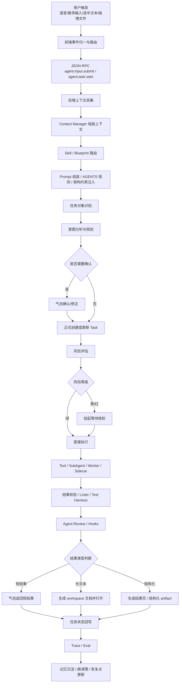
```mermaid
flowchart TB
    A[用户触发
语音/悬停输入/选中文本/拖拽文件]
    B[前端事件归一与路由]
    C[JSON-RPC agent.input.submit / agent.task.start]
    D[后端上下文采集]
    E[Context Manager 组装上下文]
    F[Skill / Blueprint 路由]
    G[Prompt 组装 / AGENTS 规则 / 架构约束注入]
    H[任务对象识别]
    I[意图分析与规划]
    J{是否需要确认}
    K[气泡确认/修正]
    L[正式创建或更新 Task]
    M[风险评估]
    N{风险等级}
    O[直接执行]
    P[挂起等待授权]
    Q[Tool / SubAgent / Worker / Sidecar]
    R[结果校验 / Linter / Test Harness]
    S[Agent Review / Hooks]
    T{结果类型判断}
    U[气泡返回短结果]
    V[生成 workspace 文档并打开]
    W[生成结果页 / 结构化 artifact]
    X[任务状态回写]
    Y[Trace / Eval]
    Z[记忆沉淀 / 熵清理 / 恢复点更新]

    A --> B --> C --> D --> E --> F --> G --> H --> I --> J
    J -- 是 --> K --> L
    J -- 否 --> L
    L --> M --> N
    N -- 绿 --> O
    N -- 黄/红 --> P --> O
    O --> Q --> R --> S --> T
    T -- 短结果 --> U --> X
    T -- 长文本 --> V --> X
    T -- 结构化 --> W --> X
    X --> Y --> Z
```

### 5.2 前馈决策展开图

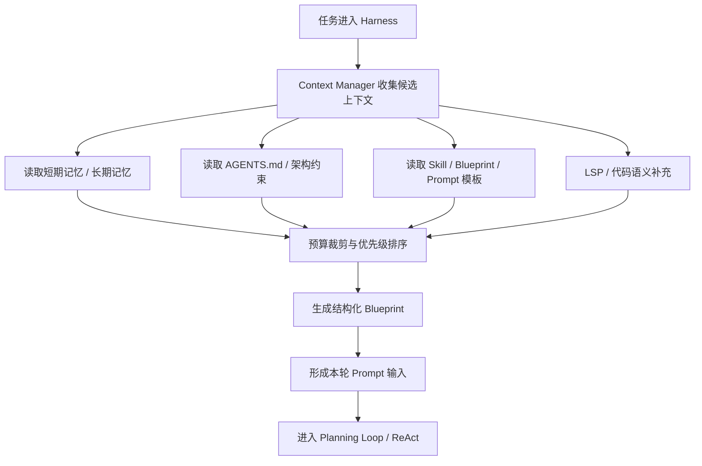
```mermaid
flowchart TB
    A[任务进入 Harness]
    B[Context Manager 收集候选上下文]
    C[读取短期记忆 / 长期记忆]
    D[读取 AGENTS.md / 架构约束]
    E[读取 Skill / Blueprint / Prompt 模板]
    F[LSP / 代码语义补充]
    G[预算裁剪与优先级排序]
    H[生成结构化 Blueprint]
    I[形成本轮 Prompt 输入]
    J[进入 Planning Loop / ReAct]

    A --> B
    B --> C
    B --> D
    B --> E
    B --> F
    C --> G
    D --> G
    E --> G
    F --> G
    G --> H --> I --> J
```

### 5.3 风险执行与回滚图

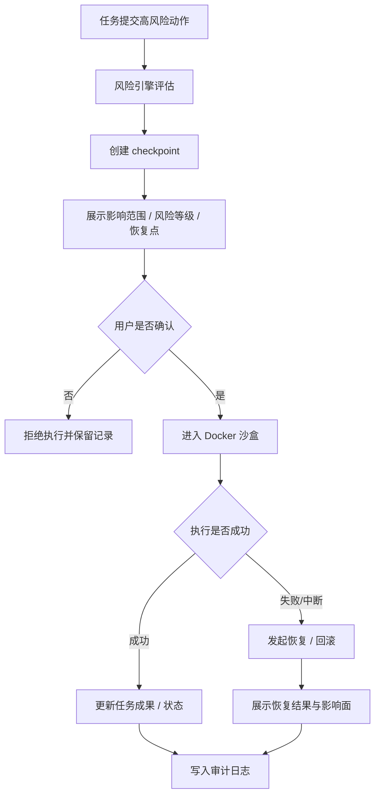
```mermaid
flowchart TB
    A[任务提交高风险动作]
    B[风险引擎评估]
    C[创建 checkpoint]
    D[展示影响范围 / 风险等级 / 恢复点]
    E{用户是否确认}
    F[拒绝执行并保留记录]
    G[进入 Docker 沙盒]
    H{执行是否成功}
    I[更新任务成果 / 状态]
    J[写入审计日志]
    K[发起恢复 / 回滚]
    L[展示恢复结果与影响面]

    A --> B --> C --> D --> E
    E -- 否 --> F
    E -- 是 --> G --> H
    H -- 成功 --> I --> J
    H -- 失败/中断 --> K --> L --> J
```

### 5.4 反馈闭环与熔断图

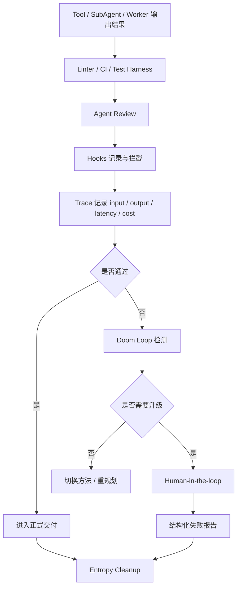
```mermaid
flowchart TB
    A[Tool / SubAgent / Worker 输出结果]
    B[Linter / CI / Test Harness]
    C[Agent Review]
    D[Hooks 记录与拦截]
    E[Trace 记录 input / output / latency / cost]
    F{是否通过}
    G[进入正式交付]
    H[Doom Loop 检测]
    I{是否需要升级}
    J[切换方法 / 重规划]
    K[Human-in-the-loop]
    L[结构化失败报告]
    M[Entropy Cleanup]

    A --> B --> C --> D --> E --> F
    F -- 是 --> G --> M
    F -- 否 --> H --> I
    I -- 否 --> J
    I -- 是 --> K --> L --> M
```

### 5.5 记忆写入与检索图

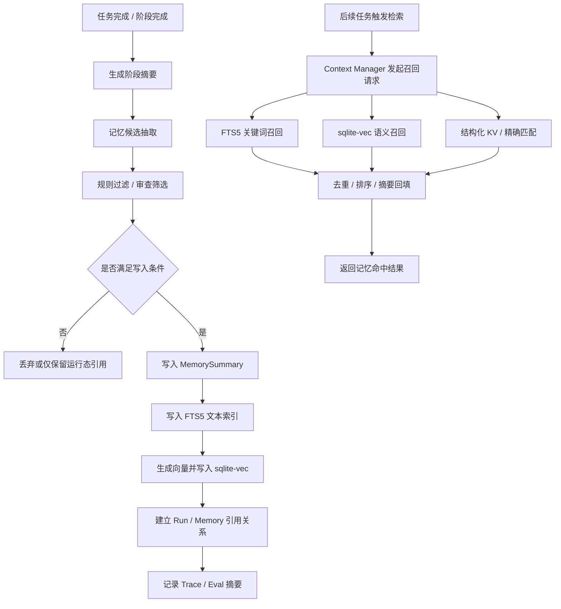
```mermaid
flowchart TB
    A[任务完成 / 阶段完成]
    B[生成阶段摘要]
    C[记忆候选抽取]
    D[规则过滤 / 审查筛选]
    E{是否满足写入条件}
    F[丢弃或仅保留运行态引用]
    G[写入 MemorySummary]
    H[写入 FTS5 文本索引]
    I[生成向量并写入 sqlite-vec]
    J[建立 Run / Memory 引用关系]
    K[记录 Trace / Eval 摘要]
    L[后续任务触发检索]
    M[Context Manager 发起召回请求]
    N[FTS5 关键词召回]
    O[sqlite-vec 语义召回]
    P[结构化 KV / 精确匹配]
    Q[去重 / 排序 / 摘要回填]
    R[返回记忆命中结果]

    A --> B --> C --> D --> E
    E -- 否 --> F
    E -- 是 --> G --> H --> I --> J --> K
    L --> M
    M --> N
    M --> O
    M --> P
    N --> Q
    O --> Q
    P --> Q --> R
```

---

### 5.6 任务巡检转任务图

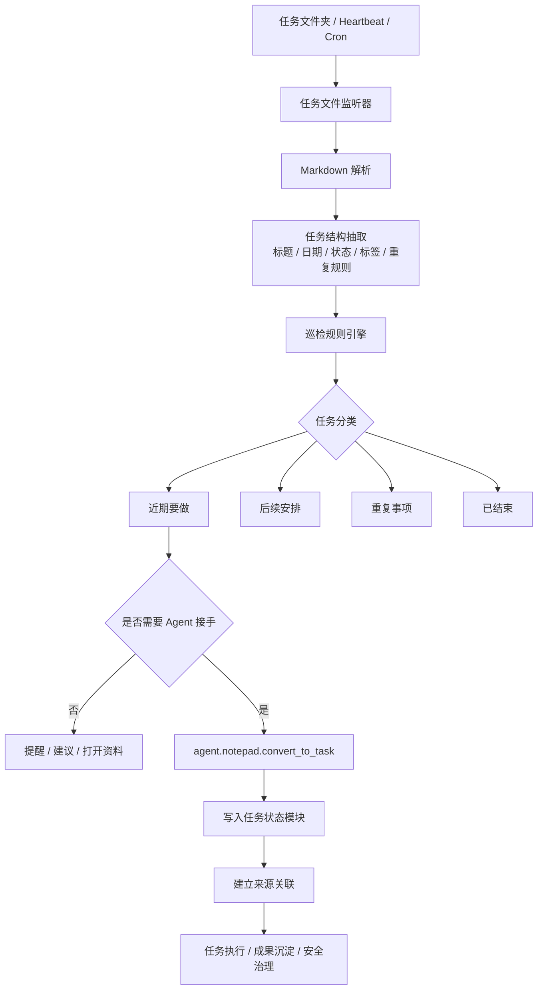
```mermaid
flowchart TB
    A[任务文件夹 / Heartbeat / Cron]
    B[任务文件监听器]
    C[Markdown 解析]
    D[任务结构抽取
标题 / 日期 / 状态 / 标签 / 重复规则]
    E[巡检规则引擎]
    F{任务分类}
    G[近期要做]
    H[后续安排]
    I[重复事项]
    J[已结束]
    K{是否需要 Agent 接手}
    L[提醒 / 建议 / 打开资料]
    M[agent.notepad.convert_to_task]
    N[写入任务状态模块]
    O[建立来源关联]
    P[任务执行 / 成果沉淀 / 安全治理]

    A --> B --> C --> D --> E --> F
    F --> G --> K
    F --> H
    F --> I
    F --> J
    K -- 否 --> L
    K -- 是 --> M --> N --> O --> P
```

### 5.7 仪表盘订阅与任务视图刷新图

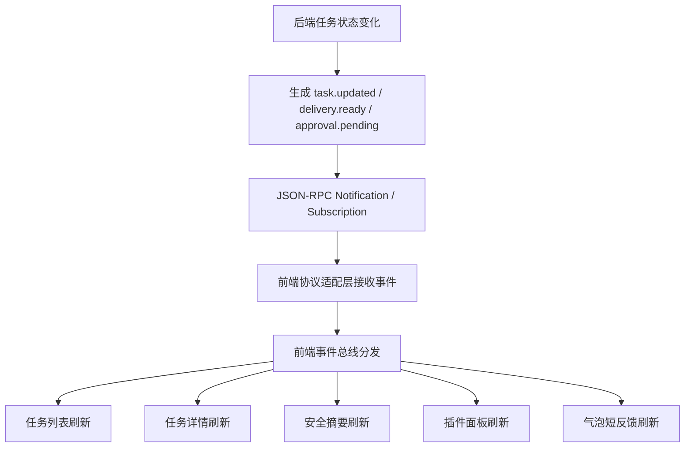
```mermaid
flowchart TB
    A[后端任务状态变化]
    B[生成 task.updated / delivery.ready / approval.pending]
    C[JSON-RPC Notification / Subscription]
    D[前端协议适配层接收事件]
    E[前端事件总线分发]
    F[任务列表刷新]
    G[任务详情刷新]
    H[安全摘要刷新]
    I[插件面板刷新]
    J[气泡短反馈刷新]

    A --> B --> C --> D --> E
    E --> F
    E --> G
    E --> H
    E --> I
    E --> J
```

### 5.8 结果审查、Trace 与熔断闭环图

```mermaid
flowchart TB
    A[Tool / SubAgent / Worker 输出结果]
    B[Linter / CI / Test Harness]
    C[Agent Review]
    D[Hooks 记录与拦截]
    E[Trace 记录 input / output / latency / cost]
    F{是否通过}
    G[进入正式交付]
    H[Doom Loop 检测]
    I{是否需要升级}
    J[切换方法 / 重规划]
    K[Human-in-the-loop]
    L[结构化失败报告]
    M[Entropy Cleanup]

    A --> B --> C --> D --> E --> F
    F -- 是 --> G --> M
    F -- 否 --> H --> I
    I -- 否 --> J
    I -- 是 --> K --> L --> M
```

### 5.9 长按语音与滑动控制图

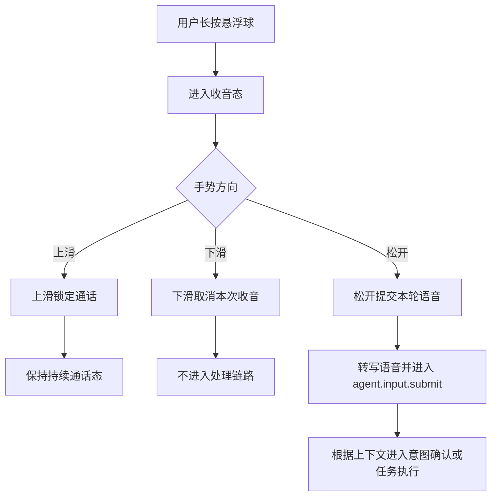
```mermaid
flowchart TB
    A[用户长按悬浮球]
    B[进入收音态]
    C{手势方向}
    D[上滑锁定通话]
    E[下滑取消本次收音]
    F[松开提交本轮语音]
    G[保持持续通话态]
    H[不进入处理链路]
    I[转写语音并进入 agent.input.submit]
    J[根据上下文进入意图确认或任务执行]

    A --> B --> C
    C -- 上滑 --> D --> G
    C -- 下滑 --> E --> H
    C -- 松开 --> F --> I --> J
```

### 5.10 主动推荐触发与轻提示图

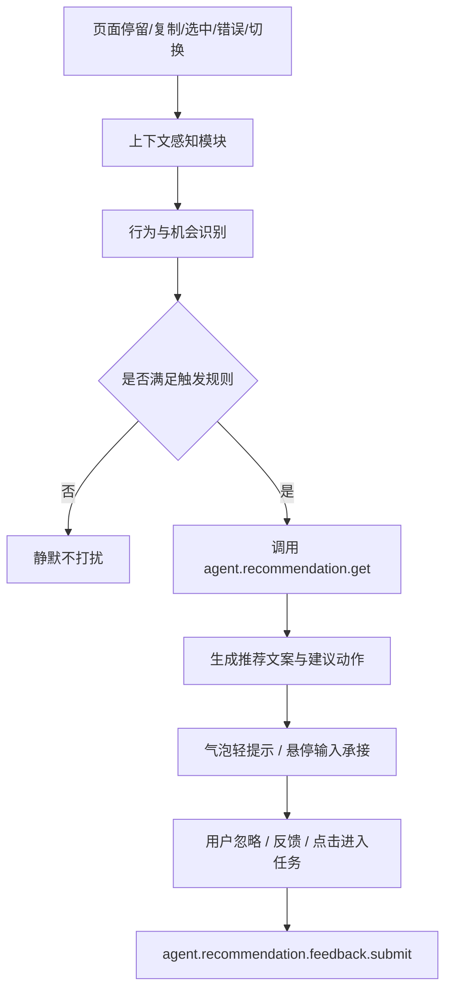
```mermaid
flowchart TB
    A[页面停留/复制/选中/错误/切换]
    B[上下文感知模块]
    C[行为与机会识别]
    D{是否满足触发规则}
    E[静默不打扰]
    F[调用 agent.recommendation.get]
    G[生成推荐文案与建议动作]
    H[气泡轻提示 / 悬停输入承接]
    I[用户忽略 / 反馈 / 点击进入任务]
    J[agent.recommendation.feedback.submit]

    A --> B --> C --> D
    D -- 否 --> E
    D -- 是 --> F --> G --> H --> I --> J
```

### 5.11 结果分流与失败中断交付图

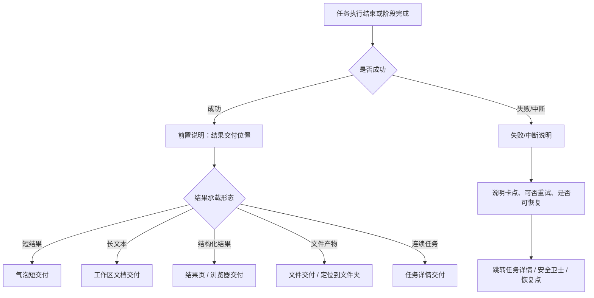
```mermaid
flowchart TB
    A[任务执行结束或阶段完成]
    B{是否成功}
    C[前置说明：结果交付位置]
    D{结果承载形态}
    E[气泡短交付]
    F[工作区文档交付]
    G[结果页 / 浏览器交付]
    H[文件交付 / 定位到文件夹]
    I[任务详情交付]
    J[失败/中断说明]
    K[说明卡点、可否重试、是否可恢复]
    L[跳转任务详情 / 安全卫士 / 恢复点]

    A --> B
    B -- 成功 --> C --> D
    D -- 短结果 --> E
    D -- 长文本 --> F
    D -- 结构化结果 --> G
    D -- 文件产物 --> H
    D -- 连续任务 --> I
    B -- 失败/中断 --> J --> K --> L
```

### 5.12 本章与后续章节的边界说明

- 第 5 章保留系统级流程图，重点回答“主链路怎样流转、前馈怎样收敛、风险怎样治理、反馈怎样闭环、记忆怎样沉淀与召回”。
- 第 6 章保留功能模块级时序和状态图，重点回答“具体某个功能如何实现、模块之间如何交互、异常时怎么降级或回滚”。
- 因此，第 5 章中的图和说明偏系统视角；第 6 章中的图和说明偏功能视角。两章之间允许存在引用关系，但不再重复解释同一层级的语义。

### 5.13 模块联动约束

- 前馈决策结果必须显式传入编排层和 Trace 记录；
- 反馈闭环的失败结果必须能回流到状态机或人工升级流程；
- 子任务与插件的输出同样要走审查、审计和交付对象链；
- 任何前馈命中和反馈命中都不允许只存在日志中而无结构化记录；
- 前端局部状态、后端正式状态、数据库对象和交付对象之间必须有单向映射，不允许相互混写；
- 模块联调时必须优先保证主链路，再补充扩展能力链路。

## 6. 关键时序图与实现说明

### 6.1 文本选中 / 文件拖拽后的意图确认与执行

**链路目标**：把文本选中、文件拖拽等“近场对象承接”转换成正式任务。  
**主要模块参与**：表现层、应用编排层、协议适配层、接口接入层、上下文管理内核、意图识别与规划内核、任务状态机、风险评估、结果交付。  
**关键结果**：形成 `task`，必要时生成 `bubble_message` 进行意图确认，最终得到 `delivery_result`。  
**异常分支**：高风险动作进入授权链路；对象失效则回退到待机或确认失败态。  
**实现说明**：此链路是所有近场承接动作的统一模板，文本选中、拖拽文件、错误信息承接和主动机会承接都应先落在这个链路上再分化。

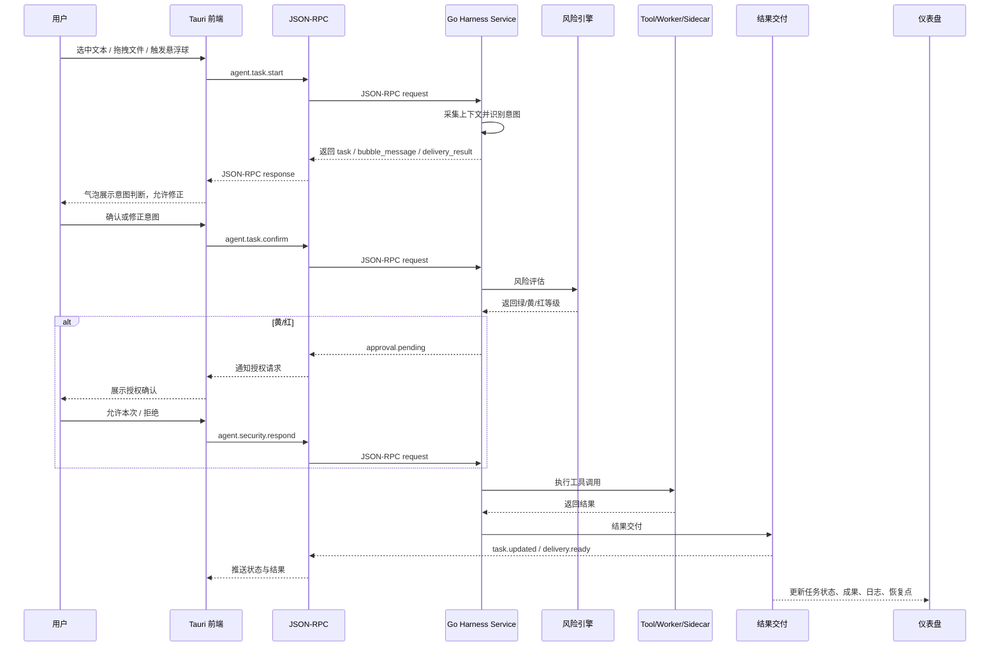
```mermaid
sequenceDiagram
    participant User as 用户
    participant UI as Tauri 前端
    participant RPC as JSON-RPC
    participant API as Go Harness Service
    participant SAFE as 风险引擎
    participant TOOL as Tool/Worker/Sidecar
    participant DEL as 结果交付
    participant DASH as 仪表盘

    User->>UI: 选中文本 / 拖拽文件 / 触发悬浮球
    UI->>RPC: agent.task.start
    RPC->>API: JSON-RPC request
    API->>API: 采集上下文并识别意图
    API-->>RPC: 返回 task / bubble_message / delivery_result
    RPC-->>UI: JSON-RPC response
    UI-->>User: 气泡展示意图判断，允许修正
    User->>UI: 确认或修正意图
    UI->>RPC: agent.task.confirm
    RPC->>API: JSON-RPC request
    API->>SAFE: 风险评估
    SAFE-->>API: 返回绿/黄/红等级
    alt 黄/红
        API-->>RPC: approval.pending
        RPC-->>UI: 通知授权请求
        UI-->>User: 展示授权确认
        User->>UI: 允许本次 / 拒绝
        UI->>RPC: agent.security.respond
        RPC->>API: JSON-RPC request
    end
    API->>TOOL: 执行工具调用
    TOOL-->>API: 返回结果
    API->>DEL: 结果交付
    DEL-->>RPC: task.updated / delivery.ready
    RPC-->>UI: 推送状态与结果
    DEL-->>DASH: 更新任务状态、成果、日志、恢复点
```

### 6.2 高风险执行、授权、回滚

**链路目标**：保证高风险动作不会绕过授权、审计和恢复点。  
**主要模块参与**：应用编排层、接口接入层、风险评估引擎、恢复与回滚引擎、执行后端适配层、审计与追踪引擎。  
**关键结果**：在执行前形成 `approval_request` 和 `recovery_point`，在执行后形成 `authorization_record` 和 `audit_record`。  
**异常分支**：执行失败或用户中断时，必须显式回滚或保留可恢复信息。  
**实现说明**：此链路是治理链的最小闭环，凡是跨工作区、命令执行、联网下载、删除/覆盖等动作，都必须从这里经过。

补充说明：对于 `exec_command` 这类高风险执行，默认应优先进入 Docker Sandbox，并且支持上下文中断后的容器清理；仅在 Windows shell 命令入口上允许走受控宿主路径，其他失败情形不能静默回退到宿主直接执行。

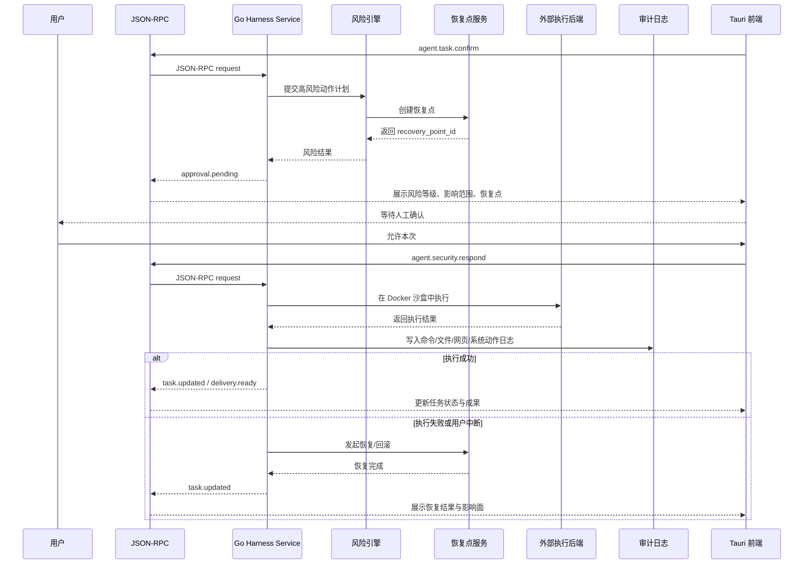
```mermaid
sequenceDiagram
    participant User as 用户
    participant RPC as JSON-RPC
    participant API as Go Harness Service
    participant SAFE as 风险引擎
    participant SNAP as 恢复点服务
    participant EXEC as 外部执行后端
    participant AUDIT as 审计日志
    participant UI as Tauri 前端

    UI->>RPC: agent.task.confirm
    RPC->>API: JSON-RPC request
    API->>SAFE: 提交高风险动作计划
    SAFE->>SNAP: 创建恢复点
    SNAP-->>SAFE: 返回 recovery_point_id
    SAFE-->>API: 风险结果
    API-->>RPC: approval.pending
    RPC-->>UI: 展示风险等级、影响范围、恢复点
    UI-->>User: 等待人工确认
    User->>UI: 允许本次
    UI->>RPC: agent.security.respond
    RPC->>API: JSON-RPC request
    API->>EXEC: 在 Docker 沙盒中执行
    EXEC-->>API: 返回执行结果
    API->>AUDIT: 写入命令/文件/网页/系统动作日志
    alt 执行成功
        API-->>RPC: task.updated / delivery.ready
        RPC-->>UI: 更新任务状态与成果
    else 执行失败或用户中断
        API->>SNAP: 发起恢复/回滚
        SNAP-->>API: 恢复完成
        API-->>RPC: task.updated
        RPC-->>UI: 展示恢复结果与影响面
    end
```

### 6.3 记忆写入与检索

**链路目标**：把阶段结果沉淀为长期记忆，并在镜子视图或后续调用中进行召回。  
**主要模块参与**：任务运行时、记忆管理内核、SQLite FTS5、sqlite-vec、镜子相关接口。  
**关键结果**：形成 `memory_summary / memory_candidate / retrieval_hit` 三类对象。  
**异常分支**：记忆写入失败不影响任务完成，但必须有 Trace 记录；召回失败时镜子视图可降级为空结果。  
**实现说明**：该链路强调记忆层与运行态主表分层，命中结果必须通过标准对象返回，不能直接改写 `task` 主表。

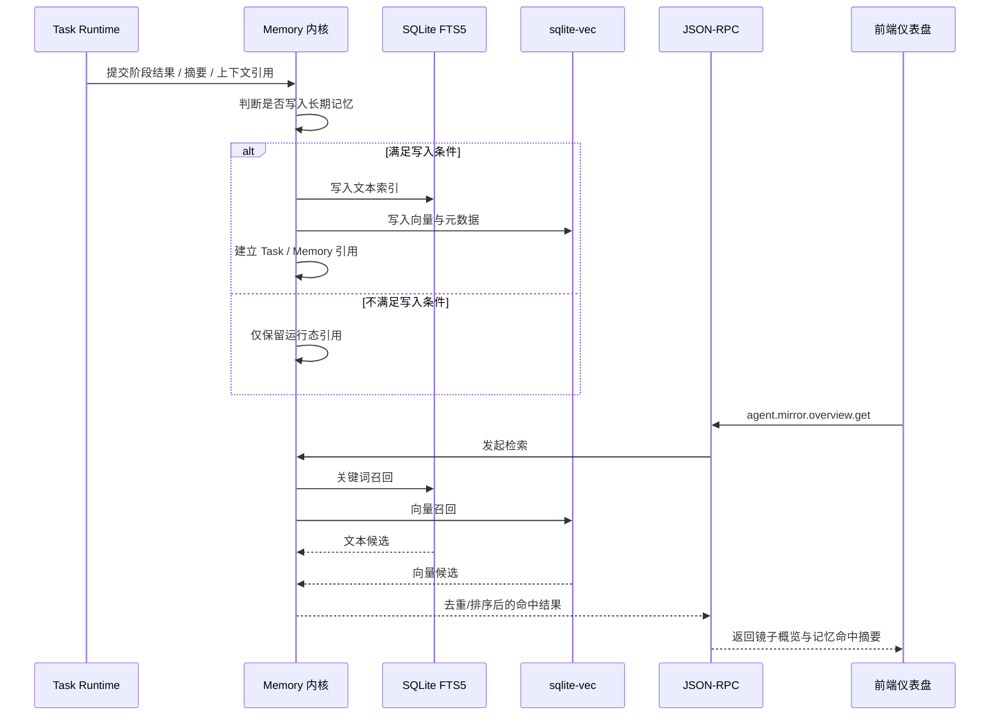
```mermaid
sequenceDiagram
    participant TASK as Task Runtime
    participant MEM as Memory 内核
    participant FTS as SQLite FTS5
    participant VEC as sqlite-vec
    participant RPC as JSON-RPC
    participant UI as 前端仪表盘

    TASK->>MEM: 提交阶段结果 / 摘要 / 上下文引用
    MEM->>MEM: 判断是否写入长期记忆
    alt 满足写入条件
        MEM->>FTS: 写入文本索引
        MEM->>VEC: 写入向量与元数据
        MEM->>MEM: 建立 Task / Memory 引用
    else 不满足写入条件
        MEM->>MEM: 仅保留运行态引用
    end
    UI->>RPC: agent.mirror.overview.get
    RPC->>MEM: 发起检索
    MEM->>FTS: 关键词召回
    MEM->>VEC: 向量召回
    FTS-->>MEM: 文本候选
    VEC-->>MEM: 向量候选
    MEM-->>RPC: 去重/排序后的命中结果
    RPC-->>UI: 返回镜子概览与记忆命中摘要
```

### 6.4 插件执行与仪表盘展示

**链路目标**：把插件运行态、指标和产物纳入统一事件流和仪表盘。  
**主要模块参与**：插件系统与插件管理器、事件流、接口接入层、仪表盘模块。  
**关键结果**：插件运行不直接暴露给前端，而是通过 `plugin.updated` 等事件与查询结果统一展示。  
**实现说明**：插件视图不能成为独立协议体系，仍必须通过标准事件和标准对象链回流。

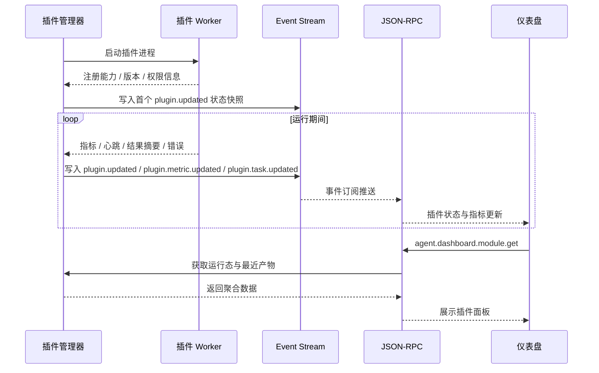
```mermaid
sequenceDiagram
    participant PM as 插件管理器
    participant PLUG as 插件 Worker
    participant EVT as Event Stream
    participant RPC as JSON-RPC
    participant UI as 仪表盘

    PM->>PLUG: 启动插件进程
    PLUG-->>PM: 注册能力 / 版本 / 权限信息
    PM->>EVT: 写入首个 plugin.updated 状态快照
    loop 运行期间
        PLUG-->>PM: 指标 / 心跳 / 结果摘要 / 错误
        PM->>EVT: 写入 plugin.updated / plugin.metric.updated / plugin.task.updated
        EVT-->>RPC: 事件订阅推送
        RPC-->>UI: 插件状态与指标更新
    end
    UI->>RPC: agent.dashboard.module.get
    RPC->>PM: 获取运行态与最近产物
    PM-->>RPC: 返回聚合数据
    RPC-->>UI: 展示插件面板
```

### 6.5 启动初始化与恢复

**链路目标**：在前端启动后尽快恢复上次状态，拉起任务概览、记忆索引和插件运行态。  
**关键结果**：`agent.dashboard.overview.get` 以正常响应返回首页可用所需的最小数据集合。  
**异常分支**：记忆或插件预热失败不能阻断首页可打开。  
**实现说明**：启动链路优先保证“首页可用”和“未完成任务可见”，而不是等所有后台能力全预热完成。

```mermaid
sequenceDiagram
    participant UI as Tauri 前端
    participant RPC as JSON-RPC
    participant API as Go Harness Service
    participant DB as SQLite
    participant MEM as Memory 内核
    participant PM as 插件管理器

    UI->>RPC: agent.dashboard.overview.get
    RPC->>API: 初始化阶段首页概览请求
    API->>DB: 读取未完成任务 / 配置 / 审计索引
    API->>MEM: 预热常用记忆索引
    API->>PM: 加载插件注册表并恢复插件状态
    DB-->>API: 返回任务状态与配置
    MEM-->>API: 记忆索引就绪
    PM-->>API: 插件状态就绪
    API-->>RPC: agent.dashboard.overview.get result
    RPC-->>UI: 返回首页摘要 / 未完成任务 / 插件状态 / 安全提醒
```

### 6.6 长按悬浮球发起语音协作

**链路目标**：将长按、上滑、下滑和松开等语音手势转换为标准任务输入。  
**关键结果**：形成语音会话状态、提交到 `agent.input.submit`，并回填气泡和任务对象。  
**重点约束**：上滑锁定和下滑取消属于前端局部状态，不直接映射正式业务状态。  
**实现说明**：长按语音是主入口之一，必须支持“锁定通话”和“打断补充”，但这些都应通过前端状态机协调，而不是发明新业务状态。

```mermaid
sequenceDiagram
    participant U as 用户
    participant P as 表现层
    participant A as 应用编排层
    participant S as 状态管理层
    participant V as 前端服务层
    participant I as 平台集成层

    U->>P: 左键长按悬浮球
    P->>S: 更新悬浮球状态=承接中
    P->>S: 更新语音状态=收音中
    P->>A: 通知发起语音协作
    A->>V: 调用语音服务，启动语音输入
    A->>V: 调用上下文服务，请求当前任务上下文

    alt 上滑锁定
        U->>P: 上滑
        P->>S: 更新语音状态=锁定通话
        P-->>U: 展现持续通话状态
    else 下滑取消
        U->>P: 下滑
        P->>S: 更新语音状态=已取消
        A-->>V: 取消语音请求
        P-->>U: 回退到待机状态
    else 松开结束本轮输入
        U->>P: 松开
        P->>S: 更新语音状态=输入结束
        A->>V: 提交语音内容与上下文
        V->>V: 语音理解与任务分析
        V-->>A: 返回理解结果与任务建议
        A->>S: 更新悬浮球状态=处理中
        A->>S: 更新当前任务对象状态
        A->>V: 调用任务服务，发起处理
        V-->>A: 返回结果
        A->>S: 更新悬浮球状态=完成
        A->>S: 更新气泡状态
        A->>P: 渲染气泡内容
        P-->>U: 展示状态、结果与下一步建议
    end

    opt 回应过程中被打断
        U->>P: 再次长按补充需求
        P->>S: 更新语音状态=再次收音
        A->>V: 追加语音内容并重新协调任务
    end
```

### 6.7 悬停悬浮球触发轻量承接

**链路目标**：在不强打扰用户的前提下，提供主动推荐和一句话补充入口。  
**关键结果**：可在不新建独立 RPC 的情况下，复用推荐和任务提交能力。  
**重点约束**：推荐失败应静默降级，不可影响用户继续单击或长按主链路。  
**实现说明**：推荐冷却、命中条件和轻量承接应全部由编排层与状态层协调，表现层只负责提示态。

```mermaid
sequenceDiagram
    participant U as 用户
    participant P as 表现层
    participant A as 应用编排层
    participant S as 状态管理层
    participant V as 前端服务层

    U->>P: 鼠标悬停悬浮球
    P->>A: 通知进入悬停检测
    A->>S: 读取悬浮球状态、冷却信息、当前任务对象状态

    alt 满足触发条件
        A->>V: 调用上下文服务，获取当前界面上下文
        A->>V: 调用推荐服务，生成推荐内容
        V-->>A: 返回推荐问题与建议动作
        A->>S: 更新悬浮球状态=可唤起
        A->>S: 更新气泡状态
        A->>S: 更新轻量输入状态=可编辑
        A->>P: 显示气泡内容
        A->>P: 显示轻量输入区
        P-->>U: 展示推荐内容与补充输入入口

        opt 用户补充一句话
            U->>P: 在轻量输入区输入需求
            P->>S: 更新轻量输入状态
            P->>A: 提交补充需求
            A->>V: 调用任务服务发起处理
            V-->>A: 返回处理结果
            A->>S: 更新气泡状态
            A->>P: 更新气泡内容
            P-->>U: 展示结果
        end
    else 不满足触发条件
        A->>S: 保持当前状态
        P-->>U: 不触发推荐
    end
```

### 6.8 协作机会承接与意图确认

**链路目标**：把文本、文件、推荐机会这些对象统一进入意图确认链路。  
**关键结果**：确认前用 `bubble_message` 承接，确认后转入正式 `task` 执行。  
**重点约束**：文件解析、机会识别和对象识别都不得直接跳过意图确认逻辑。  
**实现说明**：无论对象来源是选中文本、拖拽文件还是主动推荐，后续都应收敛到同一套确认与执行骨架。

```mermaid
sequenceDiagram
    participant U as 用户
    participant P as 表现层
    participant A as 应用编排层
    participant S as 状态管理层
    participant V as 前端服务层
    participant I as 平台集成层

    alt 文本选中
        U->>P: 选中一段文本
        P->>A: 通知识别到文本对象
        A->>S: 更新当前任务对象状态=文本
    else 文本拖拽
        U->>P: 将文本拖向悬浮球
        P->>A: 通知识别到拖拽文本对象
        A->>S: 更新当前任务对象状态=拖拽文本
    else 文件拖拽
        U->>I: 将文件拖入悬浮球区域
        I-->>P: 传入文件对象
        P->>A: 通知识别到文件对象
        A->>V: 调用文件服务，解析文件
        V-->>A: 返回文件摘要与类型信息
        A->>S: 更新当前任务对象状态=文件
    else 识别到协作机会
        A->>V: 调用上下文服务获取当前上下文
        A->>V: 调用推荐服务分析协作机会
        V-->>A: 返回可协作机会
        A->>S: 更新当前任务对象状态=协作机会
    end

    A->>S: 更新悬浮球状态=可操作提示态
    A->>P: 刷新悬浮球样式
    P-->>U: 提示可继续发起协作

    U->>P: 左键单击悬浮球
    P->>A: 触发统一承接流程
    A->>V: 调用上下文服务补充任务上下文
    A->>V: 分析用户可能意图
    V-->>A: 返回意图猜测与建议输出方式
    A->>S: 更新意图确认状态
    A->>S: 更新气泡状态
    A->>S: 更新轻量输入状态=可修正
    A->>P: 显示气泡内容
    A->>P: 显示轻量输入区
    P-->>U: 展示意图确认内容

    alt 用户确认当前意图
        U->>P: 点击确认
        P->>A: 提交确认
        A->>V: 调用任务服务发起处理
        V-->>A: 返回结果
        A->>S: 更新气泡状态
        A->>P: 更新气泡内容并触发结果分发
        P-->>U: 展示结果
    else 用户修正意图
        U->>P: 在轻量输入区修改意图
        P->>A: 提交修正后的意图
        A->>V: 按新意图发起处理
        V-->>A: 返回结果
        A->>S: 更新气泡状态
        A->>P: 更新气泡内容并触发结果分发
        P-->>U: 展示结果
    end
```

### 6.9 双击悬浮球打开仪表盘

**链路目标**：通过双击快速进入低频工作台视图。  
**关键结果**：打开仪表盘窗口并装载任务、安全、镜子和设置摘要。  
**实现说明**：双击属于窗口和视图级动作，不直接创建新任务，但会触发多服务并发取数。

```mermaid
sequenceDiagram
    participant U as 用户
    participant P as 表现层
    participant A as 应用编排层
    participant S as 状态管理层
    participant V as 前端服务层
    participant I as 平台集成层

    U->>P: 双击悬浮球
    P->>A: 通知打开仪表盘
    A->>S: 更新仪表盘状态=打开中
    A->>I: 请求打开仪表盘窗口
    I-->>P: 仪表盘窗口已打开

    A->>V: 调用任务服务，获取任务摘要
    A->>V: 调用记忆服务，获取镜子摘要
    A->>V: 调用安全服务，获取待确认项与恢复点
    A->>V: 调用设置服务，获取控制项摘要

    V-->>A: 返回仪表盘首页数据
    A->>S: 更新仪表盘状态=已打开
    A->>P: 渲染仪表盘界面
    P-->>U: 展示首页焦点区与各模块入口
```

### 6.10 托盘右键打开控制面板

**链路目标**：提供与近场窗口独立的系统级设置和控制入口。  
**关键结果**：通过 `agent.settings.get / agent.settings.update` 读取和更新正式设置快照，并按 `apply_mode / need_restart` 驱动前端表现。  
**实现说明**：控制面板是低频设置域，应以正式协议为主边界；前端本地存储只承接未保存草稿、窗口布局和面板状态，不作为正式设置真源。

```mermaid
sequenceDiagram
    participant U as 用户
    participant P as 表现层
    participant A as 应用编排层
    participant S as 状态管理层
    participant V as 前端服务层
    participant RPC as JSON-RPC Client
    participant API as Go Harness Service
    participant I as 平台集成层

    U->>I: 右键点击托盘
    I-->>U: 展示托盘菜单
    U->>I: 点击打开控制面板
    I->>A: 通知打开控制面板
    A->>S: 更新控制面板状态=打开中
    A->>V: 调用设置服务，读取当前设置
    V->>RPC: agent.settings.get
    RPC->>API: JSON-RPC request
    API-->>RPC: settings snapshot / apply metadata
    RPC-->>V: 返回正式设置快照
    V-->>A: 返回设置项与当前值
    A->>P: 渲染控制面板界面
    A->>S: 更新控制面板状态=已打开
    P-->>U: 展示控制面板

    opt 用户修改设置并保存
        U->>P: 修改设置项并点击保存
        P->>A: 提交设置变更
        A->>V: 调用设置服务保存设置
        V->>RPC: agent.settings.update
        RPC->>API: JSON-RPC request
        API-->>RPC: effective_settings / apply_mode / need_restart
        RPC-->>V: 返回保存结果
        V-->>A: 返回保存结果
        A->>S: 更新控制面板状态=已保存
        A->>P: 按 apply_mode 更新提示
        P-->>U: 提示保存成功或需要重启
    end
```

### 6.11 任务完成后的结果分发与交付

**链路目标**：把一个完成任务的结果分发到最合适的交付出口。  
**关键结果**：统一形成 `delivery_result`，并可能伴随 `artifact`。  
**重点约束**：长结果自动分流属于交付内核策略，不新增独立协议方法。  
**实现说明**：分发顺序应遵循“先告知，再正式交付，再提供入口”，保证用户能理解发生了什么。

```mermaid
sequenceDiagram
    participant U as 用户
    participant P as 表现层
    participant A as 应用编排层
    participant S as 状态管理层
    participant V as 前端服务层
    participant I as 平台集成层

    Note over U,I: 前提：任务已完成，系统拿到结果

    V-->>A: 返回任务结果
    A->>A: 判断结果类型与交付方式
    A->>S: 更新结果分发状态
    A->>S: 更新气泡状态
    A->>P: 先展示结果摘要与状态说明
    P-->>U: 气泡呈现已完成或已生成结果

    alt 短结果或轻量结果
        A->>P: 直接渲染到气泡
        P-->>U: 展示简短结果与下一步建议
    else 长文本或可编辑内容
        A->>V: 调用文件服务，生成工作区文档
        V->>I: 写入本地文件系统
        I-->>V: 返回文档路径
        V-->>A: 返回生成结果
        A->>P: 更新气泡提示=已写入文档并打开
        A->>I: 打开生成的文档
        I-->>U: 打开工作区文档
    else 网页结果或结构化结果
        A->>P: 更新气泡提示=正在打开结果页
        A->>I: 调用外部能力，打开浏览器或结果页
        I-->>U: 展示浏览器或结果页
    else 单个文件产物
        A->>P: 更新气泡提示=已生成文件，正在打开
        A->>I: 打开生成文件
        I-->>U: 展示目标文件
    else 多文件产物或导出结果
        A->>P: 更新气泡提示=已导出，正在定位文件夹
        A->>I: 打开文件夹并高亮结果
        I-->>U: 展示文件夹及目标文件
    else 连续任务或可追踪任务
        A->>P: 更新气泡提示=可在任务详情中查看
        A->>S: 更新仪表盘状态
        A->>I: 打开仪表盘或任务详情窗口
        I-->>U: 展示任务详情或历史任务页
    else 异常或待确认结果
        A->>P: 更新气泡提示=需要确认或执行异常
        A->>S: 更新悬浮球状态=等待确认或异常
        P-->>U: 展示确认入口或异常说明
    end
```

### 6.12 悬浮球状态图

**说明**：这是前端局部状态机，不等同于正式 `task_status`。它描述的是近场交互承接过程。  
**实现补充**：悬浮球状态图与应用编排层强相关，不能在表现层单独推进。

```mermaid
stateDiagram-v2
    [*] --> 待机

    待机 --> 可唤起: 用户靠近或悬停达到阈值
    待机 --> 承接中: 长按语音 / 拖拽对象进入 / 文本选中提示
    待机 --> 意图确认中: 用户点击悬浮球进入确认流程
    待机 --> 处理中: 已接收任务并开始处理

    可唤起 --> 待机: 用户离开或未满足触发条件
    可唤起 --> 承接中: 用户继续输入 / 拖拽 / 长按
    可唤起 --> 意图确认中: 用户左键单击悬浮球

    承接中 --> 意图确认中: 已识别任务对象且需要确认意图
    承接中 --> 处理中: 任务可直接执行
    承接中 --> 待机: 用户取消或对象失效

    意图确认中 --> 处理中: 用户确认或修正意图后执行
    意图确认中 --> 等待确认: 系统给出待确认事项
    意图确认中 --> 待机: 用户取消或关闭

    处理中 --> 完成: 任务成功完成
    处理中 --> 等待确认: 处理中出现待确认动作
    处理中 --> 异常: 执行失败 / 理解异常 / 环境异常

    等待确认 --> 处理中: 用户确认继续
    等待确认 --> 待机: 用户忽略或取消
    等待确认 --> 异常: 确认失败或条件不满足

    完成 --> 待机: 结果已查看且状态回落
    异常 --> 待机: 用户关闭或恢复默认状态
```

### 6.13 气泡生命周期状态图

**说明**：气泡生命周期属于表现态，不应该写入后端正式主状态表。  
**实现补充**：气泡删除、恢复、置顶等动作只影响表现层和局部状态，不应生成新的业务对象。

```mermaid
stateDiagram-v2
    [*] --> 显现

    显现 --> 隐藏: 鼠标离开悬浮球区域10s
    显现 --> 置顶显现: 用户置顶
    显现 --> 已销毁: 用户删除
    显现 --> 已销毁: 气泡数量超过阈值，旧气泡被销毁

    隐藏 --> 显现: 重新唤起/再次显示
    隐藏 --> 置顶显现: 用户置顶
    隐藏 --> 已销毁: 隐藏超过5分钟
    隐藏 --> 已销毁: 用户删除

    置顶显现 --> 显现: 用户取消置顶
    置顶显现 --> 已销毁: 用户删除

    已销毁 --> [*]
```

### 6.14 语音承接状态图

**说明**：该状态机用于描述语音承接过程，和 `voice_session_state` 有映射关系，但不等价于后端 `task_status`。  
**实现补充**：语音状态机必须允许“锁定通话”和“打断补充”，但这些都不能直接推动正式任务状态。

```mermaid
stateDiagram-v2
    [*] --> 待机

    待机 --> 准备收音: 用户长按悬浮球
    准备收音 --> 收音中: 收音启动成功
    准备收音 --> 待机: 启动失败或用户放弃

    收音中 --> 锁定通话: 用户上滑锁定
    收音中 --> 已取消: 用户下滑取消
    收音中 --> 输入结束: 用户松开结束本轮输入

    锁定通话 --> 输入结束: 用户主动结束通话
    锁定通话 --> 已取消: 用户取消本轮语音

    输入结束 --> 理解处理中: 提交语音内容并进入理解
    理解处理中 --> 响应中: 系统开始返回结果
    理解处理中 --> 异常: 理解失败或处理失败

    响应中 --> 待机: 当前轮结束
    响应中 --> 收音中: 用户再次打断并补充需求

    已取消 --> 待机
    异常 --> 待机
```

### 6.15 意图确认状态图

**说明**：这是前端承接流程和后端规划流程之间的桥接状态机，结束点通常会进入 `agent.task.confirm` 或直接执行。  
**实现补充**：所有对象型入口都应进入同一确认骨架，不允许各入口维护不同的确认状态定义。

```mermaid
stateDiagram-v2
    [*] --> 无任务对象

    无任务对象 --> 已识别任务对象: 文本选中 / 文本拖拽 / 文件拖拽 / 识别到协作机会
    已识别任务对象 --> 意图分析中: 用户点击悬浮球或系统进入确认流程

    意图分析中 --> 等待用户确认: 返回意图猜测与建议输出方式
    意图分析中 --> 已取消: 对象失效或用户关闭

    等待用户确认 --> 已确认: 用户接受当前意图
    等待用户确认 --> 已修正意图: 用户修改意图或输出方式
    等待用户确认 --> 已取消: 用户取消或忽略

    已修正意图 --> 已确认: 用户提交修正结果
    已修正意图 --> 已取消: 用户放弃

    已确认 --> 执行中: 发起任务执行
    执行中 --> [*]

    已取消 --> 无任务对象
```

### 6.16 前端任务状态图

**说明**：该图是前端任务视图的状态表达，和正式 `task_status` 相对应，但会包含一些前端视角的分组和转移。  
**实现补充**：视图状态不能替代协议状态；所有正式状态判断以协议对象为准。

```mermaid
stateDiagram-v2
    [*] --> 待发起

    待发起 --> 正在进行: 任务正式开始
    正在进行 --> 接近完成: 已完成大部分步骤
    接近完成 --> 已完成: 结果生成完成

    正在进行 --> 等待授权: 出现待授权操作
    正在进行 --> 等待补充信息: 缺少必要输入
    正在进行 --> 暂停: 用户主动暂停
    正在进行 --> 阻塞: 上游条件不满足
    正在进行 --> 失败: 执行失败
    正在进行 --> 执行异常: 运行过程异常中断

    等待授权 --> 正在进行: 用户授权通过
    等待授权 --> 已取消: 用户拒绝授权

    等待补充信息 --> 正在进行: 用户补充信息
    等待补充信息 --> 已结束未完成: 长时间未补充或流程结束

    暂停 --> 正在进行: 用户继续任务
    暂停 --> 已取消: 用户取消任务

    阻塞 --> 正在进行: 阻塞条件解除
    阻塞 --> 已结束未完成: 未恢复即结束

    失败 --> 正在进行: 用户重试或恢复
    失败 --> 已结束未完成: 放弃处理

    执行异常 --> 正在进行: 异常恢复成功
    执行异常 --> 已结束未完成: 未恢复即结束

    已完成 --> [*]
    已取消 --> [*]
    已结束未完成 --> [*]
```

---

## 7. 模块职责明细

### 7.1 前端模块职责明细

#### 7.1.1 前端工程与桌面宿主
- 负责 Tauri 2 Windows 宿主；
- 负责多窗口组织：悬浮球近场窗口、仪表盘窗口、控制面板窗口；
- 负责前端多入口分包：`shell-ball`、`dashboard`、`control-panel`；
- 负责前端应用启动、唤起、最小化、恢复、退出控制；
- 负责托盘、通知、快捷键、更新等宿主能力接入。

#### 7.1.2 表现层模块
- 负责悬浮球控制器：拖拽、贴边、大小与透明度控制；
- 负责气泡控制器：意图判断展示、短结果展示、生命周期管理、置顶与恢复；
- 负责轻量输入区：一句话补充、确认/修正、附件补充、快捷动作入口；
- 负责仪表盘界面：任务状态、便签协作、镜子模块、安全卫士、插件面板；
- 负责结果承接界面：结果页、文档打开提示、文件结果提示、任务详情入口；
- 负责控制面板界面：设置项配置、行为开关、记忆策略、自动化规则、成本与数据治理、密钥与模型配置。

#### 7.1.3 应用编排层模块
- 负责统一处理单击、双击、长按、悬停、文本选中、文件拖拽；
- 负责对象识别后的候选意图组织、输出方式建议、修正与确认；
- 负责推荐触发条件、冷却时间、用户活跃度与当前上下文判断；
- 负责轻量任务、持续任务、授权等待、暂停与恢复；
- 负责短结果、长文档、网页结果、单文件、多文件、连续任务等多出口交付。

#### 7.1.4 状态管理与查询层模块
- 负责悬浮球状态、气泡状态、轻量输入状态、当前任务对象状态、意图确认状态、语音状态、仪表盘状态、控制面板状态；
- 负责任务列表、任务详情、记忆命中、安全待确认项、插件运行态等异步查询缓存；
- 负责订阅回写和多窗口共享状态收口。

#### 7.1.5 前端服务层模块
- 负责上下文服务、任务服务、推荐服务、语音服务、文件服务、记忆服务、安全服务、设置服务；
- 负责把应用层动作翻译成具体 RPC、平台能力调用，以及局部草稿/面板状态缓存；
- 负责把返回结果标准化给状态层和表现层使用。

#### 7.1.6 平台集成与协议适配层模块
- 负责 Typed JSON-RPC Client；
- 负责 Named Pipe 建链、重连、权限和错误处理；
- 负责订阅和通知桥接；
- 负责窗口、托盘、快捷键、拖拽、文件、本地存储和浏览器打开等平台能力。

### 7.2 后端模块职责明细

#### 7.2.1 接口接入层
- 负责 JSON-RPC 2.0 Server；
- 负责 Session / Task 接口与 Notification / Subscription 管理；
- 负责结构校验、错误包装、事件推送。

#### 7.2.2 Harness 内核层
- 负责任务编排、上下文管理、意图识别与规划、Skill / Blueprint 路由、Prompt 组装、任务状态机、记忆管理、结果交付、子任务协调和插件系统；
- 负责维护 `task` 和 `run` 的稳定映射；
- 负责把前馈层、执行层、反馈层真正串起来。

#### 7.2.3 能力接入层
- 负责 OpenAI Responses SDK 接入；
- 负责工具执行适配器、LSP、Playwright、OCR / 媒体 / 视频 Worker、授权式屏幕 / 视频能力、RAG / 记忆检索层；
- 负责把外部能力统一标准化为内核可消费结果。

#### 7.2.4 治理与反馈层
- 负责风险评估、结果审查、Hooks、Trace / Eval、Doom Loop、Entropy Cleanup、Human-in-the-loop、审计与追踪、恢复与回滚、成本治理、边界与策略；
- 负责守住高风险动作、反馈闭环和回滚恢复链路。

#### 7.2.5 平台与执行适配层
- 负责文件系统抽象层、系统能力抽象层、执行后端适配层；
- 负责屏蔽 Windows 当前实现细节和未来跨平台差异。

### 7.3 联调验收清单

以下内容在模块文档层面必须能真实联调：

1. 文本选中、文件拖拽、语音输入三种入口至少各跑通一次；
2. 至少一条高风险动作链路能形成授权、审计和恢复点；
3. 至少一条记忆写入和一次镜子召回链路真实可见；
4. 至少一条长结果自动分流到文档或文件；
5. 至少一条插件状态能进仪表盘；
6. 悬浮球、气泡、语音、意图确认、前端任务状态图能和真实链路对应；
7. 任一 worker / sidecar 失败都能被前端看到正式错误或待确认结果，而不是静默丢失；
8. 任一高风险动作都不能绕过恢复点和审计链；
9. 任一前馈命中和反馈命中都能在 Trace 中找到结构化记录；
10. 前端局部状态和后端正式状态不能互相替代或互相污染。
